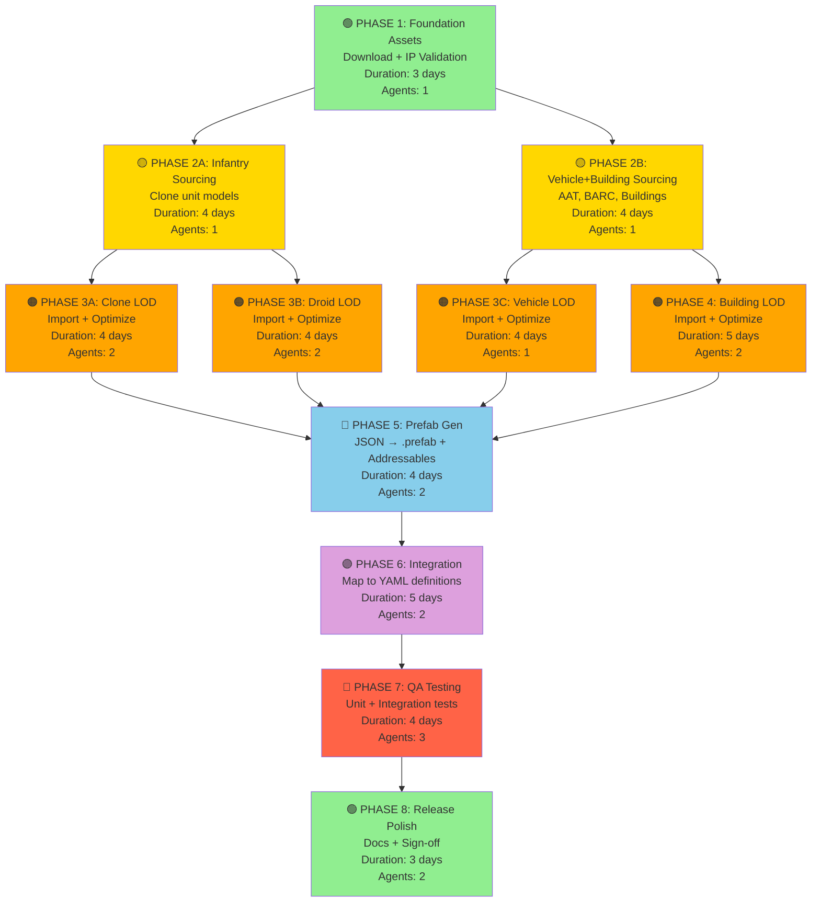

# Star Wars Completion Plan - DAG Dependency Graph

## Mermaid Diagram (Execution Flow)



## Critical Path Analysis

```
Start → P1 → P2A → P3A → P5 → P6 → P7 → P8 → Done
         3d   4d   4d   4d   5d   4d   3d   = 22 days

Parallel tracks (no impact on critical path):
  P2B → P3C → ┐
        P4  → ├→ P5
  P3B ────────┘
```

## Wall-Clock Timeline (Best Case: 2-3 agents per phase)

```
Week 1:
  Mon-Tue: Phase 1 (Foundation) ✓
  Wed:     Phase 2A + 2B (Parallel) ✓

Week 2:
  Mon-Tue: Phase 3A + 3B + 3C + 4 (Parallel, 5 agents) ✓
  Wed-Thu: Phase 5 (Prefab Gen) ✓

Week 3:
  Mon-Tue: Phase 6 (Integration) ✓
  Wed-Thu: Phase 7 (QA)
  Fri:     Phase 8 (Release) ✓

Total: ~18 days wall-clock (5 weeks with realistic delays)
       77 agent-days effort across 17-18 agents
```

## Agent Dispatch Schedule

### Wave 1 (Day 1)
```
┌─ Agent 1 ─┐
│ Phase 1   │
│ (Assets)  │
└───────────┘
```

### Wave 2 (Day 2)
```
┌─ Agent 2 ────┬─ Agent 3 ────┐
│ Phase 2A     │ Phase 2B      │
│ (Infantry)   │ (Vehicles)    │
└──────────────┴───────────────┘
```

### Wave 3 (Day 4)
```
┌─ Agent 4 ────┬─ Agent 5 ────┬─ Agent 6 ────┬─ Agent 7 ────┬─ Agent 8 ────┐
│ Phase 3A     │ Phase 3B      │ Phase 3C      │ Phase 4       │ Phase 4      │
│ Clone LOD    │ Droid LOD     │ Vehicle LOD   │ Building LOD  │ Building LOD │
│ (2 agents)   │ (2 agents)    │ (1 agent)     │ (1 agent)     │ (1 agent)    │
└──────────────┴───────────────┴───────────────┴───────────────┴──────────────┘
```

### Wave 4 (Day 9)
```
┌─ Agent 9 ────┬─ Agent 10 ────┐
│ Phase 5       │ Phase 5        │
│ (Units)       │ (Buildings)    │
└───────────────┴────────────────┘
```

### Wave 5 (Day 13)
```
┌─ Agent 11 ───┬─ Agent 12 ────┐
│ Phase 6       │ Phase 6        │
│ (Units)       │ (Buildings)    │
└───────────────┴────────────────┘
```

### Wave 6 (Day 18)
```
┌─ Agent 13 ───┬─ Agent 14 ────┬─ Agent 15 ────┐
│ Phase 7       │ Phase 7        │ Phase 7        │
│ (Asset Tests) │ (Integration)  │ (In-Game)      │
└───────────────┴────────────────┴────────────────┘
```

### Wave 7 (Day 22)
```
┌─ Agent 16 ───┬─ Agent 17 ────┐
│ Phase 8       │ Phase 8        │
│ (Changelog)   │ (Manifest)     │
└───────────────┴────────────────┘
```

## Dependency Matrix (✓ = Can start after dependency complete)

```
         P1  P2A P2B P3A P3B P3C P4  P5  P6  P7  P8
P1       -   ✓   ✓   -   -   -   -   -   -   -   -
P2A      ✓   -   -   ✓   ✓   -   -   -   -   -   -
P2B      ✓   -   -   -   -   ✓   ✓   -   -   -   -
P3A      -   ✓   -   -   -   -   -   ✓   -   -   -
P3B      -   ✓   -   -   -   -   -   ✓   -   -   -
P3C      -   -   ✓   -   -   -   -   ✓   -   -   -
P4       -   -   ✓   -   -   -   -   ✓   -   -   -
P5       -   -   -   ✓   ✓   ✓   ✓   -   ✓   -   -
P6       -   -   -   -   -   -   -   ✓   -   ✓   -
P7       -   -   -   -   -   -   -   -   ✓   -   ✓
P8       -   -   -   -   -   -   -   -   -   ✓   -
```

## Resource Utilization

```
Week 1:  1 agent  (Phase 1)
         2 agents (Phase 2A, 2B)
Week 2:  5 agents (Phase 3A, 3B, 3C, 4×2)
         2 agents (Phase 5)
Week 3:  2 agents (Phase 6)
         3 agents (Phase 7)
         2 agents (Phase 8)

Peak: 5 agents (Week 2, Day 4)
Average: 2-3 agents
Total: ~18 agents over all phases
```

## Unit Distribution by Phase

### Phase 3A: Clone Infantry
- rep_clone_militia
- rep_clone_trooper
- rep_clone_heavy
- rep_clone_sharpshooter
- rep_clone_medic
- rep_arf_trooper

### Phase 3B: Droid Infantry
- cis_b1_battle_droid
- cis_b1_squad
- cis_b2_super_battle_droid
- cis_sniper_droid
- cis_bx_commando_droid
- cis_magnaguard

### Phase 3C: Vehicles
- **Republic:** rep_barc_speeder, rep_atte_crew, rep_v19_torrent
- **CIS:** cis_aat_crew, cis_stap_pilot, cis_dwarf_spider_droid

### Phase 4: Stationary/Hero
- **Republic:** rep_clone_wall_guard, rep_arc_trooper, rep_jedi_knight, rep_clone_commando
- **CIS:** cis_droideka, cis_general_grievous, cis_probe_droid, cis_medical_droid

## Building Distribution by Phase

### Phase 4: All Buildings

**Republic (10):**
1. rep_command_center (command)
2. rep_clone_facility (barracks)
3. rep_weapons_factory (barracks)
4. rep_vehicle_bay (barracks)
5. rep_guard_tower (defense)
6. rep_shield_generator (defense)
7. rep_blast_wall (defense)
8. rep_supply_station (economy)
9. rep_tibanna_refinery (economy)
10. rep_research_lab (research)

**CIS (10):**
1. cis_tactical_center (command)
2. cis_droid_factory (barracks)
3. cis_assembly_line (barracks)
4. cis_heavy_foundry (barracks)
5. cis_sentry_turret (defense)
6. cis_ray_shield (defense)
7. cis_durasteel_barrier (defense)
8. cis_mining_facility (economy)
9. cis_processing_plant (economy)
10. cis_tech_union_lab (research)

## Success Metrics (Phase 8 Sign-Off Criteria)

```
✓ Units:        27/27 with prefab + YAML mapping
✓ Buildings:    10/10 with prefab + YAML mapping
✓ Assets:       37+ discovered → optimized → integrated
✓ Tests:        ≥95 passing (80 + 15 new)
✓ Pipeline:     0 errors, 0 warnings
✓ Docs:         Changelog + README updated
✓ Custom Art:   0 (100% wrapped from Sketchfab)
✓ Time Budget:  22 days critical path achieved
```

---

**Ready for Dispatch:** All phases, dependencies, and agent assignments defined
**Status:** Ready for execution
