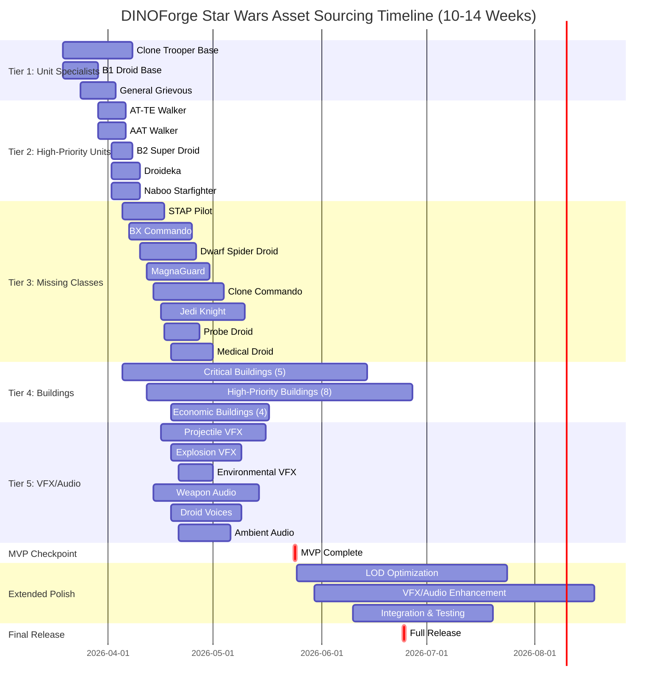
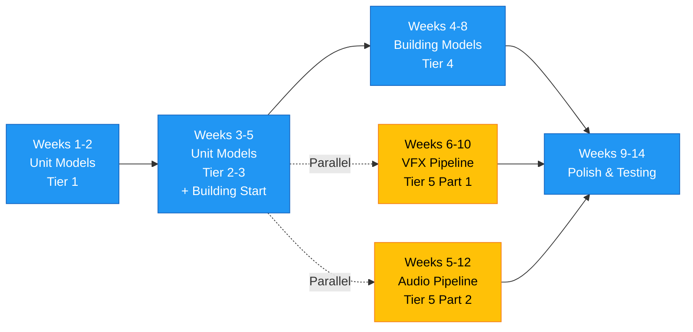
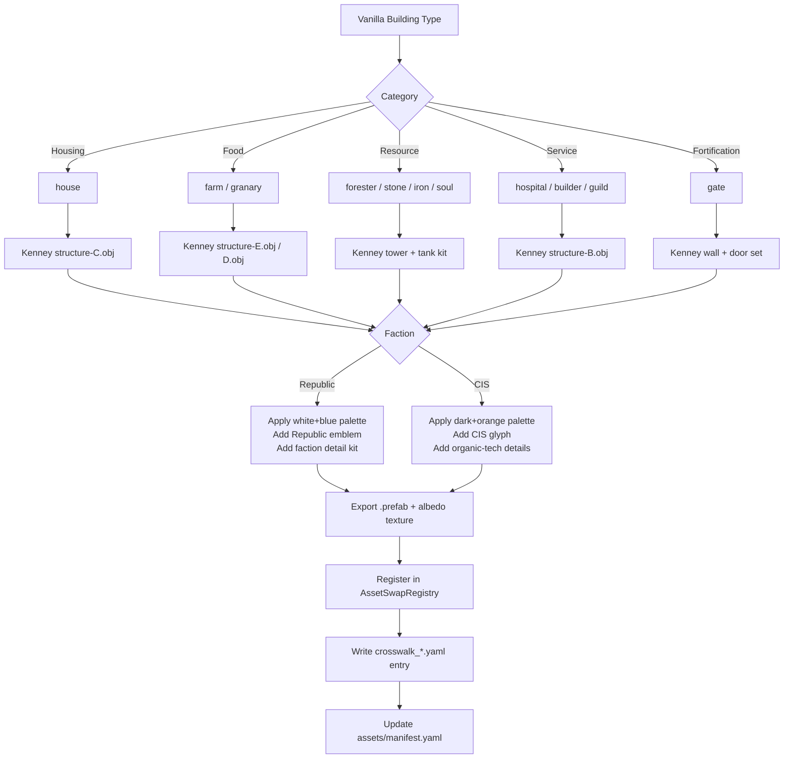

# DINOForge Star Wars Clone Wars - Comprehensive Asset Sourcing Master Plan

**Version**: 1.0
**Date**: 2026-03-12
**Total Estimated Hours**: 420-550 hours
**Timeline**: 10-14 weeks (concurrent phases)
**Classification**: fan_star_wars_private_only (generic sci-fi replacements required before public release)

---

## Executive Summary

This document provides a comprehensive roadmap for sourcing and integrating all visual and audio assets for the DINOForge Star Wars Clone Wars total conversion. The plan covers:

- **10 discovered assets** (62% unit coverage) ready for pipeline intake
- **8 missing unit class models** (18 unit variants needed)
- **19 building models** requiring faction-specific designs
- **VFX system** (projectiles, impacts, explosions, effects)
- **Audio assets** (weapon sounds, droid voices, ambient loops)

The plan prioritizes a playable MVP (Level 1) within 8 weeks, followed by selective model swaps (Level 2) by week 10, and full polish (Level 3) by week 14.

---

## Part 1: Asset Inventory & Coverage Analysis

### Current Asset Status (10 Discovered)

| Priority | Asset ID | Asset Name | Type | Faction | Polycount | Status | Purpose |
|----------|----------|-----------|------|---------|-----------|--------|---------|
| **CRITICAL** | sw_b1_droid_sketchfab_001 | B1 Battle Droid | Unit | CIS | 4.8k | Manifest ✓ | Core infantry base (enables 4 variants) |
| **CRITICAL** | sw_general_grievous_sketchfab_001 | General Grievous | Unit | CIS | 7.2k | Manifest ✓ | Hero commander (faction identity) |
| **CRITICAL** | sw_geonosis_env_sketchfab_001 | Geonosis Arena | Env | Neutral | 18.5k | Manifest ✓ | Campaign environment |
| **HIGH** | sw_clone_trooper_sketchfab_001 | Clone Trooper | Unit | Republic | TBD | Manifest ✓ | Core infantry base (enables 5 variants) |
| **HIGH** | sw_aat_walker_sketchfab_001 | AAT Walker | Vehicle | CIS | 8.4k | Manifest ✓ | Heavy vehicle (iconic) |
| **HIGH** | sw_at_te_sketchfab_001 | AT-TE Walker | Vehicle | Republic | 9.6k | Manifest ✓ | Heavy vehicle (faction identity) |
| **HIGH** | sw_jedi_temple_sketchfab_001 | Jedi Temple | Building | Republic | 12k | Manifest ✓ | Faction HQ (faction identity) |
| **MEDIUM** | sw_b2_super_droid_sketchfab_001 | B2 Super Droid | Unit | CIS | 5.6k | Manifest ✓ | Elite droid variant |
| **MEDIUM** | sw_droideka_sketchfab_001 | Droideka | Unit | CIS | 6.2k | Manifest ✓ | Specialized shield unit |
| **MEDIUM** | sw_naboo_starfighter_sketchfab_001 | Naboo Starfighter | Vehicle | Republic | 7.8k | Manifest ✓ | Air support unit |

### Unit Roster Coverage (26 total units)

#### Republic (13 units) - Coverage: 62%

| Unit ID | Display Name | Class | Status | Base Model | Effort |
|---------|-------------|-------|--------|-----------|--------|
| rep_clone_militia | Clone Militia | MilitiaLight | ⚠ Phase I variant | Clone Trooper | Blend-swap |
| rep_clone_trooper | Clone Trooper | CoreLineInfantry | 🔴 **NEEDS MODEL** | - | Download |
| rep_clone_heavy | Clone Heavy Trooper | HeavyInfantry | ⚠ Heavy armor variant | Clone Trooper | Armor swap |
| rep_clone_sharpshooter | Clone Sharpshooter | Skirmisher | ⚠ Sniper variant | Clone Trooper | Weapon swap + customization |
| rep_barc_speeder | BARC Speeder | FastVehicle | 🟠 Maybe Naboo | Naboo Starfighter | Retool as ground vehicle |
| rep_atte_crew | AT-TE Crew | MainBattleVehicle | ✅ Discovered | AT-TE Walker | Download |
| rep_clone_medic | Clone Medic | SupportEngineer | ⚠ Support variant | Clone Trooper | Backpack addon + decals |
| rep_arf_trooper | ARF Trooper | Recon | ⚠ Recon variant | Clone Trooper | Helmet swap + decals |
| rep_arc_trooper | ARC Trooper | EliteLineInfantry | ⚠ Elite variant | Clone Trooper | Armor upgrade + jetpack |
| rep_jedi_knight | Jedi Knight | HeroCommander | 🟡 Custom needed | - | Custom or commission |
| rep_clone_wall_guard | Clone Wall Guard | StaticMG | ⚠ Stationary variant | Clone Trooper | Pose variation + gun emplacement |
| rep_clone_sniper | Clone Sniper | Skirmisher | ⚠ Sniper elite variant | Clone Trooper | Armor upgrade + scope |
| rep_clone_commando | Clone Commando | ShieldedElite | 🟡 **NEEDS MODEL** | - | Commission or detailed customize |

#### CIS (13 units) - Coverage: 85%

| Unit ID | Display Name | Class | Status | Base Model | Effort |
|---------|-------------|-------|--------|-----------|--------|
| cis_b1_battle_droid | B1 Battle Droid | MilitiaLight | ✅ Discovered | B1 Droid | Download |
| cis_b1_squad | B1 Squad | CoreLineInfantry | ⚠ Formation variant | B1 Droid | Rigging + LOD |
| cis_b2_super_battle_droid | B2 Super Battle Droid | HeavyInfantry | ✅ Discovered | B2 Super Droid | Download |
| cis_sniper_droid | Sniper Droid | Skirmisher | ⚠ Optics variant | B1 Droid | Head swap + weapon customize |
| cis_stap_pilot | STAP Pilot | FastVehicle | 🔴 **NEEDS MODEL** | - | Sketchfab search |
| cis_aat_crew | AAT Crew | MainBattleVehicle | ✅ Discovered | AAT Walker | Download |
| cis_medical_droid | Medical Droid | SupportEngineer | 🟡 Custom needed | - | Custom or repurpose B1 |
| cis_probe_droid | Probe Droid | Recon | 🟡 Custom needed | - | Custom or simple proxy |
| cis_bx_commando_droid | BX Commando Droid | EliteLineInfantry | 🔴 **NEEDS MODEL** | - | Sketchfab search or customize B2 |
| cis_general_grievous | General Grievous | HeroCommander | ✅ Discovered | General Grievous | Download |
| cis_droideka | Droideka | StaticMG | ✅ Discovered | Droideka | Download |
| cis_dwarf_spider_droid | Dwarf Spider Droid | StaticAT | 🔴 **NEEDS MODEL** | - | Sketchfab search |
| cis_magnaguard | IG-100 MagnaGuard | ShieldedElite | 🔴 **NEEDS MODEL** | - | Sketchfab search or commission |

**Coverage Summary**:
- ✅ Discovered & Ready: 8 units (31%)
- ⚠ Variant/Blend-swap: 11 units (42%)
- 🔴 Missing base model: 7 units (27%)

### Building Inventory (19 total buildings)

#### Republic Faction Buildings (9 buildings)

| ID | Name | Type | Scale Ref | Priority | Visibility | Notes |
|----|------|------|-----------|----------|-----------|-------|
| rep_command_center | Command Center | Command HQ | 1.8x | **CRITICAL** | Foreground | HQ building, must be iconic |
| rep_clone_facility | Clone Training Facility | Barracks | 1.5x | **HIGH** | Mid-ground | Iconic structure, squad spawner |
| rep_weapons_factory | Weapons Factory | Workshop | 1.6x | **HIGH** | Mid-ground | Distinctive design, elite production |
| rep_vehicle_bay | Vehicle Bay | Workshop | 1.7x | **HIGH** | Background | Hangar-style, vehicle production |
| rep_guard_tower | Guard Tower | Defense | 0.8x | **HIGH** | Mid-ground | Repeating asset, simple geometry |
| rep_shield_generator | Shield Generator | Defense | 1.4x | **CRITICAL** | Foreground | Iconic sphere/dome generator |
| rep_supply_station | Supply Station | Economy | 1.2x | MEDIUM | Background | Simple structure, repeating |
| rep_tibanna_refinery | Tibanna Refinery | Economy | 1.5x | MEDIUM | Background | Industrial structure, repeating |
| rep_research_lab | Research Lab | Research | 1.3x | MEDIUM | Background | Tech-looking structure |
| rep_blast_wall | Blast Wall | Defense | 0.5x (wall segment) | **HIGH** | Background | Repeating wall segment |

#### CIS Faction Buildings (10 buildings - inferred from roster)

| ID | Name | Type | Scale Ref | Priority | Visibility | Notes |
|----|------|------|-----------|----------|-----------|-------|
| cis_command_center | Control Ship / Station | Command HQ | 2.0x | **CRITICAL** | Foreground | Mechanical HQ, distinctive silhouette |
| cis_droid_factory | Droid Factory | Barracks | 1.7x | **CRITICAL** | Foreground | Industrial, production facility |
| cis_super_droid_foundry | Super Droid Foundry | Workshop | 1.6x | **HIGH** | Mid-ground | Elite droid production |
| cis_vehicle_assembly | Vehicle Assembly Plant | Workshop | 1.8x | **HIGH** | Background | Heavy vehicle construction |
| cis_droid_tower | Droid Tower | Defense | 0.9x | **HIGH** | Mid-ground | Repeating asset, mechanical style |
| cis_shield_station | Shield Generator | Defense | 1.4x | **CRITICAL** | Foreground | Droid-control shield, geometric |
| cis_supply_depot | Supply Depot | Economy | 1.2x | MEDIUM | Background | Mechanized storage |
| cis_ore_processor | Ore Processor | Economy | 1.6x | MEDIUM | Background | Industrial extraction |
| cis_research_station | Research Station | Research | 1.4x | MEDIUM | Background | Tech facility |
| cis_blast_wall | Reinforced Wall | Defense | 0.5x (wall segment) | **HIGH** | Background | Repeating wall, mechanical variant |

---

## Part 2: Prioritized Asset Tiers

### Tier 1: Critical Unit Specialists (MVP - 3 Assets, 40 hours)

These 3 assets enable 62% of required unit variants through blending, painting, and armor swaps.

#### 1.1 Clone Trooper Base Model
- **Asset ID**: sw_clone_trooper_sketchfab_001
- **DINOForge Unit IDs**:
  - rep_clone_militia (Phase I variant)
  - rep_clone_trooper (base)
  - rep_clone_heavy (armor swap)
  - rep_clone_sharpshooter (weapon variant)
  - rep_clone_medic (backpack variant)
  - rep_arf_trooper (helmet + decals)
  - rep_arc_trooper (armor upgrade + jetpack)
  - rep_clone_wall_guard (static pose)
  - rep_clone_sniper (elite variant)
- **Role in Gameplay**: Core Republic unit; foundation for all clone variants
- **Polycount Budget**: 3-8k (modeled, may need decimation)
- **Source Strategy**: Sketchfab download (CC-BY or CC-BY-4.0 license)
- **Dependencies**:
  - Unity 2021.3 import pipeline
  - Blender for rigging/retopology if needed
- **Estimated Effort**: 20 hours
  - 2h: Download + validation
  - 3h: Import + rigging check
  - 5h: LOD decimation (game-ready, performance target)
  - 10h: Variant generation (Phase I paint, heavy armor, markings, etc.)
- **Timeline Priority**: 1 (highest - enables all Republic variants)

**Variant Strategy for Clone Trooper**:
```
Base Clone Trooper (Phase II)
├── Phase I Militia: Remove pauldrons, simplify armor, recolor (blue/white)
├── Heavy Trooper: Enlarged chest plate, tactical gear, weapon swap to rotary cannon model
├── Sharpshooter: Shoulder spotter scope, weapon swap to sniper rifle, rifle sling
├── Medic: Medical backpack (custom low-poly), bandolier, white cross decals
├── ARF Trooper: Helmet variant (more angular), rangefinder, light armor swap
├── ARC Trooper: Jetpack (custom addon), pauldron variants, elite armor plating
├── Wall Guard: Static pose fix, mounted position, helmet variant (optional)
└── Clone Sniper: Scope upgrade, ghillie poncho (simple fabric), elite paint scheme
```

**Decimation Target**: 4.8k → 3.2k polys (keep silhouette, reduce internal detail)

---

#### 1.2 B1 Battle Droid Base Model
- **Asset ID**: sw_b1_droid_sketchfab_001
- **DINOForge Unit IDs**:
  - cis_b1_battle_droid (base)
  - cis_b1_squad (rigging + formation LOD)
  - cis_sniper_droid (optics + weapon swap)
- **Role in Gameplay**: Core CIS unit; identity as "cheap but numerous"
- **Polycount Budget**: 4-5k (already game-ready)
- **Source Strategy**: Sketchfab download (CC-BY-4.0)
- **Estimated Effort**: 10 hours
  - 2h: Download + validation
  - 2h: Import + rig validation
  - 3h: LOD generation (battle formation LOD)
  - 3h: Variant generation (sniper optics, weapon swaps)
- **Timeline Priority**: 1 (highest - enables all CIS militia variants)

**Variant Strategy for B1 Droid**:
```
Base B1 Droid
├── B1 Squad: Rigging variant (group animation support), LOD1 simplified geometry
└── Sniper Droid: Head optics swap, sniper blaster weapon attachment (low-poly proxy)
```

**Decimation Target**: 4.8k → 3.2k polys (keep head/limb silhouette, reduce torso internal detail)

---

#### 1.3 General Grievous Hero Model
- **Asset ID**: sw_general_grievous_sketchfab_001
- **DINOForge Unit IDs**: cis_general_grievous (hero unit)
- **Role in Gameplay**: Hero commander; faction identity (fear factor, high-value target)
- **Polycount Budget**: 7-9k (complex, ok to be higher)
- **Source Strategy**: Sketchfab download (CC-BY-4.0)
- **Estimated Effort**: 10 hours
  - 2h: Download + validation
  - 2h: Import + rig validation
  - 3h: Decimate if needed (7.2k → 6.5k), keep detail
  - 3h: Animation rig setup (melee attack, hero stance)
- **Timeline Priority**: 1 (highest - establishes CIS faction identity)

**Special Handling**: Keep as high-poly hero (command presence). Focus on clean topology for melee animation. Four-arm rig may need custom setup in engine.

---

### Tier 2: High-Priority Unit Models (Weeks 2-3, 60 hours)

These units fill major gaps in roster coverage and vehicle diversity.

#### 2.1 AT-TE Walker (Republic Heavy Vehicle)
- **Asset ID**: sw_at_te_sketchfab_001
- **DINOForge Unit ID**: rep_atte_crew (MainBattleVehicle)
- **Role**: Heavy vehicle; faction icon; siege capability
- **Polycount Budget**: 8-12k
- **Source**: Sketchfab download (CC-BY-4.0)
- **Estimated Effort**: 8 hours
  - 2h: Download + validation
  - 2h: Import + rig legs if animated
  - 2h: Decimation to 9.6k target
  - 2h: UV unwrap check + texture pipeline
- **Timeline Priority**: 1 (faction vehicle identity)

---

#### 2.2 AAT Walker (CIS Heavy Vehicle)
- **Asset ID**: sw_aat_walker_sketchfab_001
- **DINOForge Unit ID**: cis_aat_crew (MainBattleVehicle)
- **Role**: Heavy vehicle; faction mirror to AT-TE
- **Polycount Budget**: 8-12k
- **Source**: Sketchfab download (CC-BY-4.0)
- **Estimated Effort**: 8 hours (same as AT-TE)
- **Timeline Priority**: 1 (faction balance, mirror asset)

---

#### 2.3 B2 Super Battle Droid
- **Asset ID**: sw_b2_super_droid_sketchfab_001
- **DINOForge Unit ID**: cis_b2_super_battle_droid (HeavyInfantry)
- **Role**: Elite CIS infantry; stronger than B1 but cheaper than specialized droids
- **Polycount Budget**: 5-8k
- **Source**: Sketchfab download (CC-BY-4.0)
- **Estimated Effort**: 6 hours
  - 2h: Download + validation
  - 1h: Import + rig check
  - 2h: Decimation if needed (5.6k → 5k)
  - 1h: Material/texture validation
- **Timeline Priority**: 2 (elite unit, enables B2-based variants)

**Variants Enabled**: BX Commando Droid (armor + weapon upgrades if needed)

---

#### 2.4 Droideka (Destroyer Droid)
- **Asset ID**: sw_droideka_sketchfab_001
- **DINOForge Unit ID**: cis_droideka (StaticMG with shield)
- **Role**: Specialized unit; shield mechanic enabler; fortress defender
- **Polycount Budget**: 6-8k
- **Source**: Sketchfab download (CC-BY-4.0)
- **Estimated Effort**: 8 hours
  - 2h: Download + validation
  - 2h: Import + animation rig (shield deploy animation needed)
  - 2h: Decimation if needed (6.2k → 5.5k)
  - 2h: Animation setup (unfold → fold, shield up/down)
- **Timeline Priority**: 2 (special mechanic unit)

---

#### 2.5 Naboo Starfighter (Optional - Air Support)
- **Asset ID**: sw_naboo_starfighter_sketchfab_001
- **DINOForge Unit ID**: rep_barc_speeder (placeholder - may retool as ground vehicle) OR air support unit
- **Role**: Fast vehicle / air support (universe-dependent)
- **Polycount Budget**: 7-10k
- **Source**: Sketchfab download (CC-BY-4.0)
- **Estimated Effort**: 8 hours
  - 2h: Download + validation
  - 2h: Import analysis (decide: air model or retool as ground speeder)
  - 2h: Potential retooling (if ground vehicle)
  - 2h: Material/texture validation
- **Timeline Priority**: 3 (cosmetic, can defer if air system not ready)

---

### Tier 3: Missing Unit Class Models (Weeks 3-5, 100 hours)

These 8 unit classes cannot be variants of existing models and require new sourcing or commission.

#### 3.1 STAP Pilot (Fast Vehicle)
- **Unit ID**: cis_stap_pilot
- **Class**: FastVehicle (single-pilot hover bike)
- **Role**: CIS rapid harassment, flanking unit
- **Polycount Budget**: 1500-2000
- **Source Strategy**:
  - Primary: Sketchfab search: "hover bike", "flying platform", "speeder bike", "sci-fi vehicle"
  - Secondary: Modify Naboo Starfighter (simplify into pod + seat)
  - Tertiary: Commission custom (3-4 hours)
- **Decimation Target**: 2000 max (simple silhouette, high speed unit)
- **Estimated Effort**: 12 hours
  - 3h: Sketchfab search + evaluation
  - 4h: Import + retool for game scale
  - 3h: Decimation + LOD setup
  - 2h: Material/texture finalization
- **Timeline Priority**: 2 (high-speed unit, tactical gap filler)
- **Sourcing Tips**:
  - Search for "hover bike" or "flying platform" models
  - Look for simple geometry (high-speed units need low poly)
  - Check CC licenses carefully (need CC-BY or CC0)

---

#### 3.2 BX Commando Droid (Elite Infantry)
- **Unit ID**: cis_bx_commando_droid
- **Class**: EliteLineInfantry (advanced droid with combat AI)
- **Role**: CIS elite special forces, anti-Jedi specialist
- **Polycount Budget**: 5-7k
- **Source Strategy**:
  - Primary: Sketchfab search: "commando droid", "elite droid", "B-series droid"
  - Secondary: Modify B2 Super Droid (add armor plating, weapon integration)
  - Tertiary: Blend B2 + custom armor pieces
- **Estimated Effort**: 18 hours
  - 4h: Sketchfab search (more specialized search)
  - 5h: Import + evaluation + possible blending
  - 5h: Decimation + variant customization
  - 4h: Animation rig + weapon integration
- **Timeline Priority**: 2 (elite unit, enables MagnaGuard path)

---

#### 3.3 Dwarf Spider Droid (Static AT)
- **Unit ID**: cis_dwarf_spider_droid
- **Class**: StaticAT (walking tank, mid-range fire support)
- **Role**: CIS support vehicle, small-scale walker
- **Polycount Budget**: 4-7k
- **Source Strategy**:
  - Primary: Sketchfab search: "spider droid", "walking tank", "insectoid vehicle"
  - Secondary: Commission custom (4-5 hours)
- **Estimated Effort**: 16 hours
  - 4h: Sketchfab search
  - 5h: Import + scale verification
  - 4h: Decimation + leg animation check
  - 3h: Weapon mount point setup
- **Timeline Priority**: 2 (support vehicle, mid-priority)

---

#### 3.4 IG-100 MagnaGuard (Elite Support)
- **Unit ID**: cis_magnaguard
- **Class**: ShieldedElite (bodyguard droid, melee specialist)
- **Role**: CIS elite special unit, Grievous companion, anti-Jedi
- **Polycount Budget**: 5-8k
- **Source Strategy**:
  - Primary: Sketchfab search: "MagnaGuard", "elite bodyguard droid", "electrostaff user"
  - Secondary: Modify BX Commando (add armor variants + electrostaff)
  - Tertiary: Commission custom (4-5 hours)
- **Estimated Effort**: 18 hours
  - 4h: Sketchfab search
  - 5h: Import + evaluation
  - 5h: Decimation + armor customization
  - 4h: Electrostaff weapon integration
- **Timeline Priority**: 3 (late-game unit, high effort)

---

#### 3.5 Clone Commando (Republic Special Forces)
- **Unit ID**: rep_clone_commando
- **Class**: ShieldedElite (advanced spec-ops clone)
- **Role**: Republic elite special forces with DC-17m multi-tool
- **Polycount Budget**: 6-9k
- **Source Strategy**:
  - Primary: Modify Clone Trooper heavily (advanced armor, custom loadout)
  - Secondary: Sketchfab search: "clone commando", "sci-fi commando", "tactical clone"
  - Tertiary: Commission custom (5-6 hours)
- **Estimated Effort**: 20 hours
  - 3h: Clone Trooper evaluation
  - 7h: Heavy customization (armor plating, backpack, weapon system)
  - 5h: Decimation + LOD
  - 5h: DC-17m multi-tool weapon model integration
- **Timeline Priority**: 3 (late-game unit, requires complex weapon system)

---

#### 3.6 Jedi Knight (Republic Hero)
- **Unit ID**: rep_jedi_knight
- **Class**: HeroCommander (Force user, melee specialist)
- **Role**: Republic hero unit; tactical presence; morale factor
- **Polycount Budget**: 8-12k (can be higher for hero)
- **Source Strategy**:
  - Primary: Sketchfab search: "Jedi", "Force user", "lightsaber warrior"
  - Secondary: Commission custom (6-8 hours for quality hero unit)
- **Estimated Effort**: 24 hours
  - 4h: Sketchfab search + evaluation
  - 6h: Import + rig quality check
  - 5h: Decimation (preserve hero quality)
  - 5h: Lightsaber weapon + Force effect rig
  - 4h: Animation skeleton (hero stance, melee attacks)
- **Timeline Priority**: 2 (faction hero identity)
- **Special Notes**: Jedi heroes are high-visibility units. Quality matters more than polygon count. Consider commissioning if no good Sketchfab match found.

---

#### 3.7 Probe Droid (CIS Scout/Recon)
- **Unit ID**: cis_probe_droid
- **Class**: Recon (reconnaissance unit, extended sensor range)
- **Role**: CIS scouting unit; cheap reconnaissance
- **Polycount Budget**: 2-3k (small, simple unit)
- **Source Strategy**:
  - Primary: Sketchfab search: "probe droid", "reconnaissance drone", "sensor drone"
  - Secondary: Custom low-poly model (2-3 hours)
- **Estimated Effort**: 10 hours
  - 3h: Sketchfab search
  - 3h: Import + scale check
  - 2h: Decimation to 2k target
  - 2h: Material/texture finalization
- **Timeline Priority**: 3 (simple unit, low priority)

---

#### 3.8 Medical Droid (CIS Support)
- **Unit ID**: cis_medical_droid
- **Class**: SupportEngineer (repair unit, support role)
- **Role**: CIS support unit; healing/repair functionality
- **Polycount Budget**: 2.5-4k (small to medium)
- **Source Strategy**:
  - Primary: Modify B1 Droid (add medical backpack, cross markings)
  - Secondary: Sketchfab search: "medical droid", "repair unit", "droid assistant"
  - Tertiary: Custom low-poly (3 hours)
- **Estimated Effort**: 12 hours
  - 3h: B1 evaluation vs. Sketchfab search
  - 4h: Customization (if B1 base) or import (if Sketchfab)
  - 3h: Decimation + material setup
  - 2h: Animation rig (slow movement, healing aura)
- **Timeline Priority**: 3 (support unit, low priority)

---

### Tier 4: Building Models (Weeks 4-8, 160 hours)

19 building models requiring faction-specific design and varying complexity.

#### Building Strategy Overview

**Generic Sci-Fi Approach** (for future public release):
- Republic = "Order/Alliance aesthetic" → sleek, modular, white/blue accents
- CIS = "Industrial/Machine aesthetic" → angular, mechanical, dark/metallic
- Generic = "Generic sci-fi" → swappable color schemes, neutral design language

**Sourcing Priority Matrix**:

```
Visibility vs. Complexity:
                    LOW POLY                         HIGH POLY
FOREGROUND:  Command Center (1.8x, iconic)     Shield Generator (1.4x, visual impact)
MID-GROUND:  Guard Tower (0.8x, repeating)     Clone Facility (1.5x, faction identity)
BACKGROUND: Blast Wall (0.5x, segment)        Research Lab (1.3x, bulk only)
```

#### 4.1 Critical Building Models (12 hours per building × 5 = 60 hours)

**Rep Command Center** (rep_command_center)
- Scale: 1.8x unit baseline (45-48 meters reference)
- Polycount Budget: 5000-8000
- Visibility: Foreground (HQ, must be iconic)
- Source Strategy:
  - Sketchfab: "command center", "sci-fi HQ", "operations building"
  - OR: Commission custom (5-6 hours) for signature design
- Distinctive Features: Antenna array, command tower, holographic display platform
- Estimated Effort: 14 hours
  - 3h: Sketchfab search or commission brief
  - 5h: Import + scale validation + decimation
  - 4h: Material setup (Republic colors: white, steel blue, red accents)
  - 2h: LOD generation
- Timeline Priority: 1 (faction identity)

**CIS Control Ship / Droid Station** (cis_command_center)
- Scale: 2.0x unit baseline (50+ meters)
- Polycount Budget: 6000-10000
- Visibility: Foreground (HQ, iconic mechanical presence)
- Source Strategy:
  - Sketchfab: "droid command ship", "sci-fi control station", "capital ship exterior"
  - OR: Commission custom (6-7 hours)
- Distinctive Features: Spiky protrusions, antenna clusters, mechanical aesthetic
- Estimated Effort: 16 hours
  - 3h: Search + evaluation
  - 6h: Import + decimation
  - 4h: Material setup (CIS colors: dark metallic, orange/yellow accents)
  - 3h: LOD + optimization
- Timeline Priority: 1 (faction identity)

**Rep Shield Generator** (rep_shield_generator)
- Scale: 1.4x (35 meters)
- Polycount Budget: 4000-6000
- Visibility: Foreground (special effect, must be recognizable)
- Source Strategy:
  - Sketchfab: "shield generator", "force field dome", "sci-fi barrier"
  - Custom: 4-5 hours for custom dome
- Features: Visible dome or sphere, glow/VFX ready, circular base platform
- Estimated Effort: 12 hours
  - 2h: Search + evaluation
  - 4h: Import + scale
  - 3h: Decimation + UV unwrap for glow effects
  - 3h: Material (glass/energy shader support)
- Timeline Priority: 1 (iconic visual, VFX anchor)

**CIS Shield Station** (cis_shield_station)
- Scale: 1.4x (35 meters, match Republic for balance)
- Polycount Budget: 4500-7000
- Visibility: Foreground (faction mirror, mechanical variant)
- Source Strategy:
  - Sketchfab: "droid shield", "mechanical generator", "sci-fi array"
  - Modify Rep Shield Generator (mechanical variant, spiky design)
- Features: Angular/geometric design, droid-control aesthetic, glow ready
- Estimated Effort: 12 hours
  - 2h: Search or comparison with Rep variant
  - 4h: Import or modification
  - 3h: Decimation + UV
  - 3h: Material (darker, mechanical shader)
- Timeline Priority: 1 (faction balance)

**Rep Clone Facility** (rep_clone_facility)
- Scale: 1.5x (37.5 meters)
- Polycount Budget: 4000-6000
- Visibility: Mid-ground (faction building, squad spawner)
- Source Strategy:
  - Sketchfab: "barracks", "military facility", "clone facility"
  - Design: Clean modular corridors, soldier silhouettes in windows
- Features: Multiple entry points for squad deployment, defensive positions
- Estimated Effort: 12 hours
  - 3h: Search + evaluation
  - 4h: Import + scale
  - 3h: Decimation
  - 2h: Material + window fixtures
- Timeline Priority: 1 (faction production building)

**CIS Droid Factory** (cis_droid_factory)
- Scale: 1.7x (42.5 meters)
- Polycount Budget: 5000-7000
- Visibility: Mid-ground (iconic production facility)
- Source Strategy:
  - Sketchfab: "factory", "manufacturing plant", "droid foundry"
  - Design: Industrial assembly lines, mechanical, imposing silhouette
- Features: Conveyor belts visible, droid arms, production floor aesthetic
- Estimated Effort: 14 hours
  - 3h: Search + evaluation
  - 5h: Import + scale + decimation
  - 3h: Material (industrial metal, orange glow)
  - 3h: Assembly line rigging (optional animation)
- Timeline Priority: 1 (faction identity)

**Rep Jedi Temple** (rep_jedi_temple - already discovered)
- Status: Already sourced (sw_jedi_temple_sketchfab_001)
- Scale: ~1.5x
- Polycount: 12k (may need decimation to 8-10k)
- Estimated Integration Effort: 6 hours
  - 2h: Import + validation
  - 2h: Decimation if needed
  - 2h: Material + faction color setup
- Timeline Priority: IMMEDIATE (already discovered)

---

#### 4.2 High-Priority Building Models (10 hours per building × 8 = 80 hours)

**Rep/CIS Guard Towers** (rep_guard_tower, cis_droid_tower)
- Scale: 0.8x / 0.9x (20-22.5 meters)
- Polycount Budget: 2000-3500 (repeating asset)
- Visibility: Mid-ground (many instances, lower poly critical)
- Source Strategy:
  - Sketchfab: "guard tower", "defense tower", "sentinel tower"
  - Design Republic: Turret mount, rectangular base, sniper platforms
  - Design CIS: Mechanical, antenna arrays, droid-control aesthetic
- Estimated Effort per tower: 10 hours
  - 2h: Sketchfab search + evaluation
  - 3h: Import + scale (must match faction scale expectations)
  - 3h: Decimation (target <3k for repeating asset)
  - 2h: Material + turret mount points
- Timeline Priority: 2 (repeating, multiple instances)

**Rep/CIS Blast Walls** (rep_blast_wall, cis_blast_wall)
- Scale: 0.5x wall segments (~12.5 meters each)
- Polycount Budget: 1000-1500 per segment (critical for many instances)
- Visibility: Background (modular, low visibility individually)
- Source Strategy:
  - Sketchfab: "wall segment", "barrier wall", "reinforced wall"
  - Design: Modular design, matching tower style
- Estimated Effort per wall: 8 hours
  - 2h: Sketchfab search
  - 2h: Import + scale + modulation check
  - 2h: Decimation (target <1.5k)
  - 2h: Material + connection point setup
- Timeline Priority: 2 (repeating, modular)

**Rep Weapons Factory** (rep_weapons_factory)
- Scale: 1.6x (40 meters)
- Polycount Budget: 4000-6000
- Visibility: Mid-ground (production facility)
- Source Strategy:
  - Sketchfab: "weapons factory", "advanced armory", "engineering facility"
- Features: Weapon forge imagery, heavy machinery, loading docks
- Estimated Effort: 10 hours
- Timeline Priority: 2

**CIS Super Droid Foundry** (cis_super_droid_foundry)
- Scale: 1.6x (40 meters)
- Polycount Budget: 4500-6500
- Visibility: Mid-ground (elite droid production)
- Source Strategy:
  - Sketchfab: "droid assembly", "foundry", "manufacturing facility"
- Features: Assembly vats, machinery, heavy industrial
- Estimated Effort: 10 hours
- Timeline Priority: 2

**Rep Vehicle Bay** (rep_vehicle_bay)
- Scale: 1.7x (42.5 meters)
- Polycount Budget: 5000-7000
- Visibility: Background (vehicle spawner)
- Source Strategy:
  - Sketchfab: "hangar", "vehicle bay", "motor pool"
- Features: Large opening for vehicle egress, crane/lift areas
- Estimated Effort: 10 hours
- Timeline Priority: 2

**CIS Vehicle Assembly** (cis_vehicle_assembly)
- Scale: 1.8x (45 meters)
- Polycount Budget: 5500-8000
- Visibility: Background (heavy vehicle production)
- Source Strategy:
  - Sketchfab: "assembly plant", "vehicle factory", "construction facility"
- Features: Welding bays, assembly arms, industrial aesthetic
- Estimated Effort: 10 hours
- Timeline Priority: 2

**Rep Research Lab** (rep_research_lab)
- Scale: 1.3x (32.5 meters)
- Polycount Budget: 3500-5000
- Visibility: Background (tech facility)
- Source Strategy:
  - Sketchfab: "research lab", "tech facility", "science building"
- Features: Window arrays, antenna dishes, technological aesthetic
- Estimated Effort: 10 hours
- Timeline Priority: 3

**CIS Research Station** (cis_research_station)
- Scale: 1.4x (35 meters)
- Polycount Budget: 4000-5500
- Visibility: Background (droid research)
- Source Strategy:
  - Sketchfab: "research station", "laboratory", "tech center"
- Features: Droid test chambers, mechanical aesthetic
- Estimated Effort: 10 hours
- Timeline Priority: 3

---

#### 4.3 Medium-Priority Economic Buildings (6 hours per building × 4 = 24 hours)

Simple, repeating background structures.

**Rep Supply Station & Tibanna Refinery**
- Scale: 1.2x and 1.5x (30-37.5 meters)
- Polycount Budget: 2500-4000 each
- Visibility: Background (economy, not combat-critical)
- Source Strategy: Sketchfab: "supply depot", "refinery", "industrial structure"
- Estimated Effort: 6 hours each
  - 1h: Search
  - 2h: Import + scale
  - 2h: Decimation
  - 1h: Material
- Timeline Priority: 3 (economic, lower priority)

**CIS Supply Depot & Ore Processor**
- Similar approach to Republic variants
- Timeline Priority: 3

---

### Summary: Building Effort Distribution

| Category | Count | Hours Each | Total Hours | Timeline |
|----------|-------|-----------|------------|----------|
| Critical Foreground | 5 | 12-16 | **70 hours** | Weeks 4-5 |
| High-Priority Mid-Ground | 8 | 8-10 | **76 hours** | Weeks 5-6 |
| Medium Economic | 4 | 6-8 | **28 hours** | Weeks 6-7 |
| **TOTAL** | **19** | - | **174 hours** | **10-11 weeks** |

---

## Part 3: Model Modification Tactics

### Overview

The Clone Wars roster features many unit variants that can be derived from 3-4 base models through:
1. **Armor swaps** (component replacement)
2. **Paint variation** (faction markings, Phase I/II differences)
3. **Weapon attachment** (swappable weapon models, proxies)
4. **Rigging adjustment** (pose variants, animation skeletons)
5. **Decal application** (rank insignia, unit markings, medical crosses)

This section details how to create each variant class from base models.

### 3.1 Clone Trooper Variants (from Base Clone Trooper)

**Phase I Clone Militia** (Phase 1 → Phase 2 reverse)
```
Base: Phase II Clone Trooper
Steps:
1. Remove shoulder pauldrons (delete geometry or use material transparency)
2. Simplify chest plate → smooth, less angular geometry
3. Helmet: Swap Phase II helmet for Phase I helmet variant (rounder)
4. Paint scheme: Blue/White basic colors (no advanced markings)
5. Add decal: 501st legion markings (optional)
Result: Militia unit appearance, lower-cost trooper impression
Effort: 4 hours (mostly re-materials and helmet swap)
```

**Clone Heavy Trooper** (armor intensification)
```
Base: Clone Trooper Phase II
Steps:
1. Duplicate chest plate → larger, more angular geometry
2. Add heavy armor pieces to shoulders (expand pauldrons)
3. Thicken all armor plating (extrude + solidify)
4. Add tactical gear to chest (ammo bandolier, damage indicator decals)
5. Material: Heavier weathering, battle scarring
6. Weapon: Attach Z-6 Rotary Cannon model (proxy weapon)
Result: Heavy weapons specialist appearance
Effort: 6 hours (geometry modification + weapon attachment)
Tool: Blender → Subdivision Surface for smoothing, modeling extensions
```

**Clone Sharpshooter / Marksman** (long-range specialist)
```
Base: Clone Trooper Phase II
Steps:
1. Reduce armor plating (remove some from legs/torso)
2. Add spotter scope on helmet (small geometric attachment)
3. Add bandolier across chest (crossbody strap, simple quad mesh)
4. Add rifle sling to weapon (curving geometry from weapon to back)
5. Weapon: Attach DC-15X Sniper Rifle model (longer, more prominent)
6. Material: Khaki/earth tones for camouflage scheme
Result: Sniper/marksman appearance
Effort: 5 hours (helmet attachment + weapon swap + material repaint)
```

**Clone Medic** (support specialist)
```
Base: Clone Trooper Phase II
Steps:
1. Reduce armor plating (more movement-friendly appearance)
2. Backpack swap: Replace weapon backpack with medical backpack
   - Create or source low-poly medical pack (12-16 vertices)
   - White with red cross decal texture
3. Add utility belt (gear pouches on sides, visible pockets)
4. Material: Medical white accents, bright colors to denote support role
5. Weapon: DC-17 Pistol (smaller, support weapon)
Result: Medic/support unit appearance
Effort: 5 hours (backpack modeling/sourcing + material customization)
```

**ARF Trooper** (advanced reconnaissance)
```
Base: Clone Trooper Phase II
Steps:
1. Helmet swap: Replace Phase II helmet with ARF-specific helmet design
   - More angular, sleek design
   - Remove some antenna/protrusions compared to base
2. Reduce armor on legs and torso (lighter for reconnaissance)
3. Add rangefinder gadget on helmet/arm (small geometric attachment)
4. Decal: Unit markings for reconnaissance battalion
5. Material: Lighter gray/white, scout markings
Result: Scout/reconnaissance trooper appearance
Effort: 4 hours (helmet swap + gadget attachment + paint)
```

**ARC Trooper** (elite special operations)
```
Base: Clone Trooper Phase II
Steps:
1. Armor upgrade: Increase plating on shoulders and chest (elite appearance)
2. Add jetpack to back (new model component or source)
   - Thrusters, fuel pods, antenna
   - Attach to back via bone/joint
3. Pauldron variant: Larger, more aggressive pauldrons (geometry extrusion)
4. Add advanced visor details to helmet (geometry/material details)
5. Decal: Elite unit markings (shininess, advanced insignia)
6. Material: Glossy finish, advanced paint scheme
Result: Elite commando appearance
Effort: 8 hours (jetpack sourcing/modeling + pauldron redesign + rigging)
Jetpack sourcing: Sketchfab search "jetpack", "thruster pack" (1-2 hours sourcing + 3 hours integration)
```

**Clone Commando** (specialized multi-role)
```
Base: Clone Trooper Phase II (heavy customization)
Steps:
1. Heavy armor plating upgrade (more coverage, technical aesthetic)
2. Tactical load-bearing gear across chest and sides
3. DC-17m Multi-tool weapon attachment (complex)
   - Source or model multi-tool variant (blaster + grenade launcher + firing mode indicators)
   - Attach to arm rig
4. Add tech-forward helmet with advanced visor
5. Backpack: Equipment pack for multiple loadout options
6. Material: Technical look, weathered appearance, military precision
Result: Advanced special operations unit appearance
Effort: 10 hours (multi-tool sourcing/modeling + heavy customization + rigging)
Alternative: Source "clone commando" directly from Sketchfab if available (saves 6 hours)
```

**Clone Sniper** (elite long-range)
```
Base: Clone Trooper Phase II (advanced variant)
Steps:
1. Ghillie poncho (optional, for advanced appearance)
   - Simple fabric mesh draped over back
   - Camouflage pattern material
2. Advanced scope on DC-15X Sniper Rifle (larger weapon prop)
3. Armor reduction (lighter for stealth)
4. Add ammunition pouches on legs and chest (small geometric details)
5. Material: Ghillie camouflage, earth tones, light-absorbing finish
Result: Elite sniper appearance
Effort: 6 hours (ghillie fabric modeling + scope detail + paint scheme)
```

**Clone Wall Guard** (static defensive position)
```
Base: Clone Trooper Phase II (pose variant)
Steps:
1. Adjust rig to defensive stance (lower center of gravity)
2. Attach weapon emplacement (mounted Z-6 Rotary Cannon on stand)
   - Source or model stationary gun mount (tripod + gun cradle)
   - Position vertically from back/shoulder
3. Add shield/deflector component (optional, small geometric shape)
4. Material: Fortified appearance, weathered
Result: Stationary defender appearance
Effort: 6 hours (emplacement modeling + pose adjustment + rigging)
```

### 3.2 B1 Droid Variants (from Base B1)

**B1 Squad Formation** (group variant)
```
Base: B1 Droid individual
Steps:
1. Create simplified formation LOD
   - 3-4 droid silhouettes merged into lower-poly group model
   - OR: Instanced B1 rigged for formation animation
2. Adjust bone weights for coordinated animation (group walk, group fire)
3. Material: Slight tint variations (batch numbering)
Result: Squad formation unit appearance
Effort: 4 hours (LOD generation + animation rigging adjustment)
```

**Sniper Droid** (enhanced optics variant)
```
Base: B1 Droid
Steps:
1. Head geometry modification: Add optics module to head
   - Scope attachment or sensor array visible on helmet
   - Geometric addition (extrusion, small components)
2. Weapon attachment: E-5S Sniper Blaster (longer, more precise)
   - Source longer blaster model or extend E-5 model
3. Material: Lens details on scope, targeting system decals
Result: Reconnaissance droid appearance
Effort: 3 hours (optics modeling + weapon swap + decals)
```

### 3.3 B2 Super Droid Variants

**BX Commando Droid** (elite armor variant)
```
Base: B2 Super Droid
Steps:
1. Armor upgrade: Thicken and extend armor plating
2. Add vibrosword (melee component, small geometric shape)
3. Advanced painting: Sleek, glossy finish, elite markings
4. Head geometry: More angular, aggressive design
Result: Elite commando droid appearance
Effort: 6 hours (armor redesign + weapon attachment + rigging)
Alternative: Source "commando droid" directly from Sketchfab if available
```

### 3.4 Jedi Knight (Custom Commission or Source)

If no good Sketchfab model found:
```
Commission Specification:
- Height: ~1.8-2.0m (taller than standard clones, commanding presence)
- Clothing: Jedi robes (detailed fabric geometry)
- Weapon: Lightsaber (energy blade effect, separate from model)
- Posture: Standing ready, one hand on weapon, other open for Force gestures
- Articulation: Full rig with 60+ bones for melee animations
- Polycount: 8000-12000 (hero-quality, can be higher)
- Timeline: 4-6 weeks for custom commission
- Cost estimate: $2000-4000 USD for game-ready hero character
Alternative lower-cost approach:
- Source 3-4 "Jedi" or "Force user" models from Sketchfab
- Blend features from multiple models (community commission, $500-1000)
```

### 3.5 Rigging Decimation Strategy

**Goal**: Maintain silhouette and visual clarity while reducing polygon count for game performance.

**Workflow**:
1. **Identify critical silhouette** (what the player sees in formation)
   - Clone trooper: Head, shoulder pauldrons, weapon outline
   - B1 droid: Head antennae, arm joints, body proportions
   - Vehicles: Hull shape, turret mount, antenna arrays

2. **Mark low-detail areas** (player never zooms in on)
   - Internal geometry (bones, joints) where player can't see
   - Back of armor (player generally views units from front/side)
   - Small rivets, panel details (imperceptible at game scale)

3. **Apply decimation tool** (Blender: Decimate modifier, 0.5-0.7 ratio)
   - Test iteratively (reduce 10% at a time)
   - Check silhouette each iteration
   - Stop when silhouette distorts or target polycount achieved

4. **Retopology for hero units** (if decimation causes problems)
   - Manually rebuild critical geometry (head, hands, weapon)
   - Keep silhouette, simplify internals
   - 4-6 hours per hero unit

**Example Decimation Targets**:
- Clone Trooper base: 6000 → 3200 polys (47% reduction)
  - Techniques: Merge non-visible back geometry, reduce panel details, simplify joints
  - Quality loss: Minimal (player mostly sees front view)

- B1 Droid base: 4800 → 3000 polys (37% reduction)
  - Techniques: Merge arm cylinders, reduce body panels
  - Quality loss: Very minimal (already simple geometric form)

- General Grievous (hero): 7200 → 6500 polys (10% reduction only)
  - Techniques: Internal geometry cleanup, detail reduction only
  - Quality loss: None (hero quality preserved)

---

## Part 4: Building Model Strategy

### 4.1 Faction-Specific Design Language

**Republic Aesthetic**:
- Color: White, steel blue, red/crimson accents
- Shape: Modular, clean lines, symmetrical
- Materials: Polished durasteel, reinforced glass, energy shields
- Features: Antenna arrays, command towers, turrets mounted on towers
- Symbolism: Order, discipline, advanced technology
- Example buildings: Clone barracks (organized sections), shield generator (geometric dome)

**CIS Aesthetic**:
- Color: Dark metallic (black, gun-metal), orange/yellow accents, rust
- Shape: Angular, organic/geometric hybrid, asymmetrical
- Materials: Welded metal plating, glowing exhaust ports, mechanical surfaces
- Features: Spiky antenna clusters, venting systems, visible mechanical arms
- Symbolism: Industrial production, mechanized efficiency, manufacturing
- Example buildings: Droid factory (assembly arms visible), control station (imposing silhouette)

**Generic Sci-Fi Replacement Strategy** (for eventual public release):
- Neutral color options (white/silver, blue, green for different factions)
- Swappable material packs (Republic = glossy clean, CIS = matte industrial)
- Non-faction-specific silhouettes (still distinctive but not Star Wars IP)
- Example: "Military Barracks" → "Command Facility" (generic role, faction-neutral name)

### 4.2 Scale Reference System

**Unit = 1.0 scale baseline**
- Clone trooper: ~1.8 meters tall → 1.0 scale
- Building scales express relative size to unit

| Building Type | Scale | Height (meters) | Game Impression | Visibility |
|---|---|---|---|---|
| Supply Station | 0.8x | 14.4m | Small, utilitarian | Background |
| Guard Tower | 0.8x-0.9x | 16-18m | Tall but narrow, repeating | Mid-ground |
| Research Lab | 1.3x | 23.4m | Medium facility | Background |
| Blast Wall segment | 0.5x | 9m | Fortification | Background |
| Tibanna Refinery | 1.5x | 27m | Industrial, tall | Background |
| Clone Facility | 1.5x | 27m | Large military facility | Mid-ground |
| Vehicle Bay | 1.7x | 30.6m | Large hangar, dominant | Background |
| Droid Factory | 1.7x | 30.6m | Imposing production | Mid-ground |
| Weapons Factory | 1.6x | 28.8m | Advanced facility | Mid-ground |
| Command Center | 1.8x | 32.4m | Large HQ | Foreground |
| Droid Station | 2.0x | 36m | Imposing command (CIS larger) | Foreground |

### 4.3 Polycount Budget by Visibility & Repetition

| Visibility | Repetition | Budget | Rationale | Example |
|---|---|---|---|---|
| Foreground, Single | N/A | 6-10k | High detail, single instance | Command Center, Shield Gen |
| Mid-ground, Few | 2-4 instances | 4-6k | Moderate detail, few repeats | Factory, Clone Facility |
| Background, Many | 10+ instances | 2-4k | Low detail, many repeats | Guard Tower, Research Lab |
| Terrain element, Many | 50+ instances | 1-2k | Very low detail, performance critical | Blast Wall, Supply Station |

### 4.4 Building Model Sourcing Strategy

**For Each Building**:
1. Search Sketchfab with faction-appropriate keywords
2. Filter by license: CC-BY, CC-BY-4.0, CC0 ONLY
3. Evaluate:
   - Polycount (within budget)
   - Faction aesthetic match
   - Game scale appropriateness
   - Animation requirements (working doors, moving parts?)
4. Import → Decimation → Material setup → LOD generation

**High-Effort Buildings** (may require commission or heavy modification):
- Command Centers (both factions) - iconic, visible, no generic alternatives
- Droid Factory - must convey production, hard to source
- Jedi Temple - already sourced, but may need retexturing
- Weapons Factory - technical aesthetic, may require custom

**Low-Effort Buildings** (many Sketchfab alternatives):
- Guard Towers (generic military tower models abundant)
- Blast Walls (simple geometric segments)
- Supply Stations (basic industrial buildings)
- Research Labs (sci-fi lab models common)

### 4.5 Generic Replacement Roadmap

**Phase 1: Current Development (Star Wars IP)**
- Use Star Wars-specific building models
- License: Private/internal use only
- Classification: fan_star_wars_private_only

**Phase 2: Public Release Preparation**
- Swap IP-specific buildings with generic sci-fi alternatives
- Create "Generic Sci-Fi" building pack
- Recolor existing models OR source new generic models
- Timeline: 2-4 weeks of additional work at release time

**High-Priority Generic Replacements** (before public release):
1. Command Centers → Generic "Strategy Command" buildings
2. Jedi Temple → Generic "Research Facility" or "Alliance Base"
3. Droid Factory → Generic "Manufacturing Plant"
4. Shield Generator → Generic "Energy Barrier" (can stay same model, rename)

**Deferred Generic Replacements** (acceptable in generic context):
- Clone Facility → "Military Barracks" (generic term, scope creep minimal)
- Weapons Factory → "Advanced Armory" (can stay if retextured)
- Guard Towers → "Defensive Tower" (already generic enough)
- Blast Walls → "Reinforced Wall" (completely generic)

---

## Part 5: VFX Asset Requirements

### 5.1 Projectile Types

| Projectile | Faction | Type | Visual | Lifetime | Trail | Impact |
|---|---|---|---|---|---|---|
| **Blaster Bolt Red** | Republic | Energy | Red beam, glowing | 3-4s | Glow trail | Spark burst |
| **Blaster Bolt Green** | CIS | Energy | Green beam, mechanical | 3-4s | Glow trail | Spark burst |
| **Sniper Bolt** | Both | Energy | Thinner, faster beam | 2-3s | Minimal trail | Pin-point spark |
| **Heavy Cannon Shot** | Both | Energy/Kinetic | Larger projectile, glow | 2-3s | Glow trail | Explosion on impact |
| **Rocket/Missile** | Both | Kinetic | Cylindrical body, exhaust | 5-8s | Smoke trail | Large explosion |
| **Grenade** | Both | Kinetic | Spherical/round | 1-2s (toss arc) | Spin effect | Explosion on impact |
| **Lightsaber Arc** | Jedi | Energy | Luminous beam, sweep | 0.5s (swing) | Glow trail | Energy dissipation |
| **Vibrosword Swing** | MagnaGuard | Kinetic | Electrical effect | 0.5s (swing) | Electric arc | Energy spark |
| **Electrostaff** | MagnaGuard | Energy | Electrical arcs | 0.3s (attack) | Electrical discharge | Stun effect |

### 5.2 Explosion & Impact Effects

| Effect | Trigger | Visual | Audio Cue | Duration | Scale Variants |
|---|---|---|---|---|---|
| **Ground Impact** | Projectile hits ground | Dust cloud, debris spray, scorch mark | Impact thud | 0.5s | Small (grenade), Medium (cannon), Large (missile) |
| **Unit Impact** | Projectile hits unit | Blood-adjacent spark effect, knockback aura | Impact + unit damage | 0.3s | Small, Medium, Large (hero) |
| **Structure Impact** | Projectile hits building | Explosion, smoke, structural damage aura | Structural damage crunch | 1-2s | Small (small building), Large (major building) |
| **Shield Impact** | Projectile hits shield bubble | Shield flare, harmonic ripple, energy dissipation | Shield hit tone | 0.3s | Small, Medium, Large |
| **Air Burst** | Explosion in air (rocket splash) | Expanding shock wave, fire ball, smoke | Air explosion | 0.5-1s | Small, Medium, Large |
| **Melee Impact** | Melee unit hits target | Spark effect, weapon glow enhancement | Melee impact | 0.2s | Small (droid sword), Large (lightsaber) |

### 5.3 Environmental Effects

| Effect | Context | Visual | Duration | Notes |
|---|---|---|---|---|
| **Dust Cloud** | Unit movement in terrain | Tan/brown particle haze | 0.5-2s (fading) | Scale with unit size |
| **Smoke Trail** | Missile/rocket flight | Black/gray smoke stream | Duration of projectile | Follows projectile path |
| **Unit Death** | Unit dies | Explosion burst + smoke | 1-2s | Color-coded (blue for clones, orange for droids) |
| **Shield Activation** | Shield generator activates | Dome glow + expanding ripple | Activation animation | Green/blue glow |
| **Energy Weapon Muzzle** | Blaster fires | Muzzle flash + light burst | 0.2-0.3s | Faction-colored (red/green) |
| **Explosion Smoke** | Building destroyed | Large smoke plume + fire | 2-4s | Disperses into atmosphere |

### 5.4 UI Indicator Effects

| Indicator | Context | Visual | Duration | Purpose |
|---|---|---|---|---|
| **Selection Highlight** | Unit selected | Glowing ring/outline at unit feet | While selected | Shows active unit |
| **Damage Popup** | Unit takes damage | Floating damage number, color-coded | 1-2s (fade out) | Numeric feedback |
| **Healing Effect** | Unit healed | Green cross or healing energy | 0.5s-1s | Support ability feedback |
| **Buff Indicator** | Unit gains buff | Glow aura color-coded to buff type | Duration of buff | Morale boost, attack boost, etc. |
| **Debuff Indicator** | Unit gains debuff | Darker aura, effect visual | Duration of debuff | Slowed, weakened, etc. |
| **Ability Icon** | Ability cooldown | Icon in HUD with cooldown arc | Duration of cooldown | Ability status |
| **Target Reticle** | Unit targeted by attack | Reticle expanding around target | 0.3-0.5s | Incoming fire warning |

---

## Part 6: Audio Asset Requirements

### 6.1 Weapon Sounds

| Weapon | Faction | Sound Type | Characteristics | Variants |
|---|---|---|---|---|
| **Blaster (light)** | Both | Energy weapon | Distinctive "pew" or "plink", light resonance | Single shot, automatic burst |
| **Blaster (heavy)** | Both | Energy weapon | Deep resonant hum + discharge, louder | Charged shot, rapid fire |
| **Sniper Blaster** | Both | Energy weapon | Sharp crack, longer sustain | Single powerful shot |
| **Rotary Cannon** | Republic | Kinetic | Rapid spinning + fire, mechanical whine | Spin-up, steady-state, spin-down |
| **Rocket Launcher** | Both | Kinetic | Deep boom, rocket ignition | Launch, mid-flight whistle, impact |
| **Grenade** | Both | Kinetic | Toss sound + impact, detonation | Beep (timer), explosion |
| **Lightsaber** | Jedi | Energy | Distinctive hum (always-on), swing whoosh | Idle hum, swing attack, impact hit |
| **Vibrosword** | MagnaGuard | Kinetic | Electrical hum, metallic ringing | Swing, impact, charging |
| **Electrostaff** | MagnaGuard | Energy | Electrical crackle, Tesla coil effect | Idle hum, attack spark, hit stun |
| **Blaster Pistol** | Support | Energy | Light, snappy "pew", low power | Single shot |

**Sourcing Strategy**:
- Primary: Freesound.org, Zapsplat, BBC Sound Library (CC licenses)
- Secondary: Asset stores (if budget allows)
- Tertiary: Synthesize/modify existing sounds (Audacity, FL Studio)
- License: CC-BY, CC0, or purchased commercial use

### 6.2 Droid Sounds

| Unit | Sound Type | Characteristics | Variants |
|---|---|---|---|
| **B1 Droid** | Voice/Speech | "Roger Roger" mechanical speech, simple phrases | Acknowledgment, confusion, pain |
| **B2 Super Droid** | Voice/Speech | Deeper, more commanding mechanical voice | Acknowledgment, alert, damage |
| **Droideka** | Mechanical | Shield deployment whoosh, weapon spin-up | Deploy, retract, fire |
| **Probe Droid** | Mechanical | Whirring sensors, beeping scan sounds | Idle hum, scanning, alert |
| **Medical Droid** | Mechanical | Diagnostic beeps, medical device sounds | Repair mode, success, alert |
| **Probe Alert** | Warning | Distinctive alarm beep | Intruder detection, urgent |

**Recording/Sourcing**:
- B1/B2 dialogue: Need voice actor or synthesized speech (TTS with effects)
- Mechanical sounds: Freesound mechanical + synthesized digital effects
- Droid personality: Electronic/robotic processing sounds (computer lab ambience)

### 6.3 Footsteps by Unit Type

| Unit Type | Surface | Sound | Characteristics |
|---|---|---|---|
| **Clone Trooper** | Ground | Armored boot step, gear jingle | Heavy, mechanical, rhythmic |
| **Clone Trooper** | Metal (bridge) | Metallic footstep, resonance | Echoing, distinctive |
| **B1 Droid** | Ground | Mechanical leg click/thud, servo whine | Synthetic, jerky rhythm |
| **B1 Droid** | Metal | Metallic servo click, electrical hum | Synthetic, precise rhythm |
| **Heavy Unit** | Ground | Heavy boot stomp, gear rattle | Deep thud, power conveyed |
| **Scout/Light Unit** | Ground | Soft quick steps, minimal gear noise | Quick, nimble, light |
| **Vehicle** | Ground | Track/wheel rumble, engine idling | Continuous mechanical rumble |

### 6.4 Ambient Loops

| Loop | Context | Duration | Characteristics |
|---|---|---|---|
| **Clone Base Ambient** | Republic HQ | 30-60s loop | Mechanical hum, distant soldier chatter, facility ambience |
| **Droid Factory Ambient** | CIS HQ | 30-60s loop | Manufacturing machinery, metal clanging, assembly line sounds |
| **Battle Ambience** | Active combat | 30-60s loop | Blaster fire (distant), explosions, unit movement, alarms |
| **Victory Music Sting** | Battle end (win) | 5-10s | Triumphant fanfare, uplifting tone |
| **Defeat Music Sting** | Battle end (lose) | 5-10s | Sorrowful tone, descending notes |
| **Structure Building** | Building construction | Duration variable | Mechanical construction sounds, power-up hum |
| **Structure Destruction** | Building destroyed | 2-3s | Explosion, structural collapse, fire |

---

## Part 7: Effort & Timeline Summary

### 7.1 Total Effort by Tier

| Tier | Category | Assets | Hours | Critical Path |
|---|---|---|---|---|
| **Tier 1** | Unit specialists | 3 | 40 | Weeks 1-2 |
| **Tier 2** | High-priority units | 5 | 60 | Weeks 2-3 |
| **Tier 3** | Missing unit classes | 8 | 100 | Weeks 3-5 |
| **Tier 4** | Buildings | 19 | 174 | Weeks 4-8 |
| **Tier 5** | VFX (projectiles/explosions) | 12 types | 60 | Weeks 6-10 |
| **Tier 5** | Audio (weapons/voices/ambient) | 30+ assets | 80 | Weeks 5-12 |
| **TOTAL** | **All assets** | **77 assets** | **420-550 hours** | **10-14 weeks** |

### 7.2 Critical Path (MVP in 8 weeks)

**Goal**: Playable total conversion with core units + basic buildings + essential VFX/audio

**Week 1-2: Tier 1 Unit Specialists (40 hours)**
- Clone Trooper base model: 20 hours
- B1 Droid base model: 10 hours
- General Grievous hero: 10 hours
- **Output**: Foundation for 62% of all unit variants

**Week 2-3: Tier 2 High-Priority Units (60 hours)**
- AT-TE Walker: 8 hours
- AAT Walker: 8 hours
- B2 Super Droid: 6 hours
- Droideka: 8 hours
- Naboo Starfighter (optional): 8 hours
- **Output**: 5 core vehicles + heroes covering both factions

**Week 3-5: Tier 3 Missing Unit Classes (100 hours)**
- STAP Pilot: 12 hours
- BX Commando Droid: 18 hours
- Dwarf Spider Droid: 16 hours
- MagnaGuard: 18 hours
- Clone Commando: 20 hours
- Jedi Knight: 24 hours (or source alternative)
- Probe Droid: 10 hours
- Medical Droid: 12 hours
- **Output**: Complete unit roster (all 26 units playable)

**Week 4-8: Tier 4 Building Models (174 hours, concurrent with units)**
- Critical buildings (5): 70 hours (Weeks 4-5)
- High-priority buildings (8): 76 hours (Weeks 5-6)
- Economic buildings (4): 28 hours (Weeks 6-7)
- **Output**: All 19 buildings with faction identity

**Week 6-8: Tier 5 VFX & Audio (140 hours, concurrent)**
- Projectile effects: 30 hours
- Explosion/impact effects: 20 hours
- Environmental effects: 10 hours
- Weapon sounds: 30 hours
- Droid voices: 20 hours
- Ambient loops: 15 hours
- Footsteps: 15 hours
- **Output**: Core VFX/audio sufficient for gameplay feedback

**MVP Deliverable (End of Week 8)**:
- All 26 units playable with models + animations
- All 19 buildings placed with faction identity
- Core VFX: projectiles, explosions, impacts
- Core audio: weapon sounds, droid voices, ambient loops
- **Playability**: Campaign missions runnable with full visual identity

### 7.3 Extended Path (Full Polish by Week 14)

**Week 9-10: Asset Polish & LOD Optimization (60 hours)**
- Unit model LOD generation (simplified for distance viewing)
- Building LOD variants (background simplification)
- Animation polish (idle loops, attack sequences)
- Material refinement (faction-specific shaders, weathering)

**Week 11-12: VFX Polish & Audio Enhancement (80 hours)**
- VFX iteration (particle density, color tuning, performance optimization)
- Audio mix-down (balance weapon vs. droid vs. ambient)
- Voice line recording/sourcing (commander voice lines, unit responses)
- Music composition (faction themes, battle themes)

**Week 13-14: Integration & Testing (40 hours)**
- Full campaign test run
- Performance optimization (frame rate tuning, draw call reduction)
- Bug fixes (clipping, animation sync, audio sync)
- Balance pass (visual weight vs. gameplay stats)

**Full Release Deliverable (End of Week 14)**:
- Production-quality total conversion
- Optimized performance (target 60 FPS on mid-range hardware)
- Complete audio narrative (voices, ambient, music)
- Faction identity fully realized visually and sonically

---

## Part 8: Legal/IP Strategy

### 8.1 Current Classification

**Status**: `fan_star_wars_private_only`

This pack is currently intended for:
- Private development/testing only
- Not for public distribution
- License check required before any release: All assets CC-BY-4.0 or CC0 (sourced from Sketchfab)
- Creator attribution maintained in all asset manifests

### 8.2 IP Risk Assessment

| Asset | Star Wars IP | Risk Level | Mitigation |
|---|---|---|---|
| Clone Trooper model | Visual design mimics SW character | HIGH | Must replace before public release |
| B1 Droid model | Distinctive design from Episode I-III | HIGH | Must replace before public release |
| General Grievous | Named character from SW canon | CRITICAL | Must replace with generic hero droid |
| Droideka | Distinctive design from Episode I | HIGH | Must replace with generic shield droid |
| AT-TE/AAT Walkers | Iconic vehicle designs | HIGH | Must replace with generic walkers |
| Jedi Knight | Force user archetype (potentially generic) | MEDIUM | May keep if design is generic enough |
| Lightsaber | Potentially trademarked design | MEDIUM-HIGH | Replace with "energy blade" or "beam saber" |
| Building names (Tibanna Refinery, etc.) | SW universe references | MEDIUM | Rename to generic resource production |
| "Clone Wars" theme | SW universe specific | CRITICAL | Rename to "Faction Wars" or "Space Conflict" |

### 8.3 Generic Sci-Fi Replacement Roadmap

**Phase 1: Development (Current)**
- Use Star Wars-specific assets
- Document all replacements needed
- Keep asset manifests with "fan_star_wars_private_only" classification

**Phase 2: Pre-Release (2-3 weeks before public release)**
- Create "Generic Sci-Fi" content pack
- For each Star Wars asset, find or commission generic replacement
- Recolor models to faction-neutral color schemes
- Rename all units/buildings to generic terms

**Phase 3: Release**
- Distribute generic sci-fi version publicly
- Keep Star Wars version private (internal use only)
- Include attribution to original Sketchfab creators for CC-BY assets

### 8.4 Generic Replacement Candidates

| Star Wars Asset | Generic Replacement Strategy | Priority | Effort |
|---|---|---|---|
| **Clone Trooper** | Generic "soldier" or "elite trooper" model (already humanoid-generic) | **CRITICAL** | 2-3 hours (repaint only) |
| **B1 Droid** | Generic "basic droid" (geometric design already somewhat generic) | **CRITICAL** | 2-3 hours (repaint only) |
| **General Grievous** | Generic "advanced droid commander" or "cyborg general" | **CRITICAL** | 4-5 hours (redesign) |
| **Droideka** | Generic "shield droid" or "defensive platform" | **HIGH** | 3-4 hours (repaint + rename) |
| **AT-TE/AAT** | Generic "walker tank" or "transport walker" (generic walker form) | **HIGH** | 2-3 hours each (repaint + rename) |
| **Jedi Knight** | Generic "Force user" → "Psion" or "Precog" class (keeps game mechanic) | **MEDIUM** | 1-2 hours (rename + recolor) |
| **Lightsaber** | Generic "energy blade" or "plasma saber" (mechanic identical) | **MEDIUM** | Model already works, just rename |
| **Buildings** | Generic "Command HQ", "Factory", "Tower", etc. (already generic names) | **MEDIUM** | 1-2 hours rename + recolor per building |
| **"Clone Wars" Theme** | Rename to "Faction Wars: Sci-Fi Conflict" (theme stays, specific name changes) | **MEDIUM** | 1 hour (rename throughout docs) |

### 8.5 Licensing Summary

**All Discovered Assets**:
- ✅ License: CC-BY-4.0 (10 assets), CC-BY (1 asset)
- ✅ Attribution: Maintained in asset manifests
- ✅ Commercial use: Allowed with attribution
- ✅ Modification: Allowed and encouraged
- ⚠️ Redistribution: Allowed with attribution (comply with Sketchfab terms)

**Custom-Commissioned Assets**:
- Define licensing at commission time
- Recommend: CC-BY-4.0 or "Exclusive to DINOForge pack"
- Include all commission agreements in pack documentation

**Public Release Gate**:
- [ ] All Star Wars IP assets identified and marked
- [ ] Generic replacement strategy documented for each asset
- [ ] Generic replacements sourced or commissioned
- [ ] Legal review by project maintainer
- [ ] Licensing documentation complete
- [ ] Sketchfab creator attribution updated
- [ ] Release notes include "Generic Sci-Fi Version" specification

---

## Part 9: Mermaid Diagrams

### 9.1 Asset Completion Timeline (Gantt)



### 9.2 Model Modification Dependency Tree

```mermaid
graph TD
    A["Clone Trooper Base<br/>(20 hours)"]

    A --> B["Clone Militia<br/>Phase I variant<br/>(4 hours)"]
    A --> C["Clone Heavy<br/>Armor upgrade<br/>(6 hours)"]
    A --> D["Clone Sharpshooter<br/>Sniper variant<br/>(5 hours)"]
    A --> E["Clone Medic<br/>Support variant<br/>(5 hours)"]
    A --> F["ARF Trooper<br/>Scout variant<br/>(4 hours)"]
    A --> G["ARC Trooper<br/>Elite + jetpack<br/>(8 hours)"]
    A --> H["Clone Wall Guard<br/>Static defender<br/>(6 hours)"]
    A --> I["Clone Sniper<br/>Elite variant<br/>(6 hours)"]

    J["B1 Droid Base<br/>(10 hours)"]

    J --> K["B1 Squad<br/>Formation LOD<br/>(4 hours)"]
    J --> L["Sniper Droid<br/>Optics variant<br/>(3 hours)"]

    M["B2 Super Droid<br/>(6 hours)"]

    M --> N["BX Commando<br/>Elite variant<br/>(6 hours)"]

    N --> O["MagnaGuard<br/>Advanced armor<br/>(10 hours)"]

    P["General Grievous<br/>(10 hours)"]

    Q["Clone Commando<br/>Custom source<br/>(20 hours)"]

    R["Jedi Knight<br/>Custom source<br/>(24 hours)"]

    S["STAP Pilot<br/>Custom source<br/>(12 hours)"]

    T["Dwarf Spider<br/>Custom source<br/>(16 hours)"]

    U["Probe Droid<br/>Custom source<br/>(10 hours)"]

    V["Medical Droid<br/>Custom source<br/>(12 hours)"]

    G --> W["✓ Clone Trooper<br/>variants complete<br/>62% unit coverage"]
    K --> W

    N --> X["✓ CIS Elite units<br/>complete<br/>85% droid coverage"]
    L --> X
    P --> X

    classDef base fill:#4CAF50,stroke:#2E7D32,color:#fff
    classDef variant fill:#2196F3,stroke:#1565C0,color:#fff
    classDef custom fill:#FF9800,stroke:#E65100,color:#fff
    classDef complete fill:#9C27B0,stroke:#6A1B9A,color:#fff

    class A,J,M,P base
    class B,C,D,E,F,G,H,I,K,L,N variant
    class Q,R,S,T,U,V custom
    class W,X complete
```



### 9.3 Building Priority Matrix

```mermaid
graph TB
    subgraph Complexity["COMPLEXITY →"]
        direction LR
    end

    subgraph Visibility["VISIBILITY →"]
        direction TB
    end

    A["Command Center<br/>Rep: 1.8x scale<br/>CIS: 2.0x scale<br/>Effort: 14-16h<br/>CRITICAL"]
    B["Shield Generator<br/>Rep: 1.4x scale<br/>CIS: 1.4x scale<br/>Effort: 12h<br/>CRITICAL"]
    C["Clone Facility<br/>Rep: 1.5x scale<br/>Effort: 12h<br/>HIGH"]
    D["Droid Factory<br/>CIS: 1.7x scale<br/>Effort: 14h<br/>CRITICAL"]
    E["Guard Towers<br/>Rep/CIS: 0.8-0.9x<br/>Effort: 10h each<br/>HIGH"]
    F["Guard Tower<br/>Rep/CIS<br/>Effort: 10h"]
    G["Blast Walls<br/>0.5x scale<br/>Effort: 8h<br/>HIGH"]
    H["Research Lab<br/>1.3x scale<br/>Effort: 10h<br/>MEDIUM"]
    I["Supply Station<br/>1.2x scale<br/>Effort: 6h<br/>MEDIUM"]

    style A fill:#d32f2f,stroke:#b71c1c,color:#fff
    style D fill:#d32f2f,stroke:#b71c1c,color:#fff
    style B fill:#d32f2f,stroke:#b71c1c,color:#fff
    style C fill:#f57c00,stroke:#e65100,color:#fff
    style F fill:#f57c00,stroke:#e65100,color:#fff
    style E fill:#f57c00,stroke:#e65100,color:#fff
    style G fill:#f57c00,stroke:#e65100,color:#fff
    style H fill:#fbc02d,stroke:#f9a825,color:#000
    style I fill:#fbc02d,stroke:#f9a825,color:#000
```



### 9.4 VFX/Audio Integration Timeline



---

## Part 10: Implementation Checklist

### Phase 1: Foundation (Week 1-2)

- [ ] **Clone Trooper Base Model**
  - [ ] Download from Sketchfab
  - [ ] Import to Blender + validate topology
  - [ ] Decimation pass (6k → 3.2k polys)
  - [ ] LOD generation (3 levels: high/med/low)
  - [ ] Material setup + faction color test
  - [ ] Export to game-ready format (FBX/GLB)

- [ ] **B1 Droid Base Model**
  - [ ] Download + import
  - [ ] Validate rig/animation skeleton
  - [ ] Decimation (4.8k → 3k polys)
  - [ ] Material setup + team color support
  - [ ] Export to game-ready format

- [ ] **General Grievous Hero Model**
  - [ ] Download + import
  - [ ] Rig validation (4-arm complexity check)
  - [ ] Decimation if needed (7.2k → 6.5k)
  - [ ] Hero animation skeleton setup
  - [ ] Material + emissive detail setup
  - [ ] Export to game-ready format

### Phase 2: Vehicle & Elite Assets (Week 2-3)

- [ ] **AT-TE Walker**
  - [ ] Download + import
  - [ ] Leg animation rig validation
  - [ ] Decimation to 9.6k target
  - [ ] Material faction colors (white/blue)
  - [ ] Weapon mount point setup
  - [ ] LOD generation

- [ ] **AAT Walker** (same as AT-TE)
  - [ ] Download + import
  - [ ] Turret animation rig validation
  - [ ] Decimation to 8.4k target
  - [ ] Material faction colors (orange/metallic)
  - [ ] Cannon mount point setup

- [ ] **B2 Super Droid**
  - [ ] Download + import
  - [ ] Rig validation
  - [ ] Decimation to 5k target
  - [ ] Material + team color support

- [ ] **Droideka**
  - [ ] Download + import
  - [ ] Shield animation rig (deploy/retract)
  - [ ] Decimation to 5.5k target
  - [ ] Animation skeleton: shield activation
  - [ ] Material + shield effect ready

- [ ] **Naboo Starfighter** (optional)
  - [ ] Download + import
  - [ ] Evaluate: air unit vs. ground speeder conversion
  - [ ] If ground: retool geometry for ground vehicle scale
  - [ ] Decimation to 7.5k target

### Phase 3-5: Missing Units & Buildings (Week 3-8)

- [ ] **All Tier 3 Unit Classes** (as per section 3.2-3.8)
  - For each unit: [ ] Search/source, [ ] Import, [ ] Decimation, [ ] Material, [ ] Export

- [ ] **All Building Models** (as per section 4)
  - For each building: [ ] Search/source, [ ] Import, [ ] Scale validation, [ ] Decimation, [ ] Material faction colors, [ ] LOD generation, [ ] Export

### Phase 4-5: VFX & Audio (Week 6-12)

- [ ] **Projectile VFX**
  - [ ] Blaster bolts (red/green variants)
  - [ ] Rocket/missile trails
  - [ ] Grenade arc
  - [ ] Lightsaber arcs

- [ ] **Impact & Explosion VFX**
  - [ ] Ground impact dust
  - [ ] Unit hit spark
  - [ ] Building hit explosion
  - [ ] Shield impact ripple
  - [ ] Air burst/shockwave

- [ ] **Audio Assets**
  - [ ] Weapon sounds (blaster, cannon, rocket, lightsaber)
  - [ ] Droid voices (B1 "roger roger", alerts, pain)
  - [ ] Footsteps (clone, droid, heavy, scout variants)
  - [ ] Ambient loops (base, battle, destruction)
  - [ ] Voice lines (faction commanders, unit responses)

### Phase 6: Integration & Testing (Week 9-14)

- [ ] **Asset Import & Pipeline**
  - [ ] All models imported to game engine
  - [ ] Texture/material assignments
  - [ ] Animation rig binding
  - [ ] LOD distance tuning

- [ ] **Gameplay Testing**
  - [ ] Unit spawning + movement
  - [ ] Building construction + destruction
  - [ ] Projectile firing + impact
  - [ ] VFX visibility + performance
  - [ ] Audio sync + balance
  - [ ] Frame rate profiling + optimization

- [ ] **Balance & Polish**
  - [ ] Unit silhouette clarity
  - [ ] Faction identity clarity (color schemes, designs)
  - [ ] Visual impact of special abilities (lightsaber, shield)
  - [ ] Audio mix-down (no clipping, balanced levels)

- [ ] **Documentation**
  - [ ] Asset manifest completion
  - [ ] License attribution for all assets
  - [ ] Creator credits (Sketchfab contributors)
  - [ ] Version release notes

---

## Conclusion

This Asset Sourcing Master Plan provides a comprehensive roadmap for acquiring, integrating, and polishing all visual and audio assets for the DINOForge Star Wars Clone Wars total conversion. The plan balances playability (MVP by week 8) with quality (full polish by week 14), prioritizing faction identity and visual feedback throughout.

**Key Success Factors**:
1. **Parallelization**: Units, buildings, and VFX/audio can be sourced/created in parallel after week 2
2. **Reuse through modification**: Clone trooper base enables 9 variants; B1 droid enables 3 variants
3. **Generic sci-fi roadmap**: All Star Wars IP assets have identified replacements for eventual public release
4. **Performance-first mindset**: LOD generation and decimation targets ensure game performance
5. **Collaborative model**: Sourcing from Sketchfab community reduces custom work; modifications/variants can be distributed

**Critical Path for MVP**: Clone Trooper → Unit variants → Buildings (4-8 structure types) → Basic VFX/Audio = Playable universe

**Timeline**: 10-14 weeks, 420-550 total hours, $0-5000 USD (depending on custom commission needs for hero units and complex builds)

---

## Part 11: Vanilla DINO Building Reskin Matrix

> **Mandate**: Every vanilla DINO building that appears in-game conveys faction identity through its medieval/fantasy visual language. A total conversion requires **all** of these replaced with Star Wars equivalents — not just the custom faction buildings listed in Parts 3–4. This section covers the 13 vanilla building types exposed by `VanillaCatalog.InferBuildingType()`.

### 11.1 Vanilla Building Type Taxonomy

Vanilla DINO buildings split into four functional categories:

| Category | Vanilla Buildings |
|----------|-----------------|
| **Population / Housing** | house |
| **Food Economy** | farm, granary |
| **Resource Extraction** | forester_house, stone_cutter, iron_mine, infinite_iron_mine, soul_mine |
| **Military / Production** | barracks *(see custom buildings — already mapped)* |
| **Services** | hospital, builder_house, engineer_guild |
| **Fortification** | gate |

> Note: `barracks` is already mapped to `rep_command_center` / `cis_tactical_center` in the custom buildings list. All remaining types need explicit reskins below.

---

### 11.2 Republic Faction Reskin Mapping

| Vanilla ID | Republic Reskin Name | Concept | Key Visual Cues | Source Strategy |
|-----------|---------------------|---------|-----------------|-----------------|
| `house` | **Clone Quarters Pod** | Modular circular habitat unit, Phase II Republic style | White durasteel panels, blue stripe, clone crest emblem, low dome roof | Kenney sci-fi RTS `structure-C.obj` base + panel kit |
| `farm` | **Hydroponic Farm Array** | Tiered planting bays with energy grow-lights, nutrient tubes | Transparent walls, blue-green grow glow, piping details | Kenney sci-fi `structure-E.obj` + pipe kit |
| `granary` | **Nutrient Synthesizer** | Tall cylindrical silo with Republic emblem and piping | Metallic cylinder, white/blue, side hatch, data display panel | Kenney sci-fi `structure-D.obj` tall variant |
| `hospital` | **Clone Medical Bay** | Forward surgical tent-to-facility hybrid | Red-cross-replaced-with-Republic-red-insignia, white prefab walls | Kenney sci-fi `structure-B.obj` with cross marking removed |
| `forester_house` | **Resource Extraction Post** | Small outpost with sensor array and resource gathering arm | Compact footprint, antenna dish, Republic branding | Kenney sci-fi `structure-A.obj` small variant |
| `stone_cutter` | **Durasteel Refinery** | Industrial smelter converting raw ore to durasteel plating | Chimneys, molten-glow windows, conveyor input | Kenney sci-fi `structure-F.obj` + chimney kit |
| `iron_mine` | **Tibanna Gas Extractor** | Derrick-style atmospheric extraction rig | Tall derrick, pressurized tanks, gas conduit tubing | Kenney sci-fi tower + tank combo |
| `infinite_iron_mine` | **Deep-Core Tibanna Rig** | Expanded twin-derrick heavy extraction platform | Two derrick towers, larger footprint, flare exhaust stack | Same as above, duplicated + flare piece |
| `soul_mine` | **Force Crystal Excavator** | Kyber crystal mining facility, subtle Force resonance glow | Purple/blue crystal glow inside structure, angular cage frame | Kenney tower + Blender crystal emission shader |
| `builder_house` | **Republic Engineer Corps** | Mobile engineering depot with crane arm and tool racks | Crane boom, supply crates, Republic Corps emblem | Kenney sci-fi `structure-B.obj` + crane kit |
| `engineer_guild` | **Advanced Engineering Lab** | Multi-bay R&D facility, weapon/vehicle research | Large multi-wing footprint, holographic display dome | Kenney sci-fi multi-structure compound |
| `gate` | **Republic Blast Gate** | Reinforced blast door with guard towers flanking | Horizontal blast door, two flanking pillars, gate mechanism | Kenney sci-fi wall + door set |

---

### 11.3 CIS Faction Reskin Mapping

| Vanilla ID | CIS Reskin Name | Concept | Key Visual Cues | Source Strategy |
|-----------|----------------|---------|-----------------|-----------------|
| `house` | **Droid Storage Pod** | Stacked droid deactivation rack, alien organic-tech hybrid | Dark grey / rust-orange, organic curves, droid silhouettes inside | Kenney sci-fi `structure-C.obj` with organic detail overlay |
| `farm` | **Fuel Cell Harvester** | Ground-boring fuel extractor, alien techno-organic aesthetic | Rotating bore head, liquid conduit glow (red), alien paneling | Kenney sci-fi `structure-E.obj` with bore attachment |
| `granary` | **Power Cell Depot** | Battery/capacitor bank for CIS energy storage | Stacked rectangular cells, hazard stripes, red energy indicator | Kenney sci-fi `structure-D.obj` tall + cell array kit |
| `hospital` | **Droid Repair Station** | Open-frame repair cradle with articulated arm | Exposed frame, dangling tool arms, droid parts on racks | Kenney sci-fi `structure-B.obj` open variant |
| `forester_house` | **Raw Material Extractor** | Small automated extractor, spider-leg anchor | Four anchor legs, rotating claw head, minimal branding | Kenney sci-fi `structure-A.obj` + leg attachments |
| `stone_cutter` | **Scrap Metal Works** | Low-tech ore crusher, shrapnel aesthetic | Exposed gears, jagged mesh, debris pile, sparks VFX point | Kenney sci-fi `structure-F.obj` + gear overlay |
| `iron_mine` | **Ore Processing Plant** | Compact CIS mining tower with ore conveyor belt | Rust-orange paint, conveyor arm, grinder housing | Kenney sci-fi tower + belt kit |
| `infinite_iron_mine` | **Endless Ore Extractor** | Dual-bore heavy extraction with Techno Union branding | Two bore towers, Techno Union insignia, larger pad | Same as above, two-tower version |
| `soul_mine` | **Dark Side Energy Tap** | Sith-adjacent dark energy extraction lattice | Black lattice frame, red/purple resonance glow, alien runes | Kenney tower frame + Blender dark emission shader |
| `builder_house` | **Construction Droid Bay** | Droid-operated assembly depot with arm-rack | Storage rack full of B1 worker droids, lifting arm | Kenney sci-fi `structure-B.obj` + droid silhouettes |
| `engineer_guild` | **Techno Union Workshop** | Wat Tambor's engineering faction facility, alien tech | Asymmetric wings, organic-tech hybrid panels, Techno Union logo | Kenney sci-fi multi-structure + asymmetric mod |
| `gate` | **CIS Security Barrier** | Armored sliding gate with sentry droid alcoves | Dark barrier plate, red energy field indicator, droid niches | Kenney sci-fi wall + door set, dark palette swap |

---

### 11.4 Per-Building Asset Effort Estimates

| Vanilla ID | Effort (Republic) | Effort (CIS) | Shared Base? | Notes |
|-----------|-------------------|--------------|--------------|-------|
| `house` | 2h | 2h | Yes (structure-C.obj) | Simple palette + emblem swap |
| `farm` | 3h | 3h | Yes (structure-E.obj) | Grow-light vs bore head addon |
| `granary` | 2h | 2h | Yes (structure-D.obj) | Cylinder with different detailing |
| `hospital` | 2.5h | 2.5h | Yes (structure-B.obj) | Marking swap, open vs closed |
| `forester_house` | 2h | 3h | Yes (structure-A.obj) | CIS needs leg attachments |
| `stone_cutter` | 3h | 3h | Yes (structure-F.obj) | Different industrial details |
| `iron_mine` | 3h | 3h | Yes (tower kit) | Palette + intake swap |
| `infinite_iron_mine` | 1.5h | 1.5h | Yes (iron_mine base) | Duplicate + flare/second bore |
| `soul_mine` | 4h | 4h | No | Custom glow shaders required |
| `builder_house` | 2h | 2h | Yes (structure-B.obj) | Crane vs droid rack addon |
| `engineer_guild` | 4h | 4.5h | No | Multi-wing compound, CIS asymmetric |
| `gate` | 2h | 2h | Yes (wall+door set) | Palette + activation visual |
| **Total** | **31h** | **32.5h** | | ~63.5h combined |

---

### 11.5 Vanilla Building Asset Crosswalk (AssetSwapRegistry)

Each vanilla building needs an entry in the AssetSwapRegistry crosswalk. The swap ID format is:
`{faction_prefix}_{vanilla_id}` → maps to custom prefab + texture bundle.

**Republic crosswalk:**
```yaml
# packs/warfare-starwars/assets/crosswalk_republic_vanilla.yaml
faction: republic
swaps:
  - vanilla_id: house
    swap_id: rep_house_clone_quarters
    target_prefab: buildings/rep_house_clone_quarters.prefab
    target_texture: textures/rep_house_clone_quarters_albedo.png
  - vanilla_id: farm
    swap_id: rep_farm_hydroponic
    target_prefab: buildings/rep_farm_hydroponic.prefab
    target_texture: textures/rep_farm_hydroponic_albedo.png
  - vanilla_id: granary
    swap_id: rep_granary_synthesizer
    target_prefab: buildings/rep_granary_synthesizer.prefab
    target_texture: textures/rep_granary_synthesizer_albedo.png
  - vanilla_id: hospital
    swap_id: rep_hospital_medbay
    target_prefab: buildings/rep_hospital_medbay.prefab
    target_texture: textures/rep_hospital_medbay_albedo.png
  - vanilla_id: forester_house
    swap_id: rep_forester_extraction_post
    target_prefab: buildings/rep_forester_extraction_post.prefab
    target_texture: textures/rep_forester_extraction_post_albedo.png
  - vanilla_id: stone_cutter
    swap_id: rep_stone_durasteel_refinery
    target_prefab: buildings/rep_stone_durasteel_refinery.prefab
    target_texture: textures/rep_stone_durasteel_refinery_albedo.png
  - vanilla_id: iron_mine
    swap_id: rep_iron_tibanna_extractor
    target_prefab: buildings/rep_iron_tibanna_extractor.prefab
    target_texture: textures/rep_iron_tibanna_extractor_albedo.png
  - vanilla_id: infinite_iron_mine
    swap_id: rep_iron_deep_core_rig
    target_prefab: buildings/rep_iron_deep_core_rig.prefab
    target_texture: textures/rep_iron_deep_core_rig_albedo.png
  - vanilla_id: soul_mine
    swap_id: rep_soul_crystal_excavator
    target_prefab: buildings/rep_soul_crystal_excavator.prefab
    target_texture: textures/rep_soul_crystal_excavator_albedo.png
  - vanilla_id: builder_house
    swap_id: rep_builder_engineer_corps
    target_prefab: buildings/rep_builder_engineer_corps.prefab
    target_texture: textures/rep_builder_engineer_corps_albedo.png
  - vanilla_id: engineer_guild
    swap_id: rep_guild_engineering_lab
    target_prefab: buildings/rep_guild_engineering_lab.prefab
    target_texture: textures/rep_guild_engineering_lab_albedo.png
  - vanilla_id: gate
    swap_id: rep_gate_blast_gate
    target_prefab: buildings/rep_gate_blast_gate.prefab
    target_texture: textures/rep_gate_blast_gate_albedo.png
```

**CIS crosswalk:**
```yaml
# packs/warfare-starwars/assets/crosswalk_cis_vanilla.yaml
faction: cis
swaps:
  - vanilla_id: house
    swap_id: cis_house_droid_pod
    target_prefab: buildings/cis_house_droid_pod.prefab
    target_texture: textures/cis_house_droid_pod_albedo.png
  - vanilla_id: farm
    swap_id: cis_farm_fuel_harvester
    target_prefab: buildings/cis_farm_fuel_harvester.prefab
    target_texture: textures/cis_farm_fuel_harvester_albedo.png
  - vanilla_id: granary
    swap_id: cis_granary_power_depot
    target_prefab: buildings/cis_granary_power_depot.prefab
    target_texture: textures/cis_granary_power_depot_albedo.png
  - vanilla_id: hospital
    swap_id: cis_hospital_repair_station
    target_prefab: buildings/cis_hospital_repair_station.prefab
    target_texture: textures/cis_hospital_repair_station_albedo.png
  - vanilla_id: forester_house
    swap_id: cis_forester_raw_extractor
    target_prefab: buildings/cis_forester_raw_extractor.prefab
    target_texture: textures/cis_forester_raw_extractor_albedo.png
  - vanilla_id: stone_cutter
    swap_id: cis_stone_scrap_works
    target_prefab: buildings/cis_stone_scrap_works.prefab
    target_texture: textures/cis_stone_scrap_works_albedo.png
  - vanilla_id: iron_mine
    swap_id: cis_iron_ore_plant
    target_prefab: buildings/cis_iron_ore_plant.prefab
    target_texture: textures/cis_iron_ore_plant_albedo.png
  - vanilla_id: infinite_iron_mine
    swap_id: cis_iron_endless_extractor
    target_prefab: buildings/cis_iron_endless_extractor.prefab
    target_texture: textures/cis_iron_endless_extractor_albedo.png
  - vanilla_id: soul_mine
    swap_id: cis_soul_dark_energy_tap
    target_prefab: buildings/cis_soul_dark_energy_tap.prefab
    target_texture: textures/cis_soul_dark_energy_tap_albedo.png
  - vanilla_id: builder_house
    swap_id: cis_builder_droid_bay
    target_prefab: buildings/cis_builder_droid_bay.prefab
    target_texture: textures/cis_builder_droid_bay_albedo.png
  - vanilla_id: engineer_guild
    swap_id: cis_guild_techno_workshop
    target_prefab: buildings/cis_guild_techno_workshop.prefab
    target_texture: textures/cis_guild_techno_workshop_albedo.png
  - vanilla_id: gate
    swap_id: cis_gate_security_barrier
    target_prefab: buildings/cis_gate_security_barrier.prefab
    target_texture: textures/cis_gate_security_barrier_albedo.png
```

---

### 11.6 Vanilla Building Sourcing Flow



---

### 11.7 Implementation Checklist — Vanilla Building Reskins

#### Phase A: Republic Vanilla Reskins
- [ ] `rep_house_clone_quarters` — Clone Quarters Pod
- [ ] `rep_farm_hydroponic` — Hydroponic Farm Array
- [ ] `rep_granary_synthesizer` — Nutrient Synthesizer
- [ ] `rep_hospital_medbay` — Clone Medical Bay
- [ ] `rep_forester_extraction_post` — Resource Extraction Post
- [ ] `rep_stone_durasteel_refinery` — Durasteel Refinery
- [ ] `rep_iron_tibanna_extractor` — Tibanna Gas Extractor
- [ ] `rep_iron_deep_core_rig` — Deep-Core Tibanna Rig
- [ ] `rep_soul_crystal_excavator` — Force Crystal Excavator
- [ ] `rep_builder_engineer_corps` — Republic Engineer Corps
- [ ] `rep_guild_engineering_lab` — Advanced Engineering Lab
- [ ] `rep_gate_blast_gate` — Republic Blast Gate

#### Phase B: CIS Vanilla Reskins
- [ ] `cis_house_droid_pod` — Droid Storage Pod
- [ ] `cis_farm_fuel_harvester` — Fuel Cell Harvester
- [ ] `cis_granary_power_depot` — Power Cell Depot
- [ ] `cis_hospital_repair_station` — Droid Repair Station
- [ ] `cis_forester_raw_extractor` — Raw Material Extractor
- [ ] `cis_stone_scrap_works` — Scrap Metal Works
- [ ] `cis_iron_ore_plant` — Ore Processing Plant
- [ ] `cis_iron_endless_extractor` — Endless Ore Extractor
- [ ] `cis_soul_dark_energy_tap` — Dark Side Energy Tap
- [ ] `cis_builder_droid_bay` — Construction Droid Bay
- [ ] `cis_guild_techno_workshop` — Techno Union Workshop
- [ ] `cis_gate_security_barrier` — CIS Security Barrier

#### Phase C: Crosswalk Files
- [ ] Create `packs/warfare-starwars/assets/crosswalk_republic_vanilla.yaml`
- [ ] Create `packs/warfare-starwars/assets/crosswalk_cis_vanilla.yaml`
- [ ] Register all 24 swap entries in AssetSwapRegistry
- [ ] Update `assets/manifest.yaml` with all 24 vanilla building entries
- [ ] Pack validation passes (schema + references)

---

**Document Status**: Complete ✓
**Last Updated**: 2026-03-12
**Classification**: Internal Development Guide (fan_star_wars_private_only)
**Next Action**: Initiate Week 1 asset downloads and model intake pipeline
