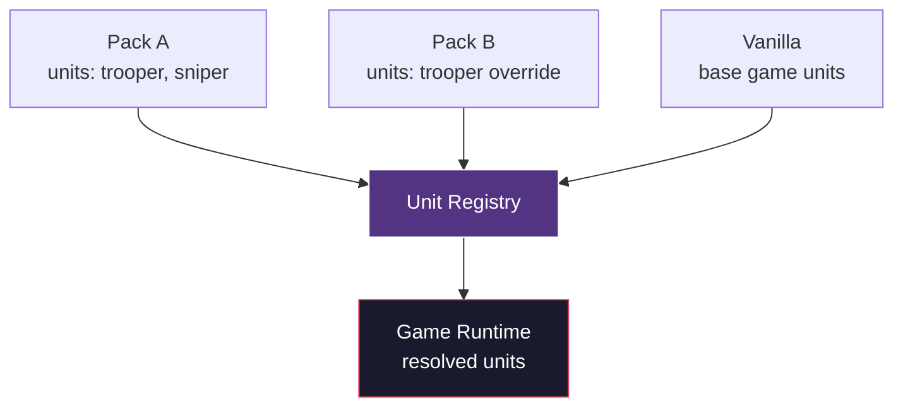

# Registry System

Registries are the core extensibility mechanism in DINOForge. Every moddable content type flows through a registry.

## What is a Registry?

A registry is a typed, priority-layered dictionary that maps content IDs to definitions. When a pack declares units, factions, weapons, or buildings, those definitions enter the appropriate registry.



## Supported Registries

| Registry | Content Type | Schema |
|----------|-------------|--------|
| Units | Infantry, vehicles, artillery, heroes | `unit.schema.yaml` |
| Buildings | Barracks, defenses, economy, research | `building.schema.json` |
| Weapons | Ballistic, explosive, beam, melee | `weapon.schema.json` |
| Projectiles | Tracers, rockets, blasters, shells | `projectile.schema.json` |
| Factions | Faction identity, roster, economy, visuals | `faction.schema.yaml` |
| Doctrines | Combat doctrine modifiers | `doctrine.schema.json` |
| Skills | Unit abilities and special actions | `skill.schema.json` |
| Waves | Enemy wave composition templates | `wave.schema.json` |
| Squads | Squad formation definitions | `squad.schema.json` |

## Priority Layers

Content is resolved through ordered layers:

| Priority | Layer | Description |
|----------|-------|-------------|
| 0 | Base Game | Vanilla DINO values |
| 100 | Framework | DINOForge defaults |
| 200 | Domain Plugin | Warfare/Economy plugin values |
| 300+ | Pack | Mod pack overrides |

Higher priority wins. Within the same priority, `load_order` in the pack manifest breaks ties (lower `load_order` = loads first = lower priority within the tier).

## Conflict Detection

When two packs at the same priority modify the same registry entry, the system detects a conflict:

```
CONFLICT: Unit "clone_trooper" defined by both
  - pack "starwars-republic" (load_order: 100)
  - pack "starwars-alt-republic" (load_order: 100)
```

Resolution strategies:
- **Last-write-wins** — Higher `load_order` takes precedence (default)
- **Explicit conflict** — Packs declare `conflicts_with` to prevent co-loading
- **Merge** — Future: field-level merge for compatible partial overrides

## Registry Operations

Packs interact with registries through their manifests:

### Adding New Entries

```yaml
loads:
  units:
    - clone_trooper
    - arc_trooper
```

These add new entries to the Unit Registry.

### Overriding Existing Entries

```yaml
overrides:
  units:
    - vanilla_archer    # replaces the base game archer
```

Overrides replace existing entries at the pack's priority level.

## Implementation

The SDK provides a generic `Registry&lt;T&gt;` class:

```csharp
public class Registry<T> where T : IRegistryEntry
{
    void Register(string id, T entry, int priority);
    T? Resolve(string id);
    IReadOnlyList<T> GetAll();
    IReadOnlyList<RegistryConflict> GetConflicts();
}
```

All registries are populated during pack loading, before the game simulation starts. This allows full validation and conflict detection at boot time rather than during gameplay.
