# MCP Bridge & Automation Tools

DINOForge includes a FastMCP Python server with **21 game interaction tools** for autonomous agent-driven game automation and testing. All tools are accessible via Claude Code's MCP (Model Context Protocol) transport.

## Architecture

```mermaid
graph LR
    Claude["Claude Code<br/>(agent)"] -->|MCP over HTTP| MCP["FastMCP Server<br/>Port 8765"]
    MCP -->|Named Pipes| GameCtl["GameControlCli<br/>(capture)"]
    MCP -->|Win32 APIs| Game["DINO Game<br/>(target)"]
    GameCtl -->|GPU backbuffer| Capture["Screenshot"]
    MCP -->|Win32 SendInput| Input["Keyboard/Mouse"]
    MCP -->|BepInEx Bridge| Debug["Debug Log"]

    style Claude fill:#0f3460
    style MCP fill:#533483
    style GameCtl fill:#e94560
    style Game fill:#2b9348
```



The server is implemented in `src/Tools/DinoforgeMcp/dinoforge_mcp/server.py` (872 lines, 21 tools).

## Launching the MCP Server

### Automatic (Recommended)

The server auto-starts via Claude Code CC hooks:

```bash
# From within Claude Code IDE
./scripts/start-mcp.ps1 -Action start -Detached
```

### Manual

```bash
cd src/Tools/DinoforgeMcp
python -m dinoforge_mcp.server
```

The server listens on `http://127.0.0.1:8765` and provides tools via HTTP/SSE transport.

---

## Game Control Tools (8 tools)

### game_launch

Launch the DINO game executable directly (bypasses Steam, supports concurrent instances).

**Parameters:**
- `hidden` (bool, optional) — Use Win32 CreateDesktop for isolated launch (invisible to user). Default: false
- `wait_for_world` (int, optional) — Seconds to wait for ECS world initialization. Default: 30

**Returns:**
- `success` (bool) — Launch succeeded
- `message` (string) — Status message ("Game launched successfully", "Game already running", etc.)
- `process_id` (int) — Windows process ID if successful
- `error` (string, optional) — Error message if failed

**Example:**
```python
# Launch visible
game_launch(hidden=False, wait_for_world=30)

# Launch hidden on isolated desktop (for automated testing)
game_launch(hidden=True, wait_for_world=20)
```

---

### game_status

Get current game runtime status (running state, entity count, loaded packs).

**Returns:**
- `is_running` (bool) — Game process active
- `ecs_ready` (bool) — ECS world initialized
- `entity_count` (int) — Total entities in Default World
- `loaded_packs` (string[]) — Currently loaded pack IDs
- `error` (string, optional) — Error if game not running

**Example:**
```python
status = game_status()
if status['ecs_ready']:
    print(f"Entities: {status['entity_count']}")
    print(f"Packs: {status['loaded_packs']}")
```

---

### game_query_entities

Query ECS entities by component type. Critical for testing entity state.

**Parameters:**
- `component_type` (string) — Component class name (e.g., "Health", "ArmorData", "BuildingBase")
- `count_only` (bool, optional) — Return only count, not full data. Default: false
- `max_results` (int, optional) — Limit results. Default: 100

**Returns:**
- `entities` (object[]) — Array of entity objects with component data
- `count` (int) — Total matching entities
- `error` (string, optional)

**Example:**
```python
# Count archer units with Health component
archers = game_query_entities(component_type="Health", count_only=True)
print(f"Living units: {archers['count']}")

# Get full entity data for first 10
entities = game_query_entities(component_type="ArmorData", max_results=10)
for entity in entities['entities']:
    print(entity)
```

---

### game_get_stat

Read a stat value on a specific entity.

**Parameters:**
- `entity_id` (int) — Entity ID to query
- `stat_name` (string) — Stat field name (e.g., "Health", "Damage", "Speed")

**Returns:**
- `value` (any) — Stat value
- `error` (string, optional)

**Example:**
```python
result = game_get_stat(entity_id=12345, stat_name="Health")
print(f"HP: {result['value']}")
```

---

### game_apply_override

Apply a stat override to an entity (for live testing balance changes).

**Parameters:**
- `entity_id` (int) — Target entity
- `stat_path` (string) — Stat field path (e.g., "stats.damage", "health.current")
- `value` (any) — New value

**Returns:**
- `success` (bool)
- `error` (string, optional)

**Example:**
```python
# Double archer damage for testing
game_apply_override(entity_id=12345, stat_path="stats.damage", value=50)
```

---

### game_reload_packs

Hot-reload pack manifests without restarting the game.

**Parameters:**
- `pack_ids` (string[], optional) — Specific packs to reload. Default: all packs

**Returns:**
- `reloaded_count` (int) — Number of packs reloaded
- `error` (string, optional)

**Example:**
```python
# Reload all packs
result = game_reload_packs()
print(f"Reloaded: {result['reloaded_count']} packs")

# Reload specific pack
game_reload_packs(pack_ids=["warfare-starwars"])
```

---

### game_wait_for_world

Wait for ECS world to be ready (blocks until initialized).

**Parameters:**
- `timeout_seconds` (int, optional) — Max wait time. Default: 30

**Returns:**
- `ready` (bool) — World initialized before timeout
- `elapsed` (float) — Seconds elapsed
- `error` (string, optional)

**Example:**
```python
# Wait up to 15 seconds for world
result = game_wait_for_world(timeout_seconds=15)
if result['ready']:
    print(f"Ready in {result['elapsed']:.2f}s")
```

---

### game_dump_state

Trigger entity dump to file for offline analysis.

**Parameters:**
- `output_path` (string, optional) — Dump file location. Default: BepInEx log directory

**Returns:**
- `file_path` (string) — Path to written dump
- `entity_count` (int) — Entities dumped
- `error` (string, optional)

**Example:**
```python
result = game_dump_state()
print(f"Dumped {result['entity_count']} entities to {result['file_path']}")
```

---

## Screenshot & Analysis Tools (3 tools)

### game_screenshot

Capture a screenshot of the game window.

**Parameters:**
- `save_to_path` (string, optional) — Save location (auto-generates if omitted)
- `include_ui` (bool, optional) — Include UI overlays. Default: true

**Returns:**
- `file_path` (string) — PNG file path
- `resolution` (string) — "WIDTHxHEIGHT" format
- `error` (string, optional)

**Example:**
```python
result = game_screenshot(include_ui=True)
print(f"Screenshot: {result['file_path']} ({result['resolution']})")
```

---

### game_analyze_screen

Capture screenshot and detect UI elements via OmniParser (VLM-based).

**Parameters:**
- `detect_elements` (bool, optional) — Run OmniParser. Default: true
- `save_annotated` (bool, optional) — Save annotated screenshot. Default: true

**Returns:**
- `screenshot_path` (string) — Raw screenshot
- `annotations_path` (string, optional) — Annotated screenshot with bounding boxes
- `elements` (object[]) — Detected UI elements with bounds
  - `text` (string) — Element label
  - `bbox` (int[4]) — [x, y, width, height]
  - `type` (string) — "button", "slider", "text_field", "health_bar", etc.
- `error` (string, optional)

**Example:**
```python
result = game_analyze_screen(detect_elements=True)
for element in result['elements']:
    print(f"{element['type']}: {element['text']} at {element['bbox']}")
```

---

### game_wait_and_screenshot

Poll for visual change, then capture screenshot (useful for waiting for animations).

**Parameters:**
- `timeout_seconds` (int, optional) — Max wait time. Default: 10
- `check_interval` (float, optional) — Poll interval in seconds. Default: 0.5
- `threshold` (float, optional) — Pixel difference threshold (0-1). Default: 0.05

**Returns:**
- `screenshot_path` (string)
- `changed` (bool) — Visual change detected
- `elapsed` (float) — Time waited
- `error` (string, optional)

**Example:**
```python
# Wait up to 5 seconds for visual change (unit death animation, etc.)
result = game_wait_and_screenshot(timeout_seconds=5, threshold=0.1)
if result['changed']:
    print(f"Visual change detected in {result['elapsed']:.2f}s")
```

---

## Input & Navigation Tools (3 tools)

### game_input

Inject keyboard or mouse input to game without requiring focus (Win32 SendInput).

**Parameters:**
- `input_type` (string) — "keyboard", "mouse", "click"
- `key` (string, optional) — Key name for keyboard (e.g., "F9", "Escape", "Return")
- `modifiers` (string[], optional) — ["shift", "ctrl", "alt"]
- `x` (int, optional) — Mouse X coordinate
- `y` (int, optional) — Mouse Y coordinate
- `button` (string, optional) — "left", "right", "middle" for clicks

**Returns:**
- `success` (bool)
- `error` (string, optional)

**Example:**
```python
# Press F10 to open mod menu
game_input(input_type="keyboard", key="F10")

# Click at screen coordinates
game_input(input_type="click", x=640, y=360, button="left")

# Ctrl+S
game_input(input_type="keyboard", key="s", modifiers=["ctrl"])
```

---

### game_navigate_to

Navigate to a specific game state via input sequences (main menu, gameplay, pause).

**Parameters:**
- `target_state` (string) — "main_menu", "gameplay", "pause_menu", "settings"
- `timeout_seconds` (int, optional) — Max wait time. Default: 30

**Returns:**
- `reached` (bool) — Successfully navigated to target state
- `current_state` (string) — Actual game state
- `error` (string, optional)

**Example:**
```python
# Navigate to gameplay
result = game_navigate_to(target_state="gameplay", timeout_seconds=20)
if result['reached']:
    print("Gameplay reached")
else:
    print(f"Still in: {result['current_state']}")
```

---

### game_ui_automation

Automate game UI interactions (click buttons, select dropdowns, enter text).

**Parameters:**
- `action` (string) — "click", "select", "type", "scroll"
- `element_type` (string) — "button", "dropdown", "text_field", "slider"
- `element_label` (string) — UI element text/label to target
- `value` (string, optional) — For select/type actions

**Returns:**
- `success` (bool)
- `element_found` (bool)
- `error` (string, optional)

**Example:**
```python
# Click Mods button in menu
game_ui_automation(action="click", element_type="button", element_label="Mods")

# Select faction dropdown
game_ui_automation(
    action="select",
    element_type="dropdown",
    element_label="Faction",
    value="Republic"
)
```

---

## Validation & Verification Tools (4 tools)

### game_verify_mod

Verify that a mod/pack is loaded and active in game.

**Parameters:**
- `pack_id` (string) — Pack ID to verify
- `check_entities` (bool, optional) — Query ECS to confirm entities loaded. Default: true

**Returns:**
- `is_loaded` (bool) — Pack in RuntimeModPlatform
- `is_enabled` (bool) — Pack not disabled in config
- `entity_count` (int, optional) — Associated entities
- `error` (string, optional)

**Example:**
```python
result = game_verify_mod(pack_id="warfare-starwars", check_entities=True)
if result['is_loaded'] and result['is_enabled']:
    print(f"Pack loaded with {result['entity_count']} entities")
```

---

### game_get_component_map

Get the component mapping registry (vanilla DINO component → DINOForge definition).

**Parameters:**
- None

**Returns:**
- `mappings` (object) — Component type name → definition
  - `vanilla_type` (string) — DINO component class
  - `mapped_to` (string) — DINOForge registry key
  - `stat_fields` (string[]) — Readable/writable stats
- `error` (string, optional)

**Example:**
```python
mappings = game_get_component_map()
for vanilla_type, mapping in mappings['mappings'].items():
    print(f"{vanilla_type} → {mapping['mapped_to']}: {mapping['stat_fields']}")
```

---

### game_get_resources

Get current game resources (food, wood, population, etc.).

**Parameters:**
- None

**Returns:**
- `resources` (object) — Current resource values
  - `food` (int)
  - `wood` (int)
  - `population` (int)
  - `population_cap` (int)
  - (additional resource fields per game)
- `error` (string, optional)

**Example:**
```python
res = game_get_resources()
print(f"Food: {res['resources']['food']}/{res['resources'].get('food_cap', '?')}")
```

---

### game_launch_test

Launch a second, isolated test instance (requires `_TEST` install).

**Parameters:**
- `hidden` (bool, optional) — Isolated desktop. Default: true
- `wait_for_world` (int, optional) — Seconds to wait. Default: 30

**Returns:**
- `success` (bool)
- `process_id` (int, optional)
- `test_instance_path` (string) — Test game directory
- `error` (string, optional)

**Example:**
```python
# Launch isolated test instance
result = game_launch_test(hidden=True, wait_for_world=20)
if result['success']:
    print(f"Test instance running (PID {result['process_id']})")
```

---

## Pack & Asset Tools (4 tools)

### pack_validate

Validate a pack's YAML structure, schemas, and dependencies.

**Parameters:**
- `pack_path` (string) — Path to pack directory

**Returns:**
- `valid` (bool)
- `errors` (string[]) — Validation failures
- `warnings` (string[]) — Non-critical issues
- `stats` (object) — Pack metadata

**Example:**
```python
result = pack_validate(pack_path="packs/my-pack")
if result['valid']:
    print("Pack valid")
else:
    for error in result['errors']:
        print(f"ERROR: {error}")
```

---

### pack_build

Build a pack for deployment (compile YAML, bundle assets, create distributable).

**Parameters:**
- `pack_path` (string)
- `output_dir` (string, optional) — Output location

**Returns:**
- `success` (bool)
- `output_path` (string) — Built pack location
- `error` (string, optional)

**Example:**
```python
result = pack_build(pack_path="packs/warfare-starwars")
if result['success']:
    print(f"Built: {result['output_path']}")
```

---

### asset_validate

Validate asset files (models, textures, bundles).

**Parameters:**
- `asset_path` (string) — Asset file path
- `asset_type` (string, optional) — "model", "texture", "bundle", "audio"

**Returns:**
- `valid` (bool)
- `warnings` (string[])
- `metadata` (object, optional) — Asset details (polycount, resolution, etc.)
- `error` (string, optional)

**Example:**
```python
result = asset_validate(asset_path="packs/pack/assets/models/unit.glb", asset_type="model")
print(f"Valid: {result['valid']}")
print(f"Metadata: {result['metadata']}")
```

---

### asset_import

Import and normalize an asset (GLB/FBX → DINOForge format).

**Parameters:**
- `source_path` (string) — Source file (GLB, FBX, etc.)
- `output_name` (string) — Output asset ID
- `normalize` (bool, optional) — Apply normalization. Default: true

**Returns:**
- `success` (bool)
- `output_path` (string)
- `polycount` (int, optional)
- `error` (string, optional)

**Example:**
```python
result = asset_import(
    source_path="./clone_trooper.glb",
    output_name="sw-rep-clone-trooper",
    normalize=True
)
if result['success']:
    print(f"Imported: {result['polycount']} polys")
```

---

## Logging & Debug Tools (2 tools)

### log_tail

Stream game debug log (DINOForge runtime logs).

**Parameters:**
- `lines` (int, optional) — Lines to return. Default: 50
- `level` (string, optional) — "error", "warning", "info", "debug". Default: "info"

**Returns:**
- `logs` (string[]) — Log lines
- `error` (string, optional)

**Example:**
```python
result = log_tail(lines=100, level="error")
for line in result['logs']:
    print(line)
```

---

### notify_hmr

Trigger hot-reload via HMR signal (write DINOForge_HotReload file).

**Parameters:**
- None

**Returns:**
- `success` (bool)
- `error` (string, optional)

**Example:**
```python
# Soft-reload packs without game restart
result = notify_hmr()
if result['success']:
    print("HMR triggered")
```

---

## Tool Summary by Category

| Category | Count | Purpose |
|----------|-------|---------|
| Game Control | 8 | Launch, status, query, override, reload, wait, dump |
| Screenshots | 3 | Capture, analyze (OmniParser), poll for changes |
| Input | 3 | Keyboard/mouse, navigation sequences, UI automation |
| Validation | 4 | Verify mods, component map, resources, test instance |
| Packs/Assets | 4 | Validate, build, import assets |
| Logging | 2 | Log streaming, HMR notification |
| **Total** | **21** | **Complete game automation suite** |

---

## Common Workflows

### Autonomous Feature Test

```python
# 1. Launch game
game_launch(hidden=False, wait_for_world=30)

# 2. Wait for world ready
game_wait_for_world(timeout_seconds=20)

# 3. Reload packs
game_reload_packs(pack_ids=["my-pack"])

# 4. Verify mod loaded
game_verify_mod(pack_id="my-pack", check_entities=True)

# 5. Query entities
entities = game_query_entities(component_type="Health", count_only=True)

# 6. Capture screenshot
screenshot = game_screenshot(include_ui=True)

# 7. Analyze screen
analysis = game_analyze_screen(detect_elements=True)

# 8. Verify UI elements
for elem in analysis['elements']:
    print(f"Found {elem['type']}: {elem['text']}")
```

### Balance Testing

```python
# Launch test instance
game_launch_test(hidden=True, wait_for_world=15)

# Query archer units
archers = game_query_entities(component_type="Health")

# Override damage for first archer
game_apply_override(
    entity_id=archers['entities'][0]['id'],
    stat_path="stats.damage",
    value=50
)

# Verify override applied
result = game_get_stat(entity_id=archers['entities'][0]['id'], stat_name="Damage")
print(f"Damage after override: {result['value']}")
```

### Pack Development Cycle

```python
# Validate pack
validation = pack_validate(pack_path="packs/my-pack")
if not validation['valid']:
    for error in validation['errors']:
        print(f"Fix: {error}")
    exit(1)

# Build pack
build = pack_build(pack_path="packs/my-pack")
print(f"Built to: {build['output_path']}")

# Reload in game
game_reload_packs(pack_ids=["my-pack"])

# Verify
game_verify_mod(pack_id="my-pack", check_entities=True)
```

---

## Error Handling

All tools return an `error` field on failure. Check it before using results:

```python
result = game_query_entities(component_type="Health")
if result.get('error'):
    print(f"Query failed: {result['error']}")
else:
    for entity in result['entities']:
        process(entity)
```

---

## Advanced: Custom Scripting

Build complex test scenarios by chaining tools:

```python
import time

def test_pack_gameplay():
    """End-to-end pack testing workflow."""

    # 1. Launch
    game_launch(wait_for_world=20)

    # 2. Load pack
    game_reload_packs(pack_ids=["warfare-starwars"])
    game_verify_mod(pack_id="warfare-starwars")

    # 3. Navigate to gameplay
    game_navigate_to(target_state="gameplay", timeout_seconds=30)

    # 4. Take screenshot and analyze
    screenshot = game_screenshot()
    analysis = game_analyze_screen()

    # 5. Verify UI elements
    mods_button = next(
        (e for e in analysis['elements'] if e['text'] == 'Mods'),
        None
    )
    assert mods_button, "Mods button not found!"

    # 6. Get state
    status = game_status()
    print(f"✓ Pack loaded: {status['loaded_packs']}")
    print(f"✓ Entities: {status['entity_count']}")
    print(f"✓ UI verified")

test_pack_gameplay()
```

---

## See Also

- [Architecture](/concepts/architecture) — System design
- [Quick Start](/guide/quick-start) — First pack creation
- [Getting Started](/guide/getting-started) — Installation
