# Asset Pipeline Reference

This document describes the complete asset pipeline system in DINOForge, including the `asset_pipeline.yaml` configuration format and all related CLI commands.

## Overview

The asset pipeline automates the workflow of importing 3D models, textures, and VFX from source files (GLB/FBX) into Unity Addressables, with automatic LOD (Level of Detail) generation, material application, and definition injection.

**Key principle**: All asset operations must go through PackCompiler, never fragmented tools.

## Unified Asset Workflow

The mandatory workflow sequence (in order):

```mermaid
graph LR
    A["1. Define<br/>asset_pipeline.yaml"] --> B["2. Download<br/>sync download"]
    B --> C["3. Import<br/>assets import"]
    C --> D["4. Validate<br/>assets validate"]
    D --> E["5. Optimize<br/>assets optimize"]
    E --> F["6. Generate<br/>assets generate"]
    F --> G["7. Verify<br/>assets build"]
    G --> H["8. Commit<br/>git commit"]

    style A fill:#2b9348
    style B fill:#1b7340
    style C fill:#0f5f3f
    style D fill:#0a4d2e
    style E fill:#073b1f
    style F fill:#052914
    style G fill:#0f3460
    style H fill:#533483
```



## asset_pipeline.yaml Configuration

### File Location

```
packs/<pack-id>/asset_pipeline.yaml
```

### Required Top-Level Fields

#### version
- **Type**: `string`
- **Pattern**: `^\d+\.\d+$`
- **Description**: Schema version (e.g., `1.0`)
- **Example**: `1.0`

```yaml
version: "1.0"
```

#### pack_id
- **Type**: `string`
- **Pattern**: `^[a-z0-9-]+$`
- **Description**: Pack identifier. Must match the `id` field in `pack.yaml`.
- **Example**: `warfare-starwars`

```yaml
pack_id: warfare-starwars
```

#### target_unity_version
- **Type**: `string`
- **Pattern**: `^\d+\.\d+\.\d+`
- **Description**: Target Unity version (must match DINO's Unity version)
- **Default**: `2021.3.45f2`
- **Example**: `2021.3.45f2`

```yaml
target_unity_version: "2021.3.45f2"
```

#### asset_settings
- **Type**: `object`
- **Description**: Global asset import settings

##### asset_settings.base_path
- **Type**: `string`
- **Description**: Relative path to assets directory
- **Example**: `assets/`

##### asset_settings.output_path
- **Type**: `string`
- **Description**: Relative path to Unity Assets/ output directory
- **Example**: `Assets/DINOForge/Models/`

##### asset_settings.materials_path
- **Type**: `string`
- **Description**: Relative path to materials subdirectory
- **Example**: `assets/materials/`

##### asset_settings.texture_quality
- **Type**: `enum`
- **Values**: `low`, `medium`, `high`
- **Description**: Texture compression quality
- **Example**: `high`

##### asset_settings.lod_strategy
- **Type**: `enum`
- **Values**: `aggressive`, `balanced`, `conservative`
- **Description**: LOD reduction strategy
  - **aggressive**: LOD0=100%, LOD1=60%, LOD2=30% (maximum optimization)
  - **balanced**: LOD0=100%, LOD1=70%, LOD2=40% (recommended)
  - **conservative**: LOD0=100%, LOD1=80%, LOD2=60% (minimal reduction)
- **Example**: `balanced`

```yaml
asset_settings:
  base_path: assets/
  output_path: Assets/DINOForge/Models/
  materials_path: assets/materials/
  texture_quality: high
  lod_strategy: balanced
```

#### materials
- **Type**: `object`
- **Description**: Material definitions for faction-specific colors, emission, and physical properties

**Each key is a material template name**:
```yaml
materials:
  republic_clone:
    faction: republic
    base_color: "#4169E1"        # Royal blue
    emission_color: "#0066FF"
    emission_intensity: 1.5
    roughness: 0.4
    metallic: 0.7

  cis_droid:
    faction: cis
    base_color: "#B8860B"        # Dark goldenrod
    emission_color: "#FFD700"
    emission_intensity: 2.0
    roughness: 0.3
    metallic: 0.9
```

**Material fields**:

| Field | Type | Range | Description |
|-------|------|-------|-------------|
| `faction` | string | — | Faction this material applies to |
| `base_color` | string | `#RRGGBB` | Primary color in hex format |
| `emission_color` | string | `#RRGGBB` | Glow color in hex format |
| `emission_intensity` | number | 0-5 | Glow strength multiplier |
| `roughness` | number | 0-1 | Surface roughness (optional, default 0.5) |
| `metallic` | number | 0-1 | Metallic amount (optional, default 0) |

#### phases
- **Type**: `object`
- **Description**: Asset import phases (v0.7.0, v0.8.0, etc.)

**Each key is a phase identifier**:
```yaml
phases:
  v0_7_0:
    description: Initial Star Wars unit assets - 9 models
    models: [...]  # array of AssetDefinition objects

  v0_8_0:
    description: Additional hero units - 4 models
    models: [...]
```

**Phase fields**:

| Field | Type | Description |
|-------|------|-------------|
| `description` | string | Human-readable phase description |
| `models` | array | Array of AssetDefinition objects (see below) |

#### build
- **Type**: `object`
- **Description**: Build output and performance configuration

##### build.output_directory
- **Type**: `string`
- **Description**: Base output directory for generated artifacts
- **Example**: `Assets/DINOForge/Generated/`

##### build.addressables_output
- **Type**: `string`
- **Description**: Output file path for Addressables catalog YAML
- **Example**: `packs/warfare-starwars/addressables.yaml`

##### build.log_file
- **Type**: `string`
- **Description**: Build log output file
- **Example**: `build_log.txt`

##### build.generate_html_report
- **Type**: `boolean`
- **Description**: Generate HTML build report
- **Example**: `true`

##### build.performance_targets
- **Type**: `object`
- **Description**: Performance targets for pipeline stages

```yaml
build:
  output_directory: Assets/DINOForge/Generated/
  addressables_output: packs/warfare-starwars/addressables.yaml
  log_file: build.log
  generate_html_report: true

  performance_targets:
    import_time_sec: 5              # max 5 seconds per model
    lod_generation_sec: 8           # max 8 seconds per LOD gen
    prefab_generation_sec: 3        # max 3 seconds per prefab
    total_pipeline_sec: 300         # max 5 minutes total
```

### Asset Definition (Model Configuration)

Each model in a phase is defined as an AssetDefinition object with the following structure:

#### id
- **Type**: `string`
- **Pattern**: `^[a-z0-9_]+$`
- **Description**: Unique asset identifier
- **Example**: `clone_trooper`, `b1_droid`, `at_st_walker`

#### file
- **Type**: `string`
- **Description**: Path to GLB/FBX file (relative to `base_path`)
- **Example**: `clone_trooper.glb`, `units/b1_droid.fbx`

#### type
- **Type**: `enum`
- **Values**: `infantry`, `hero`, `heavy`, `elite`, `specialized`, `vehicle`, `building`, `projectile`, `effect`
- **Description**: Asset category
- **Example**: `infantry`

#### faction
- **Type**: `string`
- **Description**: Faction this asset belongs to
- **Example**: `republic`, `cis`

#### polycount_target
- **Type**: `integer`
- **Range**: 100-500000
- **Description**: Target polycount for LOD0 (highest quality)
- **Typical values**:
  - **500-2000**: Infantry units
  - **2000-5000**: Heroes, heavy units
  - **5000-15000**: Vehicles, large structures
  - **15000+**: Complex buildings, environmental

#### scale
- **Type**: `number`
- **Range**: 0.1-10
- **Default**: 1.0
- **Description**: Scale multiplier applied on import

#### lod
- **Type**: `object`
- **Description**: LOD generation configuration

##### lod.enabled
- **Type**: `boolean`
- **Default**: `true`
- **Description**: Enable LOD generation

##### lod.levels
- **Type**: `array` of integers
- **Range**: 1-100 (percentages)
- **Min items**: 1
- **Max items**: 5
- **Description**: LOD polycount percentages
- **Examples**:
  - `[100, 60, 30]` — 3 LOD levels
  - `[100, 70, 40, 20]` — 4 LOD levels
  - `[100]` — Single LOD, no reduction

##### lod.screen_sizes
- **Type**: `array` of integers
- **Range**: 0-100 (screen percentages)
- **Description**: Screen percentage thresholds for LOD transitions
- **Example**: `[80, 40, 10]` — LOD0 at 80%+ screen, LOD1 at 40%+, LOD2 at 10%+

```yaml
lod:
  enabled: true
  levels: [100, 60, 30]
  screen_sizes: [80, 40, 10]
```

#### material
- **Type**: `string`
- **Description**: Material template to apply (key from `materials` section)
- **Example**: `republic_clone`, `cis_droid`

#### addressable_key
- **Type**: `string`
- **Pattern**: `^sw-[a-z0-9-]+$`
- **Description**: Addressables key for runtime loading
- **Example**: `sw-clone-trooper-lod0`

#### output_prefab
- **Type**: `string`
- **Description**: Output path for generated prefab
- **Example**: `Assets/DINOForge/Models/clone_trooper.prefab`

#### update_definition
- **Type**: `object` (optional)
- **Description**: Automatically inject visual_asset reference into unit/building YAML

##### update_definition.enabled
- **Type**: `boolean`
- **Default**: `false`
- **Description**: Enable definition update injection

##### update_definition.file
- **Type**: `string`
- **Description**: Path to YAML definition file to update
- **Example**: `units/clone_trooper.yaml`

##### update_definition.id
- **Type**: `string`
- **Description**: Definition ID to update (must match unit/building id)
- **Example**: `clone_trooper`

##### update_definition.field
- **Type**: `string`
- **Description**: YAML field to inject (typically `visual_asset`)
- **Example**: `visual_asset`

```yaml
update_definition:
  enabled: true
  file: units/clone_trooper.yaml
  id: clone_trooper
  field: visual_asset
```

#### metadata
- **Type**: `object` (optional)
- **Description**: Custom metadata (author, source URL, license, etc.)

```yaml
metadata:
  author: Sketchfab Artist
  source_url: https://sketchfab.com/models/abc123
  license: CC-BY
  source_date: "2024-03-10"
```

## Complete asset_pipeline.yaml Example

```yaml
version: "1.0"
pack_id: warfare-starwars
target_unity_version: "2021.3.45f2"

asset_settings:
  base_path: assets/
  output_path: Assets/DINOForge/Models/
  materials_path: assets/materials/
  texture_quality: high
  lod_strategy: balanced

materials:
  republic_clone:
    faction: republic
    base_color: "#4169E1"
    emission_color: "#0066FF"
    emission_intensity: 1.5
    roughness: 0.4
    metallic: 0.7

  cis_droid:
    faction: cis
    base_color: "#B8860B"
    emission_color: "#FFD700"
    emission_intensity: 2.0
    roughness: 0.3
    metallic: 0.9

phases:
  v0_7_0:
    description: Initial Star Wars unit assets
    models:
      - id: clone_trooper
        file: clone_trooper.glb
        type: infantry
        faction: republic
        polycount_target: 2000
        scale: 1.0
        lod:
          enabled: true
          levels: [100, 60, 30]
          screen_sizes: [80, 40, 10]
        material: republic_clone
        addressable_key: sw-clone-trooper-lod0
        output_prefab: Assets/DINOForge/Models/clone_trooper.prefab
        update_definition:
          enabled: true
          file: units/clone_trooper.yaml
          id: clone_trooper
          field: visual_asset
        metadata:
          source: Sketchfab
          author: 3D Artist
          license: CC-BY

      - id: b1_droid
        file: b1_droid.glb
        type: infantry
        faction: cis
        polycount_target: 1800
        scale: 1.0
        lod:
          enabled: true
          levels: [100, 65, 35]
        material: cis_droid
        addressable_key: sw-b1-droid-lod0
        output_prefab: Assets/DINOForge/Models/b1_droid.prefab
        update_definition:
          enabled: true
          file: units/b1_droid.yaml
          id: b1_droid
          field: visual_asset

build:
  output_directory: Assets/DINOForge/Generated/
  addressables_output: packs/warfare-starwars/addressables.yaml
  log_file: build.log
  generate_html_report: true

  performance_targets:
    import_time_sec: 5
    lod_generation_sec: 8
    prefab_generation_sec: 3
    total_pipeline_sec: 300
```

## CLI Commands

### Validate Configuration

```bash
dotnet run --project src/Tools/PackCompiler -- assets validate <pack>
```

Validates `asset_pipeline.yaml` against schema:
- Required fields present
- Correct types
- Valid enum values
- File references exist

### Import Assets

```bash
dotnet run --project src/Tools/PackCompiler -- assets import <pack>
```

Imports GLB/FBX files to JSON intermediate format using AssimpNet.

### Optimize (LOD Generation)

```bash
dotnet run --project src/Tools/PackCompiler -- assets optimize <pack>
```

Generates LOD variants by decimating meshes based on `lod.levels`.

### Generate Prefabs

```bash
dotnet run --project src/Tools/PackCompiler -- assets generate <pack>
```

Creates Unity `.prefab` files from JSON with materials applied.

### Download Assets

```bash
dotnet run --project src/Tools/PackCompiler -- sync download <pack> --phase <phase-id>
```

Downloads assets for a specific phase from configured source (Sketchfab, etc.).

### Full Pipeline Build

```bash
dotnet run --project src/Tools/PackCompiler -- assets build <pack>
```

Runs complete pipeline: validate → import → optimize → generate → verify.

Also:
- Updates `visual_asset` fields in unit/building definitions
- Generates Addressables catalog YAML
- Creates HTML build report
- Verifies performance targets

### Generate VFX

```bash
dotnet run --project src/Tools/PackCompiler -- vfx generate <pack>
```

Wraps VFXPrefabGenerator to create visual effects (explosions, beam attacks, etc.).

## Addressables Integration

The asset pipeline automatically generates `addressables.yaml` with entries like:

```yaml
addressables:
  - key: sw-clone-trooper-lod0
    path: Assets/DINOForge/Models/clone_trooper.prefab
    labels: [republic, infantry, unit]

  - key: sw-b1-droid-lod0
    path: Assets/DINOForge/Models/b1_droid.prefab
    labels: [cis, infantry, unit]
```

At runtime, the SDK's `AssetService` loads these by key:

```csharp
var trooper = await assetService.LoadAssetAsync("sw-clone-trooper-lod0");
```

## Definition Injection

When `update_definition.enabled: true`, the asset pipeline injects the `visual_asset` key into unit YAML:

Before (from phase):
```yaml
id: clone_trooper
display_name: Clone Trooper
# ... rest of fields
```

After (post-build):
```yaml
id: clone_trooper
display_name: Clone Trooper
visual_asset: sw-clone-trooper-lod0
# ... rest of fields
```

This happens **automatically** — never edit this field manually.

## Best Practices

- **LOD Strategy**: Use `balanced` for most cases, `aggressive` for performance-critical, `conservative` for high-quality art
- **Polycount targets**: Aim for 2000-5000 for typical infantry, 5000-15000 for vehicles
- **Material consistency**: Use same faction color scheme across related units
- **Phases**: Group related assets by content version (v0.7.0, v0.8.0, etc.)
- **Metadata**: Include source, author, and license for all community assets
- **Performance targets**: Set realistic expectations for your hardware
- **Always commit**: Git-track all generated prefabs and addressables YAML

## See Also

- [Creating Packs](/guide/creating-packs)
- [Unit Schema Reference](/reference/unit-schema)
- [Building Schema Reference](/reference/building-schema)
