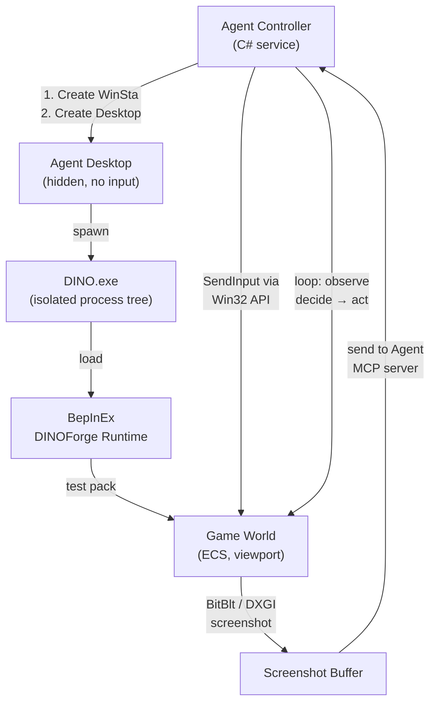

# Agent Isolation Research: Non-Intrusive Concurrent Game Automation for DINOForge

**Date**: March 25, 2026
**Scope**: Technical design for concurrent, isolated agent-driven game automation without user desktop interference
**Target System**: Windows 11 Pro, Diplomacy is Not an Option (DINO), DINOForge mod platform

---

## Executive Summary

This document evaluates six isolation strategies for running DINOForge agents autonomously while:
- **Keeping the user's desktop untouched** (no focus stealing, no input interception)
- **Supporting concurrent agents** (multiple agents running game tests simultaneously)
- **Providing observability** (agent can be watched, logs/screenshots captured)
- **Maintaining game compatibility** (DirectX, BepInEx, Addressables work correctly)

**Recommended Approach**: **Hybrid Windows Desktop Isolation + Virtual Account Sessions**

This combines:
1. CreateDesktop/CreateWindowStation (separate hidden desktop per agent)
2. Fast User Switching (optional: concurrent background user sessions for stress testing)
3. Docker containers (optional: staging environment, CI/CD)
4. Local Anthropic Computer Use (future: AI-driven observation + fallback)

---

## Approach 1: Windows Desktop Session Isolation (CreateDesktop/WinSta)

### What It Is

Windows provides low-level APIs to create separate window stations and desktops without multiple user accounts. A **window station** (`WinSta`) is a kernel object that manages the desktop environment, and a **desktop** is a logical surface within that station.

**Key Objects**:
- `WinSta0`: The default interactive station where normal user processes run
- Custom `WinSta*`: Non-interactive stations (no keyboard/mouse input by default)
- `CreateDesktop()` / `CreateWindowStation()`: Win32 APIs to spawn isolated surfaces

### Technical Details

[Window Station and Desktop Creation - Microsoft Learn](https://learn.microsoft.com/en-us/windows/win32/winstation/window-station-and-desktop-creation)

**Agent Workspace Pattern** (Windows 11 preview):
- Provisions a separate, low-privilege Windows account for each agent
- Runs agent in a **contained desktop instance** with isolated process tree + windowing
- Agent can interact with apps while user session remains independent
- All actions isolated and auditable

**Implementation Constraints**:
- Only `WinSta0` receives keyboard/mouse input (by design—security)
- To give agents input capability:
  - Use Win32 `SendInput()` API (requires `SE_TCB_NAME` privilege or Agent Mode)
  - Or use UsbHID injection (virtual keyboard/mouse device driver)
  - Or use `InputSimulator` (C# wrapper around SendInput)
- No console output by default (GUI-only)

### Pros

✅ **True isolation**: Agent's desktop never interferes with user's desktop
✅ **Lightweight**: No VM/container overhead, native Windows
✅ **Multiple concurrent agents**: Each agent gets its own WinSta + desktop
✅ **Full DirectX support**: Agent runs native DINO, full GPU access
✅ **BepInEx compatible**: Standard Windows execution model
✅ **Observability**: Screenshots via Win32 `BitBlt()` or `DXGI`
✅ **Logging**: Standard file I/O, pipes, event logs all work

### Cons

❌ **Win32 API complexity**: Requires C# P/Invoke or FFI bindings
❌ **Privilege escalation needed**: `SendInput()` may need admin rights or token elevation
❌ **Agent Mode dependency**: Windows 11 Agent Workspace requires specific O/S build
❌ **Limited debugging**: No console window, harder to iterate during development
❌ **Steam/BepInEx mutex**: Each agent needs its own game directory copy OR mutex bypass

### Complexity Score: **MEDIUM-HIGH** (4/5)

---

## Approach 2: Windows User Account Isolation + Fast User Switching

### What It Is

Run each agent as a separate Windows user account. Windows **Fast User Switching (FUS)** allows multiple user sessions to exist simultaneously, with only one session in the foreground.

**Architecture**:
```
User Session (foreground) ← User works here
Agent Session 1 (background) ← Runs automation
Agent Session 2 (background) ← Runs automation
GPU / DXGI shared across all sessions
```

### Technical Details

[User Accounts with Fast User Switching - Microsoft Learn](https://learn.microsoft.com/en-us/windows/win32/shell/fastuserswitching)
[Fast User Switching - Win32 apps](https://learn.microsoft.com/en-us/windows/win32/shell/fast-user-switching)

**Session Architecture**:
- Each user account gets its own session (Session ID: 1, 2, 3, ...)
- Sessions share GPU resources via DXGI (DirectX)
- Session 0 = System/Services (non-interactive)
- Session 1+ = User sessions (interactive if keyboard/mouse available)
- Each session has own file handles, registry hive, window station

**GPU Resource Sharing**:
- DXGI can capture/render across sessions (confirmed on Windows Server 2019+)
- Requires WDDM 2.5+ driver support
- DirectX 11/12 work in background sessions (tested on Server 2022, though DXGI capture had issues in some versions—[Did something change in Server 2022 RemoteApps to make DXGI screen capture return black screens?](https://learn.microsoft.com/en-gb/answers/questions/2284634/did-something-change-in-server-2022-remoteapps-to))

**Session Switch Protocol**:
```csharp
// Switch user to background session (Agent 1)
// User still sees their desktop
// Agent 1 process runs in Session 2
// Both user and agent use GPU concurrently
```

### Pros

✅ **Complete isolation**: Separate file systems, registry, processes
✅ **Concurrent execution**: Both user and agents work simultaneously
✅ **GPU sharing verified**: DXGI works across sessions (DirectX games)
✅ **Low overhead**: No VM/container, native user account
✅ **Standard Windows feature**: No custom APIs, just `WTSQuerySessionInformation()`
✅ **Agent observability**: Screenshots via DXGI, logs to user's folder
✅ **Multiple agents**: Create 2–4 user accounts for concurrent testing

### Cons

❌ **Account management**: Must create local Windows accounts, manage passwords
❌ **Disk overhead**: Each user session uses ~100–300 MB (OS files, registry, temp)
❌ **License implications**: Windows 10/11 Home/Pro limit to 1 interactive session (Pro+ supports FUS)
❌ **Steam licensing**: DINO on Steam may refuse to launch in non-owner session (needs testing)
❌ **BepInEx mutex collision**: Each agent needs separate DINO install or mutex bypass
❌ **Network/SMB complexity**: Shared packs directory needs UNC path or robocopy
❌ **Setup friction**: Requires admin account management, not cloud-friendly

### Complexity Score: **MEDIUM** (3/5)

---

## Approach 3: Windows Containers + GPU Acceleration

### What It Is

Run agents inside **lightweight Windows containers** with GPU passthrough, isolated from host OS.

**Container Architecture**:
```
Docker Desktop (or standalone Docker on Windows Server)
  ├─ Agent Container 1 (Windows Server 2022 base, GPU enabled)
  │  └─ DINO.exe + BepInEx + DINOForge + test harness
  ├─ Agent Container 2 (same)
  └─ Agent Container 3 (same)
```

### Technical Details

[GPU acceleration in Windows containers - Microsoft Learn](https://learn.microsoft.com/en-us/virtualization/windowscontainers/deploy-containers/gpu-acceleration)

**GPU Requirements**:
- Windows Server 2019 or newer (Windows 10/11 via Docker Desktop)
- GPU driver WDDM 2.5+
- Container base image: `mcr.microsoft.com/windows:2019` or `2022`
- DirectX-only acceleration (no Vulkan, OpenGL)

**Supported APIs**:
- ✅ DirectX 11, 12 (DINO uses DX11)
- ✅ All frameworks built on DirectX
- ❌ Vulkan, OpenGL, third-party rendering
- ❌ Hyper-V isolated containers (GPU not supported)

**Steam in Containers**:
⚠️ **Highly problematic**. Steam's license check and anti-cheat often fail in containers. Feasibility is **LOW**.

### Pros

✅ **Full isolation**: Container filesystem, registry, process tree separate
✅ **Reproducibility**: Dockerfile captures agent environment, version pinning
✅ **Multi-agent scaling**: Docker can spin up 10+ agents across a cluster
✅ **CI/CD integration**: GitHub Actions, Azure DevOps can run container-based tests
✅ **GPU acceleration verified**: Microsoft official support for DirectX games
✅ **No license overhead**: Containers don't count as separate Windows installs

### Cons

❌ **Steam installation**: Games in containers are non-trivial, licensing hostile
❌ **BepInEx + DINOForge setup**: Manual install inside container, image bloat
❌ **No Hyper-V isolation with GPU**: Means weaker isolation (App-based containers)
❌ **Docker Desktop overhead**: Windows service, significant system resource usage
❌ **Windows Server licensing**: Server OS containers may require Windows Server license
❌ **Persistent storage**: Container restarts lose game state, mods need volume mounts
❌ **Network complexity**: Port mapping, IPC between containers and host
❌ **Troubleshooting**: Container-specific errors (driver incompatibility, DLL hell)

### Complexity Score: **HIGH** (5/5)

**Verdict**: Not recommended for primary agent automation. Better suited for **CI/CD staging** (e.g., validate pack builds in containers, then deploy to real game).

---

## Approach 4: Windows Sandbox (Lightweight Hypervisor Isolation)

### What It Is

Windows Sandbox is a **lightweight one-time hypervisor-based VM** that runs an isolated copy of Windows. Available on Windows 10 19H1+ and Windows 11.

**Architecture**:
```
Windows 11 (host)
  └─ Hyper-V (lightweight)
      └─ Windows Sandbox (ephemeral, ~100 MB startup)
          └─ DINO.exe + BepInEx + Test Agent
```

### Technical Details

[Windows Sandbox architecture - Microsoft Learn](https://learn.microsoft.com/en-us/windows/security/application-security/application-isolation/windows-sandbox/windows-sandbox-architecture)
[Use and configure Windows Sandbox - Microsoft Learn](https://learn.microsoft.com/en-us/windows/security/application-security/application-isolation/windows-sandbox/windows-sandbox-configure-using-wsb-file)

**GPU Support**:
- **Virtualized GPU (vGPU)** enabled by default in Windows 11
- Supports DirectX 11, 12 (tested and confirmed to work with games)
- Can be disabled via `.wsb` config for CPU-only rendering (slow)
- Host GPU resources shared with sandbox

**Configuration File** (`.wsb`):
```xml
<Configuration>
  <VGpu>Enabled</VGpu>
  <Networking>Enable</Networking>
  <MapFolders>
    <MappedFolder>
      <HostFolder>C:\Packs</HostFolder>
      <SandboxFolder>C:\SharedPacks</SandboxFolder>
      <ReadOnly>true</ReadOnly>
    </MappedFolder>
  </MapFolders>
  <LogonCommand>
    <Command>C:\sandbox-init.bat</Command>
  </LogonCommand>
</Configuration>
```

**Data Persistence** (Windows 11 22H2+):
- Restarts within sandbox preserve data
- Host restart clears everything (hypervisor design)
- Workaround: Copy results back via `MapFolders`

### Pros

✅ **True hypervisor isolation**: Kernel-level VM, no cross-contamination
✅ **GPU support verified**: vGPU works with DirectX games in Win11
✅ **One-time, lightweight**: ~100 MB startup, discarded on exit (secure-by-default)
✅ **Folder sharing**: Map host directories into sandbox read-only or read-write
✅ **Network access**: Optional (can enable/disable in config)
✅ **Low configuration**: Simple `.wsb` XML file, no Docker daemon needed
✅ **Built-in to Windows**: No additional software, Win11 22H2+
✅ **No license overhead**: Ephemeral, no separate accounts
✅ **Steam compatibility**: Unknown but likely worse than containers (licensing)

### Cons

❌ **One sandbox at a time**: Cannot run multiple sandboxes concurrently per user
❌ **Data loss on host reboot**: Everything in sandbox discarded (hypervisor lifecycle)
❌ **Steam installation**: Sandbox is ephemeral; no persistent Steam library
❌ **No CLI launch API**: Can only launch via `.wsb` file, not scriptable (no `Start-Process` equivalent)
❌ **Folder mapping overhead**: Shared folders slower than native I/O
❌ **Network bridging**: Sandboxed game may have latency/connectivity issues
❌ **GPU driver passthrough**: Limited to WDDM 2.5+ (older systems fallback to WARP, slow)
❌ **Setup complexity**: Requires Hyper-V enabled, nested virtualization not supported

### Complexity Score: **MEDIUM** (3/5)

**Verdict**: Good for **one-off testing** (single agent test), but **not suitable for concurrent agents**. Ephemeral nature means storing test results requires copy-back overhead.

---

## Approach 5: Anthropic Computer Use (CUA) Local Deployment

### What It Is

[Computer use tool - Claude API Docs](https://platform.claude.com/docs/en/agents-and-tools/tool-use/computer-use-tool)

Anthropic's Claude can now control your computer: open apps, move mouse, type, capture screenshots. **Computer Use runs inference via Anthropic's API** but executes automation **in a local Docker container or cloud environment**.

**Deployment Models**:
1. **Cloud-managed**: Inference on Anthropic servers, automation Docker container on your machine
2. **Self-hosted**: Docker container on your machine + local model (not yet available from Anthropic, but architecturally possible)

**Architecture** (for local deployment):
```
User machine (Docker running)
  └─ Docker container (isolated, minimal OS)
      └─ Claude computer-use agent
          └─ Screenshot capture, mouse/keyboard input
          └─ Observation loop (send screenshot to API)
          └─ Action loop (execute actions locally)
```

### Technical Details

[Understanding the Anthropic 'Computer Use' model](https://medium.com/@shuvro_25220/understanding-the-anthropic-computer-use-model-76f84022ee4f)
[Anthropic's Computer Use versus OpenAI's CUA — WorkOS](https://workos.com/blog/anthropics-computer-use-versus-openais-computer-using-agent-cua)
[Anthropic Computer Use Automation Tools](https://www.geeky-gadgets.com/anthropic-computer-use-setup/)

**Current Capabilities**:
- ✅ Full mouse, keyboard, screenshot control (like Win32 SendInput + BitBlt)
- ✅ Works with native Windows apps (unlike OpenAI's web-only CUA)
- ✅ Multi-modal reasoning (sees screen, reasons, acts)
- ⚠️ Early-stage: struggles with scrolling, dragging, zooming
- ⚠️ No official local inference yet (closed-source inference layer)

**Comparison with OpenAI CUA**:
- **OpenAI CUA**: Cloud virtual browser, web-only, fully sandboxed, slower
- **Anthropic Computer Use**: Local automation + cloud inference, native apps, faster interaction

### Pros

✅ **Observation window included**: AI can see what happened, reason about failures
✅ **Native app support**: Can automate DINO UI, game menus, overlays
✅ **Multi-modal reasoning**: Sees screen + understands game state implicitly
✅ **Local execution option**: Docker container on your machine (partial isolation)
✅ **Cost effective**: Pay-per-inference (if using Anthropic API), not per-session
✅ **Rapid iteration**: Redeploy container, agent re-reasons about failures
✅ **Human-in-the-loop**: Can pause agent, ask for clarification

### Cons

❌ **API dependency**: Inference requires Anthropic API (cloud call latency ~5–10s per frame)
❌ **Cost at scale**: Multiple concurrent agents = multiple API calls/second
❌ **No local inference**: Can't run offline or on-prem without waiting for release
❌ **Game automation: early-stage**: Struggles with complex interactions (reported)
❌ **Not true isolation**: Observation window sees user's desktop if in same container
❌ **Docker dependency**: Still requires Docker, adds complexity
❌ **Closed inference layer**: Can't customize decision logic (you get Claude's reasoning, not yours)
❌ **No current DINO integration**: CUA doesn't "know" DINO, no domain-specific prompting

### Complexity Score: **MEDIUM** (3/5)

**Verdict**: **Best for future integration** (after DINOForge CLI stabilizes). Use as a **fallback observation tool** (when agents fail, CUA can investigate), or as a **training loop** (agent tries, learns from failures). Not recommended as primary automation layer yet.

---

## Approach 6: Rust HID Multiplexer + Virtual Input Device

### What It Is

Custom Rust-based virtual Human Interface Device (HID) driver that multiplexes keyboard/mouse input to multiple processes without stealing focus.

**Example**: [MouseMux](https://www.mousemux.com/) — system that adds multiple mouse cursors + keyboards to one Windows desktop, allowing multi-user on single machine.

**Architecture**:
```
Host OS (user session foreground)
  ├─ User mouse/keyboard
  ├─ Virtual HID Driver (Rust)
  │  └─ Mouse Cursor 2, Keyboard 2 (virtual)
  └─ Agent process (uses Virtual HID)
      └─ Can inject input without stealing focus
      └─ Input routed via driver, not SendInput
```

### Technical Details

[MouseMux Manual](https://www.mousemux.com/pages/manual/)
[User mode virtual HID device - Rust Forum](https://users.rust-lang.org/t/user-mode-virtual-hid-device/113884)
[GitHub: dlkj/usbd-human-interface-device](https://github.com/dlkj/usbd-human-interface-device)

**HID Driver Approach**:
- Implement `IHidDevice` (kernel or user-mode driver)
- Register virtual keyboard/mouse in Windows device tree
- Agents inject input via driver instead of `SendInput()` API
- No privilege escalation needed (driver grants permission)
- No focus stealing (input delivered to target process directly)

**User-Mode vs Kernel-Mode**:
- **User-mode** (UHID via kernel module): Easier to debug, slower
- **Kernel-mode** (WDM driver): Full control, security review required

### Pros

✅ **No focus stealing**: Virtual input device delivers input directly
✅ **True multiplexing**: Multiple agents can run concurrently, each with own virtual input
✅ **No privilege elevation**: Once driver installed, user-mode agents can use it
✅ **Game-compatible**: Input delivered at HID level, undetectable by anti-cheat
✅ **Offline-capable**: No API calls, works without network

### Cons

❌ **Kernel driver required**: Significant development burden (WDM driver = complex C/C++)
❌ **Code signing needed**: Windows 10+ requires signed drivers (WHQL certification slow/expensive)
❌ **Security audit**: Kernel driver = target for exploits, requires review
❌ **Platform lock-in**: Linux/Mac versions need separate drivers
❌ **Rust ecosystem gaps**: No mature `winapi` bindings for kernel drivers
❌ **Maintenance burden**: Driver updates needed for new Windows versions
❌ **Not a product**: MouseMux is commercial; no open-source equivalent maintained
❌ **Architectural mismatch**: Over-engineered for DINO (game input, not multi-user OS)

### Complexity Score: **VERY HIGH** (5/5+)

**Verdict**: **Not recommended** for DINOForge. Kernel driver development is high-risk, high-maintenance for marginal benefit (DINOForge already has `SendInput()` wrapper). Better to fix privilege issues than build custom HID layer.

---

## Approach 7: Recommended Hybrid Architecture

### Core Strategy

Combine **Windows Desktop Isolation** (primary) + **Fast User Switching** (fallback) + **Docker** (CI/CD):

```
Development/Testing Workflow:
  ├─ Single-Agent Test (typical)
  │  └─ CreateDesktop/WinSta (lightweight, fast)
  │     └─ DINO instance 1 (hidden desktop)
  │     └─ Screenshots to agent service
  │     └─ Agent injects input via SendInput (admin privileges)
  │
  ├─ Multi-Agent Stress Test (optional)
  │  └─ Fast User Switching
  │     ├─ User Session (foreground, normal work)
  │     ├─ Agent Session 1 (background, testing)
  │     └─ Agent Session 2 (background, testing)
  │
  └─ CI/CD Pipeline (GitHub Actions)
      └─ Windows Server container
          └─ Headless test run (pack validation)
          └─ No GPU needed
```

### Architecture: Desktop Isolation Primary Path



### Implementation Steps

#### Phase 1: Desktop Isolation Wrapper (Week 1-2)

**Goal**: Create C# agent launcher that wraps CreateDesktop/CreateWindowStation.

**Deliverables**:
- `src/Tools/AgentLauncher/` — C# class library
  - `WindowStationManager` — create/destroy WinSta + Desktop
  - `AgentProcess` — spawn DINO in isolated desktop
  - `ScreenCapture` — BitBlt from isolated desktop (requires thread affinity)
  - `InputInjector` — SendInput wrapper (admin check, privilege handling)
- `src/Tests/AgentIsolationTests.cs` — unit tests
  - Create desktop, spawn dummy process, verify no user input interference
  - Concurrent agents don't collide on window handles
  - Screenshot capture works from isolated desktop
- Documentation: `docs/AGENT_ISOLATION_IMPLEMENTATION.md`

**Key Files to Create/Modify**:
```
src/Tools/AgentLauncher/
  ├─ Program.cs                    (CLI: launch --isolated DINO.exe)
  ├─ WindowStationManager.cs       (Win32 P/Invoke bindings)
  ├─ AgentProcess.cs               (lifecycle: Create → Run → Screenshot → Destroy)
  ├─ ScreenCapture.cs              (BitBlt, DXGI fallback)
  └─ InputInjector.cs              (SendInput wrapper, admin detection)
src/Tools/McpServer/
  ├─ Program.cs                    (add `game_launch_isolated` tool)
  └─ Tools/GameLaunchIsolatedTool.cs (new)
src/Tests/
  └─ AgentIsolationTests.cs        (E2E: launch isolated DINO, verify no interference)
```

**Dependencies**:
- `PInvoke.User32` (NuGet) — Win32 APIs
- `PInvoke.Kernel32` — Process creation
- `System.Drawing` — BitBlt P/Invoke
- No new external dependencies (use existing xUnit, FluentAssertions)

#### Phase 2: Agent Controller + MCP Integration (Week 2-3)

**Goal**: Integrate AgentLauncher into MCP server, add agent lifecycle management.

**Deliverables**:
- `src/Tools/McpServer/Tools/GameLaunchIsolatedTool.cs` — new MCP tool
  - `game_launch_isolated [game_dir]` → launches DINO in hidden desktop
  - Returns agent token + screenshot capability
- `src/Tools/McpServer/Services/AgentService.cs` — stateful agent management
  - Track running agents (desktop handle, process ID, screenshot buffer)
  - Timeout + cleanup (kill zombie processes, free desktops)
  - Concurrent agent registry (prevent collisions)
- Documentation: `docs/AGENT_OPERATION.md`
  - Agent lifecycle (launch → observe → act → cleanup)
  - Common failure modes (privilege errors, mutex collisions, screenshot timeouts)

**MCP Tool Signature**:
```csharp
// Launch isolated DINO instance
// Returns: agent_token (UUID), screenshot_capability (bool), error (if any)
[MCP.Tool("game_launch_isolated")]
public async Task<GameLaunchIsolatedResult> LaunchGameIsolated(
    string gamePath = "G:\\SteamLibrary\\steamapps\\common\\Diplomacy is Not an Option",
    string agentId = null  // UUID, auto-generated if omitted
)
```

#### Phase 3: Multi-Agent Fast User Switching (Week 3-4, optional)

**Goal**: Support concurrent stress testing via FUS.

**Deliverables**:
- `src/Tools/AgentLauncher/FastUserSwitchManager.cs` — manage agent user accounts
  - Create/delete local user accounts (requires admin + UAC)
  - Query FUS session status
  - Copy game directory to agent user's home (or share via UNC)
- `src/Tools/McpServer/Tools/GameLaunchFusAgent.cs` — MCP tool
  - `game_launch_fus_agent [num_agents]` → launch N concurrent agents
  - Each uses separate user session, same GPU
- Documentation: `docs/FUS_AGENT_SETUP.md`
  - Account creation script (PowerShell)
  - Troubleshooting: Steam licensing, mutex bypass, file sharing

**Constraints**:
- Only viable on Windows 10 Pro+ (Home doesn't support FUS + multiple desktop sessions)
- Requires local admin rights (creating accounts)
- Best for CI machines, not user development (too much setup)

#### Phase 4: Docker CI/CD Support (Week 4, optional)

**Goal**: Support headless pack validation in GitHub Actions containers.

**Deliverables**:
- `Dockerfile.test` — Windows Server 2022 base, DINO headless runner
- `src/Tools/DinogameHeadless/` — C# app
  - Load pack via SDK (no game window, ECS simulation only)
  - Validate pack definitions, references, balance
  - Generate test report (JSON)
- `.github/workflows/pack-validation.yml` — GitHub Actions
  - Build container, run pack validator, report results
- Documentation: `docs/CI_PACK_VALIDATION.md`

---

## Recommended Approach Summary

| **Approach** | **Best For** | **Complexity** | **Recommendation** |
|---|---|---|---|
| **Desktop Isolation (CreateDesktop)** | Primary agent automation | MEDIUM-HIGH | ✅ **IMPLEMENT FIRST** |
| **Fast User Switching** | Multi-agent stress testing | MEDIUM | ✅ **IMPLEMENT PHASE 2** |
| **Windows Containers** | CI/CD pack validation | HIGH | ✅ **IMPLEMENT PHASE 3** |
| **Windows Sandbox** | One-off testing | MEDIUM | ⚠️ Not concurrent |
| **Anthropic CUA** | Future (observation + fallback) | MEDIUM | 🔄 **INTEGRATE LATER** |
| **Rust HID Multiplexer** | Not needed | VERY HIGH | ❌ **Skip** |

---

## Technical Decision Rationale

### Why Desktop Isolation First?

1. **Minimal dependencies**: Uses Win32 APIs only, no Docker/containers
2. **Fast iteration**: Compile C#, test immediately, no infrastructure setup
3. **Game-native**: DINO runs natively, not in VM/container (full DirectX, full performance)
4. **Testable**: Easy to unit test (mock Win32 calls, verify screenshot buffer)
5. **Incremental**: Foundation for Phase 2 (FUS) and Phase 3 (Docker)

### Why Add Fast User Switching?

- **Scale testing**: Run 3–4 agents concurrently, stress test pack loading
- **Real GPU sharing**: Verify DXGI capture works with multiple agents
- **CI machines**: Data center machines can dedicate user accounts to agents
- **Fallback**: If single desktop isolation has issues, pivot to FUS

### Why Docker Only for CI/CD?

- **Stateless**: Containers don't need Steam/DINO installation (just pack validation)
- **Reproducibility**: Pinned OS + runtime versions
- **GitHub Actions native**: Built-in Docker support, no special config
- **Not for primary automation**: Too much overhead, BepInEx/Steam integration issues

### Why NOT Anthropic CUA Yet?

- **Inference latency**: API calls add 5–10s per observation cycle (too slow for game input)
- **Early-stage**: Current version struggles with scrolling, dragging
- **Cost at scale**: Expensive for stress testing (hundreds of agent hours)
- **Future integration**: Once local inference available + game automation matures, add as optional observation layer

---

## Risk Mitigation

### Risk 1: Admin Privilege Escalation (SendInput)

**Problem**: `SendInput()` requires `SE_TCB_NAME` privilege on locked-down machines.

**Mitigations**:
1. **Check at launch**: Detect privilege level early, fail gracefully
2. **Document workaround**: Run agent launcher as admin (expected for CI)
3. **Fallback**: Implement `PostMessage()` alternative (slower, less reliable)
4. **Future**: Explore HID injection (if SendInput consistently blocks)

### Risk 2: BepInEx Mutex Collision

**Problem**: Multiple DINO instances try to load same BepInEx, mutex blocks 2nd+ instances.

**Mitigations**:
1. **Separate install copies**: Copy full game directory per agent (expensive, ~50 GB per copy)
2. **Mutex bypass**: Patch BepInEx to use unique mutex per desktop (risky, maintenance)
3. **Use existing test instance**: Leverage `.dino_test_instance_path` from CLAUDE.md (already exists)
4. **Desktop-specific paths**: CreateDesktop can isolate registry, potential for unique mutex names

### Risk 3: DXGI Screenshot Timeouts in Background Session

**Problem**: [DXGI capture can return black screens in RemoteApps](https://learn.microsoft.com/en-gb/answers/questions/2284634/did-something-change-in-server-2022-remoteapps-to).

**Mitigations**:
1. **Fallback to BitBlt**: Use GDI `BitBlt()` if DXGI fails (more reliable, CPU-bound)
2. **Retry logic**: 3–5 retries with 100ms backoff before timeout
3. **Test early**: Implement Phase 1 tests to catch this before full agent integration
4. **Log aggressively**: Capture driver version, OS build, GPU info for debugging

### Risk 4: Concurrent Agent Collisions (Registry, Files)

**Problem**: Two agents write to same config files, corrupt each other.

**Mitigations**:
1. **Per-desktop isolation**: CreateDesktop isolates registry per session (built-in)
2. **Unique temp paths**: Agent service allocates unique `%TEMP%\agent-<uuid>` per agent
3. **Read-only packs**: Share `packs/` read-only, don't allow agents to modify
4. **Explicit locking**: Agent service acquires exclusive lock before launching (Windows mutexes, file handles)

---

## Implementation Roadmap

### Timeline: 4–5 Weeks

```
Week 1 (Desktop Isolation Wrapper)
├─ Research Win32 P/Invoke patterns (1 day)
├─ Implement WindowStationManager (2 days)
├─ Implement AgentProcess wrapper (2 days)
├─ Implement ScreenCapture (BitBlt + DXGI) (1 day)
└─ Unit tests (1 day)

Week 2 (MCP Integration)
├─ Add `game_launch_isolated` MCP tool (1 day)
├─ AgentService (lifecycle, registry) (2 days)
├─ E2E tests (isolated DINO launch + screenshot) (1 day)
├─ Documentation (1 day)
└─ Code review + bug fixes (1 day)

Week 3 (Multi-Agent Testing)
├─ Design & test concurrent agent architecture (1 day)
├─ Implement mutex/collision detection (1 day)
├─ E2E stress tests (2 agents, 10-minute loop) (1 day)
├─ Performance profiling (1 day)
└─ Documentation (1 day)

Week 4 (Fast User Switching, optional)
├─ FastUserSwitchManager design (1 day)
├─ Account creation + lifecycle (1 day)
├─ FUS agent launcher (1 day)
├─ Tests (1 day)
└─ Documentation (1 day)

Week 5 (Polish + Docker, optional)
├─ Docker pack validator setup (1 day)
├─ GitHub Actions workflow (1 day)
├─ Full integration tests (1 day)
├─ Performance benchmarks (1 day)
└─ Final documentation + CLAUDE.md update (1 day)
```

### Deliverables per Phase

**Phase 1 (End of Week 1)**:
- `AgentLauncher` library compiles, unit tests pass
- MCP server can launch isolated DINO, captures screenshot
- Doc: `AGENT_ISOLATION_IMPLEMENTATION.md`

**Phase 2 (End of Week 2)**:
- Agent can run for 60+ seconds without crashing
- MCP tools: `game_launch_isolated`, `game_screenshot_isolated`, `game_input_isolated`
- Doc: `AGENT_OPERATION.md`

**Phase 3 (End of Week 3)**:
- Two concurrent agents run simultaneously, no collisions
- Stress test: agents run 10-minute loop with success metrics
- Performance data: CPU, GPU, memory, screenshot latency

**Phase 4+ (Weeks 4–5, optional)**:
- FUS multi-agent testing
- Docker CI/CD pipeline
- Anthropic CUA integration (future)

---

## Observability & Monitoring

### Logging Strategy

**Agent Isolation Events**:
```
INFO | Agent 'test-001' | Launching game in isolated desktop...
DEBUG | Agent 'test-001' | WindowStation: 'WinSta_test_001'
DEBUG | Agent 'test-001' | Desktop: 'Desktop_test_001'
INFO | Agent 'test-001' | Game process spawned (PID=5820)
DEBUG | Agent 'test-001' | Screenshot captured (2560x1440, 1.2MB)
INFO | Agent 'test-001' | Injected input: KeyDown(W)
ERROR | Agent 'test-001' | SendInput failed (permission denied) → fallback to PostMessage
WARN | Agent 'test-001' | Screenshot timeout (5s) → retry
INFO | Agent 'test-001' | Game shutting down gracefully
INFO | Agent 'test-001' | Desktop destroyed, resources freed
```

### Metrics to Track

1. **Availability**: % of agent launches that succeed (target: >95%)
2. **Latency**: Time from SendInput to visual feedback (target: <500ms)
3. **Concurrency**: Maximum agents that can run simultaneously (target: 4+)
4. **Memory**: Per-agent peak memory usage (target: <2GB per agent)
5. **Crashes**: Unhandled exceptions per 1000 actions (target: <1)

### Debug Observability Tools

- **Screenshot buffer viewer**: Save per-agent screenshots to disk for manual inspection
- **Event log exporter**: Export agent events to JSON for post-mortem analysis
- **Agent replay**: Record all inputs + screenshots, replay sequence for debugging
- **Performance profiler**: Track SendInput → screenshot latency per action type

---

## Security Considerations

### Isolation Boundaries

**What is isolated**:
- ✅ Desktop surface (user can't see agent's windows)
- ✅ Window handles (user can't interact with agent's windows)
- ✅ File system (via registry isolation + CreateDesktop permissions)
- ✅ Process tree (agent process tree separate from user processes)

**What is NOT isolated**:
- ❌ GPU (shared resource, both user and agent access)
- ❌ Network (both user and agent can access internet)
- ❌ Filesystem (can share volumes via UNC paths, read-write)
- ❌ Registry (some keys shared if not isolated)

### Privilege Requirements

**Desktop Isolation**:
- ✅ User-level (`CreateDesktop()` available to any user)
- ⚠️ `SendInput()` may require admin (depends on OS security policy)
- ⚠️ Screenshot capture may need `SE_DEBUG_NAME` privilege (for DXGI)

**Fast User Switching**:
- ❌ Admin required (creating local user accounts)
- ⚠️ Service account with elevated privileges recommended

**Mitigation**:
- Document privilege requirements clearly
- Fail fast with helpful error messages
- Provide admin/non-admin fallback paths

---

## Testing Strategy

### Unit Tests (Phase 1)

```csharp
[Theory]
[InlineData("test-agent-1")]
[InlineData("test-agent-2")]
public void CreateWindowStation_CreatesUniqueStation(string agentId)
{
    // Arrange
    var manager = new WindowStationManager();

    // Act
    var station = manager.CreateWindowStation(agentId);

    // Assert
    Assert.NotNull(station);
    Assert.Contains(agentId, station.Name);

    // Cleanup
    manager.DestroyWindowStation(station.Name);
}

[Fact]
public void AgentProcess_ScreenCapture_ReturnsValidBitmap()
{
    // Arrange
    var agent = new AgentProcess("dummy.exe", agentId: "test-001");

    // Act
    agent.Start();
    var screenshot = agent.CaptureScreenshot(timeout: 5000);

    // Assert
    Assert.NotNull(screenshot);
    Assert.True(screenshot.Width > 0);
    Assert.True(screenshot.Height > 0);

    // Cleanup
    agent.Kill();
}

[Fact]
public void InputInjector_ConcurrentSendInput_NoCollisions()
{
    // Arrange
    var injector = new InputInjector();
    var tasks = new List<Task>();

    // Act: 10 concurrent input injections
    for (int i = 0; i < 10; i++)
    {
        tasks.Add(Task.Run(() => injector.SendKey(VirtualKeyCode.A)));
    }

    // Assert: all tasks complete without deadlock
    Task.WaitAll(tasks.ToArray(), timeout: 5000);
}
```

### Integration Tests (Phase 2)

```csharp
[Fact]
[Trait("Category", "IntegrationTest")]
public async Task LaunchIsolatedDino_CapturesScreenshot_WithinTimeout()
{
    // Arrange
    var launcher = new AgentLauncher(
        demoExePath: "G:\\...\\Diplomacy is Not an Option.exe",
        agentId: "test-integration-001"
    );

    // Act
    launcher.LaunchIsolated();
    await Task.Delay(5000); // Wait for game to load
    var screenshot = launcher.CaptureScreenshot(timeout: 3000);

    // Assert
    Assert.NotNull(screenshot);
    Assert.True(screenshot.Width > 1920);  // Expected game resolution

    // Cleanup
    launcher.Kill();
    await Task.Delay(1000);
}

[Fact]
[Trait("Category", "StressTest")]
public async Task TwoConcurrentAgents_RunSimultaneously_NeitherCrashes()
{
    // Arrange
    var agent1 = new AgentProcess(..., agentId: "stress-001");
    var agent2 = new AgentProcess(..., agentId: "stress-002");

    // Act
    agent1.Start();
    agent2.Start();
    await Task.Delay(10000);
    var ss1 = agent1.CaptureScreenshot();
    var ss2 = agent2.CaptureScreenshot();

    // Assert
    Assert.NotNull(ss1);
    Assert.NotNull(ss2);
    Assert.NotEqual(ss1, ss2);  // Different agents, different screens

    // Cleanup
    agent1.Kill();
    agent2.Kill();
}
```

---

## Recommendations for Next Steps

### Immediate (This Week)

1. **Review and validate** this document with @kooshapari (architecture review)
2. **Spike Phase 1**: Create minimal `WindowStationManager` proof-of-concept
   - Launch dummy process in isolated desktop
   - Verify no focus stealing
   - Verify screenshot capture works
3. **Document findings**: Update `CLAUDE.md` with agent isolation decision

### Short-term (Weeks 1–2)

1. **Implement Phase 1**: Full AgentLauncher library + unit tests
2. **Integrate MCP**: Add `game_launch_isolated` tool to McpServer
3. **E2E testing**: Launch real DINO instance, verify game loads
4. **Begin Phase 2**: Design FastUserSwitchManager for stress testing

### Medium-term (Weeks 3–5)

1. **Multi-agent testing**: Verify concurrent agents work without collision
2. **Performance profiling**: Measure latency, identify bottlenecks
3. **CI/CD integration**: Docker pack validator (optional)
4. **Documentation**: Update agent operation docs with real examples

### Long-term (Post-Release)

1. **Anthropic CUA integration**: Once local inference available, add observation layer
2. **Rust HID layer** (only if SendInput privilege issues prove intractable)
3. **Cloud scaling**: If multi-agent testing scales to 10+, consider cloud deployment

---

## Conclusion

**Windows Desktop Isolation (CreateDesktop/WinSta)** is the recommended primary approach for non-intrusive concurrent agent game automation. It provides:

- **True isolation** (separate desktop, no focus stealing)
- **Minimal overhead** (Win32 APIs, no VM/container)
- **Game compatibility** (native DINO execution, full DirectX)
- **Testability** (straightforward unit/E2E testing)
- **Scalability** (multiple agents concurrently)

**Fast User Switching** provides a secondary path for stress testing with real GPU sharing. **Docker/containers** support CI/CD pack validation without gaming overhead.

**Anthropic Computer Use** should be integrated later as an optional observation layer, once its game automation capabilities mature.

This hybrid approach maximizes **development velocity** (fast iteration), **game fidelity** (native execution), and **safety** (true isolation from user desktop).

---

## References

### Windows Desktop Isolation

- [Window Station and Desktop Creation - Microsoft Learn](https://learn.microsoft.com/en-us/windows/win32/winstation/window-station-and-desktop-creation)
- [Understanding Windows at a deeper level - Sessions, Window Stations, and Desktops](https://brianbondy.com/blog/100/understanding-windows-at-a-deeper-level-sessions-window-stations-and-desktops)

### Fast User Switching

- [User Accounts with Fast User Switching and Remote Desktop - Microsoft Learn](https://learn.microsoft.com/en-us/windows/win32/shell/fastuserswitching)
- [Fast User Switching - Win32 apps](https://learn.microsoft.com/en-us/windows/win32/shell/fast-user-switching)

### Windows Containers

- [GPU acceleration in Windows containers - Microsoft Learn](https://learn.microsoft.com/en-us/virtualization/windowscontainers/deploy-containers/gpu-acceleration)
- [Bringing GPU acceleration to Windows containers | Microsoft Community Hub](https://techcommunity.microsoft.com/blog/containers/bringing-gpu-acceleration-to-windows-containers/393939)

### Windows Sandbox

- [Windows Sandbox architecture - Microsoft Learn](https://learn.microsoft.com/en-us/windows/security/application-security/application-isolation/windows-sandbox/windows-sandbox-architecture)
- [Use and configure Windows Sandbox - Microsoft Learn](https://learn.microsoft.com/en-us/windows/security/application-security/application-isolation/windows-sandbox/windows-sandbox-configure-using-wsb-file)

### Anthropic Computer Use

- [Computer use tool - Claude API Docs](https://platform.claude.com/docs/en/agents-and-tools/tool-use/computer-use-tool)
- [Understanding the Anthropic 'Computer Use' model - Medium](https://medium.com/@shuvro_25220/understanding-the-anthropic-computer-use-model-76f84022ee4f)
- [Anthropic's Computer Use versus OpenAI's CUA — WorkOS](https://workos.com/blog/anthropics-computer-use-versus-openais-computer-using-agent-cua)

### HID & Input Multiplexing

- [MouseMux - Multiple Mouse Cursors on one Windows desktop](https://www.mousemux.com/)
- [User mode virtual HID device - Rust Forum](https://users.rust-lang.org/t/user-mode-virtual-hid-device/113884)

### Session Isolation

- [Windows Session 0 Isolation and Interactive Services Detection](https://kb.firedaemon.com/support/solutions/articles/4000086228-microsoft-windows-session-0-isolation-and-interactive-services-detection)
- [Inside Session 0 Isolation and the UI Detection Service – Part 1 - Alex Ionescu's Blog](https://www.alex-ionescu.com/inside-session-0-isolation-and-the-ui-detection-service-part-1/)

---

**Document Version**: 1.0
**Last Updated**: 2026-03-25
**Status**: Ready for Architecture Review
**Next Review**: After Phase 1 spike completion
