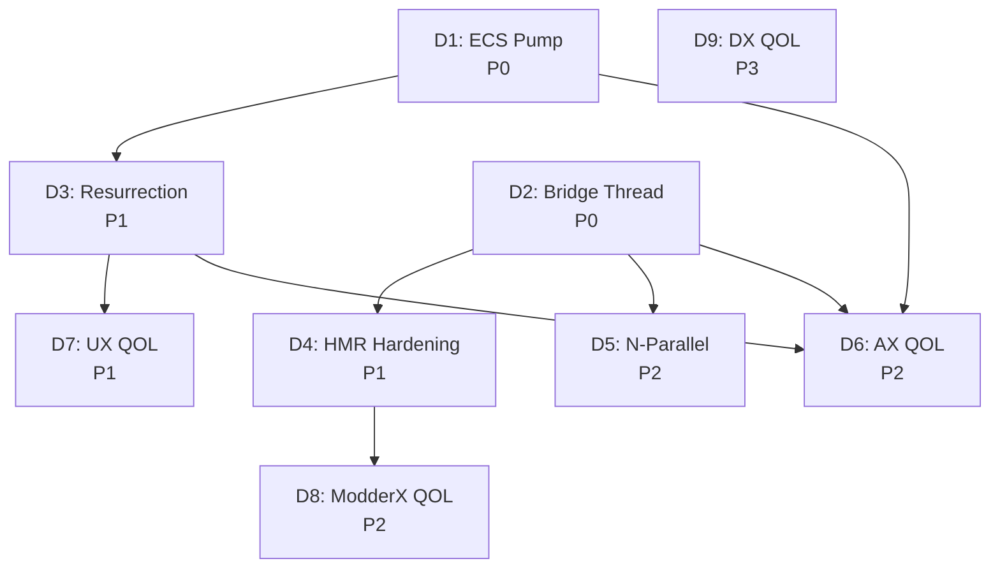

# M13: Runtime Survival, HMR Hardening & Concurrent Instances

**Status**: Draft
**Created**: 2026-03-29
**Author**: DINOForge Agents
**Priority**: P0 (critical path for runtime reliability)
**Depends on**: M1 (Runtime Scaffold), M3 (Dev Tooling), MCP Bridge

---

## Context

DINOForge is a mod platform for Diplomacy is Not an Option (DINO), a Unity 2021.3 ECS game. The runtime injects via BepInEx and provides:

- Named pipe bridge server (GameBridgeServer) for CLI/MCP tool communication
- ModPlatform orchestrator (pack loading, registries, content pipeline)
- UI overlays (F9 debug, F10 mod menu, main menu Mods button)
- Hot reload via FileSystemWatcher + HMR signal file
- Asset swap system for visual model replacement

### Root Problems Identified

1. **RuntimeDriver destruction**: DINO's scene management destroys HideAndDontSave GameObjects during scene transitions via Unity's native C++ `Object::Destroy` (bypasses C# Harmony patches). This kills the bridge server, UI components, and file watchers.

2. **MainThreadDispatcher dead pump**: MainThreadDispatcher uses `MonoBehaviour.Update()` to drain work enqueued from background threads. But DINO replaces Unity's entire PlayerLoop, so `MonoBehaviour.Update()` NEVER fires. Queries requiring main-thread access (entity count, world name) time out.

3. **HMR fragility**: Hot reload watcher thread gets aborted during scene transitions. FileSystemWatcher and HMR signal file mechanism need to survive independently of MonoBehaviour lifecycle.

4. **Single-instance limitation**: Unity's native mutex prevents concurrent game instances from the same directory. Current workaround (copy game to `_TEST` dir) is manual and fragile.

---

## Deliverables

### D1: ECS-Based Main Thread Pump

- Move MainThreadDispatcher queue drain from `MonoBehaviour.Update()` to a new ECS `SystemBase.OnUpdate()`
- ECS systems survive DINO's scene transitions (proven by KeyInputSystem)
- `SystemBase.OnUpdate()` fires reliably during gameplay (SimulationSystemGroup)
- At main menu, use a dedicated InitializationSystemGroup system for pump
- **Acceptance**: `game_status` CLI command returns entity count + world name within 1 second

### D2: Bridge Server Thread Immunity

- Bridge server thread must not be aborted during scene transitions
- Current finding: both `IsBackground=true` and `IsBackground=false` threads are aborted ~23s after RuntimeDriver destruction
- Investigation: determine if thread abort is caused by (a) Mono GC finalizer, (b) Unity engine cleanup, or (c) thread holding references to destroyed Unity objects
- Solution options: (i) catch `ThreadAbortException` and restart thread, (ii) move thread creation to static constructor, (iii) use `System.Net.Sockets` instead of `NamedPipeServerStream`
- **Acceptance**: bridge responds to `status` query 60+ seconds after game reaches main menu

### D3: RuntimeDriver Resurrection via ECS

- When PersistentRoot is destroyed, `KeyInputSystem.OnCreate` (new ECS world) triggers TryResurrect
- TryResurrect attaches new RuntimeDriver to DINO's main camera (survives transitions)
- If camera not available, create new `DINOForge_Root` with `HideAndDontSave`
- **Acceptance**: `RuntimeDriver.OnDestroy` log followed by successful resurrection log + bridge reconnects

### D4: HMR System Hardening

- Move HMR signal file watcher to a static thread (not tied to RuntimeDriver)
- FileSystemWatcher for pack YAML changes -> static singleton, survives destruction
- HMR signal: write `DINOForge_HotReload` file to BepInEx dir -> runtime detects + reloads
- Pack hot reload: detect YAML changes -> `ContentLoader.Reload()` -> registry update -> stat reapply
- **Acceptance**: modify a pack YAML while at main menu -> log shows reload without game restart

### D5: N-Parallel Concurrent Instance Support

- Automate TEST instance creation: copy game dir -> patch `boot.config` -> remove mutex DLL
- MCP tool `game_launch_test(n=2)` -> launch N independent instances
- Each instance gets unique named pipe: `dinoforge-game-bridge-{instance_id}`
- CLI/MCP tools accept `--instance <id>` to target specific game
- **Acceptance**: 2 game instances running simultaneously, each queryable via CLI

### D6: QOL -- Agent Experience (AX)

- `/validate-runtime` slash command: build -> deploy -> launch -> verify bridge -> verify packs -> verify F9/F10 -> report
- Unified `/eval-all` with `--live` flag that includes runtime validation
- MCP health endpoint returns bridge status, main-thread pump status, loaded pack count
- Auto-recovery: if bridge thread dies, ECS system restarts it on next OnUpdate
- Structured JSON error responses from bridge (not just "Failed to execute")

### D7: QOL -- User Experience (UX)

- Mods button visible and clickable on main menu (requires D3 resurrection)
- F10 mod menu shows loaded packs with enable/disable toggles
- F9 debug overlay shows entity count, FPS, pack status, swap results
- Desktop Companion shows real-time bridge status (connected/disconnected)
- Installer validates BepInEx version compatibility before install

### D8: QOL -- Modder Experience (ModderX)

- `dinoforge new-pack <name>` CLI scaffolds pack with manifest + directories
- `dinoforge validate <pack>` reports all schema violations with line numbers
- Hot reload feedback: toast notification in-game when pack YAML changes detected
- Asset swap status: F9 overlay shows N/M swaps succeeded with failure reasons
- Pack conflict detection at load time with actionable error messages

### D9: QOL -- Developer Experience (DX)

- `dotnet build -p:DeployToGame=true` deploys DLL + packs in one command (already works)
- Lefthook pre-push runs build + 1327 tests (already works)
- `dinoforge dev-harness --watch` auto-rebuilds on C# changes + HMR signal
- Debug log rotation: cap `dinoforge_debug.log` at 10MB, rotate to `.1`, `.2`
- Structured logging: JSON-line format option for machine-parseable debug output

---

## Dependencies

| Deliverable | Blocked By | Priority |
|---|---|---|
| D1 (ECS pump) | None | **P0 -- blocks everything** |
| D2 (Bridge thread) | None | **P0 -- blocks everything** |
| D3 (Resurrection) | D1 | P1 |
| D4 (HMR hardening) | D2 | P1 |
| D5 (N-parallel) | D2 | P2 |
| D6 (AX QOL) | D1, D2, D3 | P2 |
| D7 (UX QOL) | D3 | P1 |
| D8 (ModderX QOL) | D4 | P2 |
| D9 (DX QOL) | None | P3 |

---

## Acceptance Criteria Summary

| Test | Method | Pass Criteria |
|---|---|---|
| Bridge alive after 60s | `dinoforge status` via CLI | Returns JSON with `Running=true` |
| Entity count returned | `dinoforge status` via CLI | `EntityCount > 0` (not -1) |
| Mods button visible | Screenshot + VLM | "Mods" text visible on main menu |
| F9 overlay toggles | F9 keypress + screenshot | Debug overlay visible |
| Hot reload works | Modify YAML + log check | "HotReload" in debug log |
| 2 instances run | 2x game process + 2x status | Both return `Running=true` |
| Pack validate | `dinoforge validate packs/` | Exit code 0, no schema errors |
| 1327 tests pass | `dotnet test` | All green |

---

## Technical Notes

- DINO uses Unity 2021.3.45f2, full ECS (DOTS), Burst, Mono runtime
- `MonoBehaviour.Update()` NEVER fires -- DINO replaces Unity's PlayerLoop
- ECS `SystemBase.OnUpdate()` DOES fire reliably during gameplay
- `SceneManager.LoadScene()` destroys all objects including HideAndDontSave via native C++
- Background threads created from MonoBehaviour scope get aborted ~23s after destruction
- Harmony patches on `Object.Destroy` / `Object.DestroyImmediate` don't intercept native destruction
- Named pipe (`NamedPipeServerStream`) is the IPC mechanism for CLI/MCP bridge
- F9/F10 work via Win32 `GetAsyncKeyState` on a background thread + KeyInputSystem ECS callbacks

---

## Risk Register

| Risk | Impact | Mitigation |
|---|---|---|
| ECS world destroyed on scene change | D1/D3 pump stops | Resurrection re-registers system on new world creation |
| Thread abort root cause is Unity engine-level | D2 bridge dies | Fall back to static constructor + socket-based IPC |
| Mutex removal breaks game saves | D5 data corruption | Each instance uses isolated save directory |
| HMR reload triggers during gameplay | D4 instability | Queue reloads, apply only at safe points (pause/menu) |
| N-parallel disk space | D5 ~8GB per copy | Symlink shared assets, copy only DLLs + config |

---

## Implementation Order

1. **Sprint 1 (P0)**: D1 + D2 in parallel -- establish reliable main-thread pump and immortal bridge thread
2. **Sprint 2 (P1)**: D3 + D4 + D7 -- resurrection, HMR hardening, and user-facing UI
3. **Sprint 3 (P2)**: D5 + D6 + D8 -- concurrent instances, agent QOL, modder QOL
4. **Sprint 4 (P3)**: D9 -- developer QOL polish

---

## Success Metric

M13 is complete when: a DINOForge-modded game survives a full session (main menu -> gameplay -> pause -> resume -> exit) with bridge responding to CLI queries at every stage, hot reload working without restart, and a second concurrent instance queryable in parallel.
