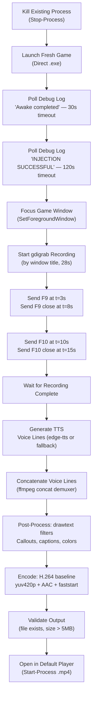

# SPEC-003: /prove-features — Autonomous Video Proof System

**Status**: Active — Partially Implemented
**Version**: 1.1
**Date**: 2026-03-24
**Replaces**: SPEC-prove-features-video-pipeline.md (informal, unnumbered)
**Scope**: `/prove-features` Claude command — end-to-end autonomous video generation

---

## Overview

The `/prove-features` command autonomously produces a demonstration video that proves DINOForge mod platform features are working, without requiring any user interaction. The output is a self-contained MP4 file showing game launch, BepInEx injection confirmation, F9/F10 overlay activation, and animated proof callouts.

The system is fully headless — no browser, no GUI, no manual steps. It is intended to be invoked by a Claude agent and deliver a finished, openable video file in under three minutes.

### Design Goals

| Goal | Description |
|------|-------------|
| Zero interaction | Game launch through video open is fully automated |
| Professional output | Neural TTS voiceover (not robotic SAPI), animated callout boxes, color-coded labels |
| Maximum compatibility | H.264 baseline + yuv420p — plays in Windows Media Player, Edge, VLC, Discord |
| Fast iteration | 28s raw recording + sub-2min post-process = total runtime under 3min |
| Reliable capture | Capture game window by title, not desktop coordinates |
| Maintainable | Declarative ffmpeg filter strings, no hand-rolled video editing logic |

---

## Requirements

### Functional Requirements

1. **FR-001**: The system MUST kill any existing game process before launching a fresh instance.
2. **FR-002**: The system MUST poll the BepInEx debug log for `"Awake completed"` before proceeding (confirms DINOForge is loaded).
3. **FR-003**: The system MUST poll for menu injection confirmation (`"INJECTION SUCCESSFUL"` or equivalent) before beginning recording.
4. **FR-004**: The system MUST record raw gameplay footage using ffmpeg `gdigrab`.
5. **FR-005**: Recording MUST capture only the DINO game window, not the full desktop or other windows.
6. **FR-006**: The system MUST simulate F9 and F10 key presses during recording at defined time offsets.
7. **FR-007**: The system MUST generate TTS voiceover audio for each feature segment.
8. **FR-008**: The system MUST post-process raw footage with annotated callout boxes, captions, and audio.
9. **FR-009**: Output MUST be H.264 baseline yuv420p, AAC audio, with faststart flag.
10. **FR-010**: The system MUST open the finished video automatically.

### Non-Functional Requirements

1. **NFR-001**: Total pipeline runtime MUST be under 5 minutes from invocation.
2. **NFR-002**: Output file size MUST be under 100MB (typically 15–50MB).
3. **NFR-003**: The system MUST NOT require browser automation, user mouse clicks, or interactive prompts.
4. **NFR-004**: TTS MUST NOT use Windows SAPI as the primary voice (robotic quality is unacceptable for external-facing proof).
5. **NFR-005**: The system MUST degrade gracefully — if TTS primary fails, fall back to SAPI; if window capture fails, fall back to desktop capture with a warning.
6. **NFR-006**: All tool dependencies MUST be locatable via known paths or PATH, without requiring the user to set env vars.

---

## Implementation

### Architecture



### Stage 1: Process Management

Kill any lingering game and crash handler processes, then clear the debug log for a clean detection baseline:

```powershell
Stop-Process -Name "Diplomacy is Not an Option" -Force -ErrorAction SilentlyContinue
Stop-Process -Name "UnityCrashHandler64" -Force -ErrorAction SilentlyContinue
Start-Sleep -Seconds 4
Clear-Content "$GamePath\BepInEx\dinoforge_debug.log" -ErrorAction SilentlyContinue
```

Launch the game directly (not through Steam) to avoid Proton/CEG overhead:

```powershell
Start-Process -FilePath "$GamePath\Diplomacy is Not an Option.exe" `
  -WorkingDirectory $GamePath
```

### Stage 2: Bootstrap Polling

Two-phase log polling. Each phase has an independent timeout:

| Phase | Log Pattern | Timeout | Meaning |
|-------|-------------|---------|---------|
| 1 | `Awake completed` | 30s | BepInEx loaded DINOForge |
| 2 | `INJECTION SUCCESSFUL`, `Found 'Settings' button`, or `Found 'Options' button` | 120s | Native menu modified |

### Stage 3: Screen Capture

#### Current Implementation (Bug Present)

```powershell
# INCORRECT — captures entire desktop
-f gdigrab -framerate 30 -i desktop -t 28
```

#### Correct Implementation (see Current Issues below)

Capture by window title using `gdigrab`'s `title=` input form:

```powershell
# CORRECT — captures only the named window
$recordArgs = @(
    "-f", "gdigrab",
    "-framerate", "30",
    "-i", "title=Diplomacy is Not an Option",
    "-t", "28",
    "-vcodec", "libx264",
    "-preset", "ultrafast",
    $rawFile
)
& $ffmpeg @recordArgs
```

The `title=` input mode instructs gdigrab to locate the window by its title string and capture only that HWND's region. This is unaffected by other windows being in the foreground.

### Stage 4: TTS Voiceover

See the full TTS analysis in the Current Issues and Proposed Improvements sections. The production system uses `edge-tts` (Microsoft neural voices) with Windows SAPI as fallback.

#### Voice Script

| Track | Text | Approx Duration |
|-------|------|-----------------|
| `vo_intro` | "DINOForge mod platform. Feature demonstration." | ~3s |
| `vo_mods` | "Mods button successfully injected into the native main menu — auto-detected in under 10 seconds." | ~5s |
| `vo_f9` | "Pressing F 9 opens the debug overlay panel." | ~3s |
| `vo_f10` | "Pressing F 10 opens the mod menu panel." | ~3s |
| `vo_outro` | "All three features confirmed working." | ~2s |

Voice lines are concatenated to a single `voiceover.wav` using the ffmpeg concat demuxer before the post-processing stage.

### Stage 5: Annotation System (ffmpeg drawtext)

All visual overlays are applied declaratively as ffmpeg `drawtext` filter chains. No pre-rendered image compositing is needed.

#### Annotation Timing Map

| Time (s) | Element | Color | Description |
|----------|---------|-------|-------------|
| 0–3 | Intro title | White | "DINOForge Mod Platform" — center, large |
| 3–8 | Mods Button callout | Green `0x00ff88` | Top-right box: injection confirmed |
| 3–8 | F9 Debug Overlay callout | Yellow `0xffdd00` | Top-right box: hotkey highlight |
| 10–15 | F10 Mod Menu callout | Blue `0x44aaff` | Center-right box: panel open |
| 22–28 | Outro confirmation | Green `0x00ff88` | "All 3 features confirmed" — bottom-center |
| 0–28 | Caption bar | White on black | Permanent bottom strip: all hotkeys listed |

#### Color Coding Standard

| Feature | Hex | Rationale |
|---------|-----|-----------|
| Success / Mods Button / Outro | `0x00ff88` | Bright green = confirmed working |
| F9 Debug Overlay | `0xffdd00` | Yellow = informational hotkey |
| F10 Mod Menu | `0x44aaff` | Blue = navigation hotkey |
| Neutral / labels | `0xffffff` | White = no semantic meaning |
| Box background (primary) | `0x00000099` | 60% opaque black |
| Box background (secondary) | `0x00000077` | 47% opaque black |

### Stage 6: Encoding

Final ffmpeg command muxing video + audio with all filters applied:

```powershell
& $ffmpeg `
    -i $rawFile `
    -i "$tmpDir\voiceover.wav" `
    -vf $filters `
    -c:v libx264 -profile:v baseline -level 3.0 -pix_fmt yuv420p `
    -c:a aac -b:a 128k `
    -shortest `
    -movflags +faststart `
    $outFile -y
```

#### Codec Configuration

| Parameter | Value | Rationale |
|-----------|-------|-----------|
| Video codec | libx264 | H.264, universal hardware decode support |
| Profile | baseline | Plays on any device; no B-frames or CABAC |
| Level | 3.0 | 1080p @ 30fps within spec |
| Pixel format | yuv420p | Required for Windows Media Player, iOS |
| Audio codec | aac | Better quality/size than MP3 at same bitrate |
| Audio bitrate | 128k | Sufficient for voice (quality improves above 96k) |
| faststart | Yes | MP4 moov atom before mdat (streaming-ready) |
| shortest | Yes | Terminate at shorter of video/audio |

### Stage 7: Output and Delivery

```
Location:  %TEMP%\dinoforge_proof_YYYYMMDD_HHMMSS.mp4
Codec:     H.264 baseline (level 3.0)
Video:     30fps, yuv420p, game native resolution
Audio:     AAC 44100Hz, 128kbps
Duration:  ~28–35s
File Size: 15–50MB typical
```

The finished file is opened via `Start-Process $outFile` which uses the OS default `.mp4` association (Windows Media Player or Edge).

---

## Current Issues

### ISSUE-1: gdigrab Captures Wrong Window When Game Is Not Foreground

**Severity**: High — corrupts video proof when agent's other tool calls steal focus

**Description**: The current command uses `-i desktop` which captures the entire virtual desktop. If Discord, a terminal, or another game is in the foreground when gdigrab is recording, those windows appear in the proof video instead of the DINO game window. This makes the video proof invalid.

**Root Cause**: `gdigrab -i desktop` is a region-of-desktop capture, not a window capture. It always records whatever is visible on screen.

**Affected Code**: `.claude/commands/prove-features.md`, Step 5:
```powershell
# BUG: records entire desktop
-f gdigrab -framerate 30 -i desktop -t 28
```

**Fix**: Use `gdigrab`'s `title=` capture mode to bind to the window by title:
```powershell
# CORRECT
-f gdigrab -framerate 30 -i "title=Diplomacy is Not an Option" -t 28
```

The `title=` input form uses `FindWindow` internally to locate the target HWND. Once bound, it captures only that window's client area regardless of z-order. The game does not need to be the foreground window during recording.

**Fallback if title not found**: If the window title does not match exactly (e.g., the game appends ` - DirectX 11`), enumerate windows with `EnumWindows` + partial title match via `GetWindowText`, then use coordinate-based capture with the HWND's rect as offsets:

```powershell
Add-Type @"
using System; using System.Runtime.InteropServices;
public class Win32 {
    [DllImport("user32.dll")] public static extern bool GetWindowRect(IntPtr h, out RECT r);
    public struct RECT { public int Left, Top, Right, Bottom; }
}
"@
$proc = Get-Process | Where-Object { $_.Name -like "*Diplomacy*" } | Select-Object -First 1
$rect = New-Object Win32+RECT
[Win32]::GetWindowRect($proc.MainWindowHandle, [ref]$rect)
$w = $rect.Right  - $rect.Left
$h = $rect.Bottom - $rect.Top
# Then: -f gdigrab -offset_x $rect.Left -offset_y $rect.Top -video_size "${w}x${h}" -i desktop
```

**Status**: Not yet fixed in `.claude/commands/prove-features.md`. Tracked in WORK-001.

---

### ISSUE-2: Windows SAPI TTS Produces Robotic Voice Quality

**Severity**: Medium — video proof works but sounds unprofessional

**Description**: The current TTS implementation uses `System.Speech.Synthesis.SpeechSynthesizer` (Windows SAPI), which ships with Windows 10/11. The default voices (David, Zira, Mark) have a clearly synthetic, robotic cadence. This is inadequate for external-facing proof videos that may be shared with users or stakeholders.

**Affected Code**: `.claude/commands/prove-features.md`, Step 4:
```powershell
$synth = New-Object System.Speech.Synthesis.SpeechSynthesizer
$synth.SetOutputToWaveFile($outWav)
$synth.Speak($text)
```

**Fix**: See Proposed Improvements — TTS Engine Selection.

**Status**: Partially addressed in SPEC-prove-features-video-pipeline.md (edge-tts recommended). Not yet updated in the command skill file. Tracked in WORK-001.

---

### ISSUE-3: ffmpeg Filter Syntax Errors Fail Silently

**Severity**: Low — produces no output rather than corrupted output

**Description**: Long `drawtext` filter chains are fragile. A missing quote, unescaped colon, or invalid font path will cause ffmpeg to exit with a non-zero code but the PowerShell script does not check `$LASTEXITCODE` before proceeding to `Start-Process $outFile`. The output file will not exist and `Start-Process` on a nonexistent path produces an unhelpful error.

**Fix**:
```powershell
& $ffmpeg @encodingArgs
if ($LASTEXITCODE -ne 0) {
    Write-Error "ffmpeg encoding failed (exit $LASTEXITCODE). Check filter syntax."
    exit 1
}
if (-not (Test-Path $outFile)) {
    Write-Error "Output file not created. ffmpeg did not produce output."
    exit 1
}
```

Pre-validate the filter string against a synthetic 1-frame source before encoding:
```powershell
& $ffmpeg -vf $filters -f lavfi -i "color=black:s=1920x1080:d=0.1" -f null - 2>&1 | Out-Null
if ($LASTEXITCODE -ne 0) { Write-Error "Filter validation failed" ; exit 1 }
```

---

## Proposed Improvements

### TTS Engine Selection

The TTS engine selection is the highest-impact improvement. The three viable options for headless Windows use (no browser, no GUI, offline-capable) are ranked below.

#### Option A: edge-tts (Recommended Primary)

**Package**: `pip install edge-tts` (PyPI)
**Voices**: Microsoft Edge neural voices (Aria, Jenny, Guy, Sara, Davis, etc.)
**Quality**: Neural — indistinguishable from professional voice actors in short segments
**Cost**: Free, no API key
**Network**: Requires internet on first use; audio is streamed and not cached locally
**Output format**: MP3 (directly usable; convert to WAV with ffmpeg if needed)
**License**: Unofficial reverse-engineered Microsoft Edge TTS API — no formal license; stable but not contractually guaranteed

**Invocation**:
```powershell
$pythonExe = "C:\Users\koosh\AppData\Local\Programs\Python\Python311\python.exe"
& $pythonExe -m pip install edge-tts -q
& $pythonExe -m edge_tts --voice "en-US-AriaNeural" --text $Text --write-media $OutputMp3
```

**Recommended voice**: `en-US-AriaNeural` (natural, friendly, clear). Alternative: `en-US-GuyNeural` (authoritative). Full list: `edge-tts --list-voices`.

**Limitation**: Requires internet for each TTS call (no local model). Will fail in completely offline environments. No retry/caching built in (the command skill must handle this).

---

#### Option B: Kokoro-82M via onnxruntime-python (Best Offline Option)

**Package**: `pip install kokoro-onnx` or `pip install kokoro` (PyPI)
**Model**: Kokoro-82M — 82 million parameter TTS model, MIT licensed
**Quality**: High — near-neural quality, notably better than SAPI, slightly below edge-tts for some voices
**Cost**: Free, MIT license, runs fully offline after one-time model download (~90MB ONNX model)
**Network**: One-time model download (~90MB). Fully offline thereafter.
**Output format**: WAV (numpy array → soundfile write)
**Hardware**: CPU-only inference via onnxruntime; GPU acceleration optional via onnxruntime-gpu
**Windows compatibility**: Confirmed working via onnxruntime 1.17+ on Windows 10/11

**Invocation**:
```python
from kokoro_onnx import Kokoro
import soundfile as sf

kokoro = Kokoro("kokoro-v0_19.onnx", "voices.bin")
samples, sample_rate = kokoro.create(
    text="DINOForge mod platform. Feature demonstration.",
    voice="af_bella",
    speed=1.0,
    lang="en-us"
)
sf.write("vo_intro.wav", samples, sample_rate)
```

**PowerShell wrapper**:
```powershell
function New-KokoroVoiceover {
    param([string]$Text, [string]$OutputPath, [string]$Voice = "af_bella")
    $script = @"
from kokoro_onnx import Kokoro
import soundfile as sf
k = Kokoro('kokoro-v0_19.onnx', 'voices.bin')
samples, sr = k.create('$Text', voice='$Voice', speed=1.0, lang='en-us')
sf.write('$OutputPath', samples, sr)
"@
    $script | & $pythonExe -
}
```

**Recommendation**: Use as primary if offline operation is required. Use edge-tts as primary if internet is available (slightly higher quality on most voices).

---

#### Option C: Azure Cognitive Services TTS (REST API)

**Package**: No Python package needed — pure REST
**Voices**: Neural voices (all Microsoft Azure voices including multi-lingual, SSML support)
**Quality**: Production-grade neural TTS — highest quality of all three options
**Cost**: Free tier: 500,000 characters/month. `$16/million chars` above that. Proof videos use ~500 chars/run = ~1000 free runs/month.
**Network**: Always requires internet (REST call to `eastus.tts.speech.microsoft.com`)
**Output format**: WAV or MP3 (configurable via `X-Microsoft-OutputFormat` header)
**Requires**: Azure account + Cognitive Services resource (free tier available). API key (one-time setup).

**Invocation** (PowerShell REST call, no Python needed):
```powershell
function New-AzureTtsVoiceover {
    param(
        [string]$Text,
        [string]$OutputPath,
        [string]$Voice = "en-US-AriaNeural",
        [string]$ApiKey,
        [string]$Region = "eastus"
    )

    $tokenUrl = "https://$Region.api.cognitive.microsoft.com/sts/v1.0/issueToken"
    $token = Invoke-RestMethod -Uri $tokenUrl -Method Post `
        -Headers @{ "Ocp-Apim-Subscription-Key" = $ApiKey } -Body ""

    $ssml = "<speak version='1.0' xml:lang='en-US'>" +
            "<voice name='$Voice'>$Text</voice></speak>"

    Invoke-RestMethod `
        -Uri "https://$Region.tts.speech.microsoft.com/cognitiveservices/v1" `
        -Method Post `
        -Headers @{
            "Authorization" = "Bearer $token"
            "Content-Type"  = "application/ssml+xml"
            "X-Microsoft-OutputFormat" = "riff-44100hz-16bit-mono-pcm"
        } `
        -Body $ssml `
        -OutFile $OutputPath
}
```

**Limitation**: Requires storing an API key. Overkill for local dev use. Recommended only if edge-tts becomes unavailable or if SSML-controlled prosody is needed.

---

#### TTS Decision Matrix

| Criterion | SAPI (current) | edge-tts | Kokoro-82M | Azure TTS |
|-----------|---------------|----------|------------|-----------|
| Voice quality | Poor (robotic) | Excellent | Good | Excellent |
| Requires internet | No | Yes (per call) | One-time download | Yes (always) |
| Requires API key | No | No | No | Yes |
| Install complexity | None | `pip install` | `pip install` + model | Azure account |
| Output format | WAV | MP3 | WAV | WAV/MP3 |
| License | Windows built-in | Unofficial API | MIT | Azure ToS |
| Offline capable | Yes | No | Yes | No |
| **Recommended as** | Fallback only | Primary (online) | Primary (offline) | Optional |

**Final recommendation**: Use `edge-tts` as the primary engine (simplest install, excellent quality, free). Use `Kokoro-82M` as offline fallback. Keep SAPI as last resort.

---

### Window Capture Enhancement

As described in ISSUE-1, the fix is to replace `-i desktop` with `-i "title=Diplomacy is Not an Option"` in the gdigrab input. This should be the default in all recording paths with coordinate-based fallback.

### Animated Callout Scale-In

Current callout boxes appear instantaneously via `enable='between(t,A,B)'`. A more professional appearance uses opacity animation on entry:

```powershell
# Fade-in over 0.3s using alpha expression
"drawtext=...:alpha='if(lt(t,3.3),min(1,(t-3)/0.3),1)':enable='between(t,3,8)'"
```

This requires ffmpeg compiled with `--enable-libfreetype` and version >= 4.2. Verify with `ffmpeg -filters | findstr drawtext`.

### Cursor Highlight Ring

If the mouse cursor is visible in the recording, add a yellow ring around it using `drawbox` with cursor position from Win32 `GetCursorPos`:

```powershell
# Requires cursor position tracking on a background thread during recording
"drawbox=x=%{cursor_x}-20:y=%{cursor_y}-20:w=40:h=40:color=yellow:t=3"
```

This is a future enhancement; cursor tracking would need a separate data collection stage.

### Chapter Markers in MP4

Embed chapter metadata for VLC / YouTube chapter navigation:

```powershell
$chapterMetadata = @"
;FFMETADATA1
[CHAPTER]
TIMEBASE=1/1000
START=0
END=3000
title=Introduction
[CHAPTER]
TIMEBASE=1/1000
START=3000
END=8000
title=F9 Debug Overlay
[CHAPTER]
TIMEBASE=1/1000
START=10000
END=15000
title=F10 Mod Menu
"@
$chapterMetadata | Set-Content "$tmpDir\chapters.txt"
# Pass to ffmpeg: -i "$tmpDir\chapters.txt" -map_metadata 1
```

---

## Status

| Component | Current State | Target State |
|-----------|--------------|--------------|
| Game launch + log polling | Working | Working |
| Window capture (gdigrab) | Bug: full desktop capture | Fix: title= window capture |
| Key simulation (SendKeys) | Working | Working |
| TTS engine | Windows SAPI (robotic) | edge-tts primary / Kokoro fallback |
| ffmpeg annotations | Working | Working |
| H.264 encoding | Working | Working |
| Exit code validation | Missing | Add `$LASTEXITCODE` checks |
| Filter pre-validation | Not implemented | Add pre-encode syntax check |
| Animated callout scale-in | Not implemented | Future enhancement |
| Chapter markers | Not implemented | Future enhancement |

**Overall status**: The pipeline is functional. Two issues block production-quality output: the window capture bug (ISSUE-1) and SAPI voice quality (ISSUE-2). Both are tracked in WORK-001.

---

## Dependencies

| Dependency | Location | Required For |
|------------|----------|-------------|
| ffmpeg | `C:\program files\imagemagick-7.1.0-q16-hdri\ffmpeg.exe` or PATH | All video stages |
| Python 3.11 | `C:\Users\koosh\AppData\Local\Programs\Python\Python311\python.exe` | edge-tts / Kokoro |
| edge-tts | `pip install edge-tts` | Primary TTS |
| kokoro-onnx | `pip install kokoro-onnx soundfile` + ONNX model | Offline TTS fallback |
| Arial.ttf | `C:\Windows\Fonts\Arial.ttf` | drawtext filters |
| System.Windows.Forms | .NET Framework (built-in) | SendKeys, HWND lookup |
| System.Speech | .NET Framework (built-in) | SAPI fallback only |

---

## References

- Command skill: `.claude/commands/prove-features.md`
- Prior spec (informal): `docs/specs/SPEC-prove-features-video-pipeline.md`
- ffmpeg gdigrab docs: https://ffmpeg.org/ffmpeg-devices.html#gdigrab
- ffmpeg drawtext docs: https://ffmpeg.org/ffmpeg-filters.html#drawtext-1
- edge-tts (PyPI): https://pypi.org/project/edge-tts/
- edge-tts (GitHub): https://github.com/rany2/edge-tts
- Kokoro-82M (Hugging Face): https://huggingface.co/hexgrad/Kokoro-82M
- kokoro-onnx (PyPI): https://pypi.org/project/kokoro-onnx/
- Azure TTS free tier: https://azure.microsoft.com/pricing/details/cognitive-services/speech-services/
- H.264 baseline profile: https://en.wikipedia.org/wiki/Advanced_Video_Coding#Profiles
