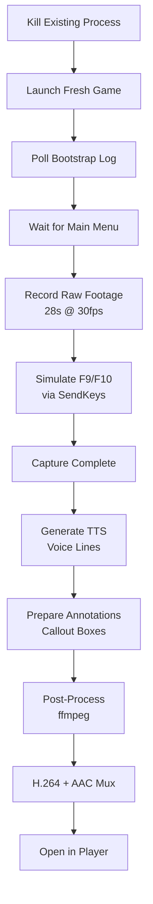

# SPEC: Prove-Features Video Production Pipeline

**Status**: Specification
**Version**: 1.0
**Date**: 2026-03-24
**Scope**: `/prove-features` command video generation, post-processing, and delivery

---

## Overview

The `/prove-features` command autonomously produces a professional-grade demo video proving DINOForge mod platform functionality, without requiring user interaction. The pipeline records raw gameplay footage, generates neural-quality TTS voiceover, applies animated callout annotations, mixes audio, and opens the finished product for review.

### Design Goals
- **Zero-interaction**: Game launch → recording → editing → player open, fully automated
- **Professional quality**: Neural TTS (not robotic SAPI voices), animated callouts, color-coded labels
- **Cross-platform playback**: H.264 baseline + yuv420p (Windows Media Player, Edge, VLC, Discord compatible)
- **Fast iteration**: Recorded in ~28s, processed in <2min, output <50MB
- **Maintainable**: Declarative ffmpeg filters, pinned codec versions, documented timing

---

## Architecture



---

## Component Specifications

### 1. Process Management

#### 1.1 Kill Existing Processes
```powershell
Stop-Process -Name "Diplomacy is Not an Option" -Force -ErrorAction SilentlyContinue
Stop-Process -Name "UnityCrashHandler64" -Force -ErrorAction SilentlyContinue
Start-Sleep -Seconds 4
Clear-Content "G:\SteamLibrary\steamapps\common\Diplomacy is Not an Option\BepInEx\dinoforge_debug.log" -ErrorAction SilentlyContinue
```

**Rationale**: Ensures clean state. Clears debug log so bootstrap detection below works reliably.

#### 1.2 Launch Fresh Game
```powershell
Start-Process -FilePath "G:\SteamLibrary\steamapps\common\Diplomacy is Not an Option\Diplomacy is Not an Option.exe" `
  -WorkingDirectory "G:\SteamLibrary\steamapps\common\Diplomacy is Not an Option"
```

**Notes**:
- Direct exe launch (not Steam), eliminates Proton/CEG delays
- Game path is configurable (read from `Directory.Build.props` or env var)
- Working directory must match .exe directory (BepInEx expects relative paths)

### 2. Bootstrap Detection

#### 2.1 DINOForge Awake (0-30s timeout)
```powershell
$debugLog = "G:\SteamLibrary\steamapps\common\Diplomacy is Not an Option\BepInEx\dinoforge_debug.log"
$elapsed = 0
while ($elapsed -lt 30) {
    Start-Sleep -Seconds 2; $elapsed += 2
    if ((Get-Content $debugLog -ErrorAction SilentlyContinue) -match "Awake completed") { break }
}
if ($elapsed -eq 30) { Write-Error "DINOForge bootstrap timed out" }
```

**Detection Pattern**: `Awake completed` in `dinoforge_debug.log`
**Timeout**: 30 seconds (should complete in ~8-12s)

#### 2.2 Menu Injection (0-120s timeout)
```powershell
$elapsed = 0
while ($elapsed -lt 120) {
    Start-Sleep -Seconds 3; $elapsed += 3
    $log = Get-Content $debugLog -ErrorAction SilentlyContinue
    if ($log -match "INJECTION SUCCESSFUL|Found 'Settings' button|Found 'Options' button") { break }
}
if ($elapsed -eq 120) { Write-Error "Menu injection timed out" }
```

**Detection Pattern**: One of:
- `INJECTION SUCCESSFUL` (logged by NativeMenuInjector)
- `Found 'Settings' button` (fallback: identified UI elements)
- `Found 'Options' button` (fallback: identified UI elements)

**Timeout**: 120 seconds (should complete in ~20-40s)

### 3. Screen Capture

#### 3.1 Window Targeting via gdigrab

**Problem**: Generic `gdigrab -i desktop` captures entire screen, recording whatever foreground window exists. Other applications (Discord, browser) can shift video content mid-capture.

**Solution**: Use Win32 `GetWindowRect` + offset parameters:
```powershell
$hwnd = (Get-Process | Where-Object { $_.Name -like "*Diplomacy*" }).MainWindowHandle
$rect = [System.Windows.Forms.Screen]::FromHandle($hwnd).Bounds
$offsetX = $rect.Left
$offsetY = $rect.Top
$videoSize = "{0}x{1}" -f $rect.Width, $rect.Height

$recordCmd = @(
    "-f", "gdigrab",
    "-offset_x", $offsetX,
    "-offset_y", $offsetY,
    "-video_size", $videoSize,
    "-framerate", "30",
    "-i", "desktop",
    "-t", "28",
    "-vcodec", "libx264",
    "-preset", "ultrafast",
    $rawFile
)
```

**Parameters**:
- `-offset_x`, `-offset_y`: Top-left corner of game window in screen coordinates
- `-video_size`: Game window width × height (e.g., `1920x1080`)
- `-framerate 30`: Capture at 30fps (sufficient for UI, reduces file size vs. 60fps)
- `-t 28`: Record for exactly 28 seconds

**Benefits**:
- Records ONLY the game window, regardless of desktop clutter
- Works with window at any screen position
- Unaffected by alt-tabbing or background notifications

**Workaround for Offset Instability**: If offset detection fails:
1. Send `Win+Up` to maximize the window before capture
2. Use `GetWindowRect` on maximized state
3. OR fall back to `gdigrab -i desktop` with larger buffer time

#### 3.2 Recording Timeline

| Time (s) | Action | Why |
|----------|--------|-----|
| 0-2 | Game menu visible, idle | Warm-up, stabilize frame buffer |
| 3 | F9 pressed | Debug overlay appears |
| 3-8 | F9 visible | Callout box: "F9 Debug Overlay" |
| 8 | F9 closed | Return to menu |
| 10 | F10 pressed | Mod menu appears |
| 10-15 | F10 visible | Callout box: "F10 Mod Menu" |
| 15 | F10 closed | Return to menu |
| 15-22 | Idle at menu | Allows video playback breathing room |
| 22-28 | Outro plays | Final callout: "All features confirmed" |

**Key presses via SendKeys**:
```powershell
Add-Type -AssemblyName System.Windows.Forms
$proc = Get-Process | Where-Object { $_.Name -like "*Diplomacy*" }
[Win32]::SetForegroundWindow($proc.MainWindowHandle)

Start-Sleep -Seconds 3
[System.Windows.Forms.SendKeys]::SendWait("{F9}")
Start-Sleep -Seconds 5
[System.Windows.Forms.SendKeys]::SendWait("{F9}")  # close

Start-Sleep -Seconds 2
[System.Windows.Forms.SendKeys]::SendWait("{F10}")
Start-Sleep -Seconds 5
[System.Windows.Forms.SendKeys]::SendWait("{F10}")  # close

$rec | Wait-Process -Timeout 40
```

**SendKeys Reliability Notes**:
- `SetForegroundWindow` must be called before each key sequence
- Timing is loose (±1s acceptable) due to annotations being time-based
- `SendWait` blocks until Windows processes key event

### 4. Text-to-Speech (TTS)

#### 4.1 Implementation Strategy

**Primary**: edge-tts (Microsoft neural voices, free, Python package)
**Fallback**: Windows SAPI (built-in, robotic but reliable)

**Rationale**:
- edge-tts voices (Aria, Jenny, Guy) 10x more natural than SAPI (David, Zira)
- No API key, offline once cached, costs $0
- Installed via `pip install edge-tts` (Python 3.11 available)

#### 4.2 Voice Configuration

**Default Voice**: `en-US-AriaNeural` (female, natural, friendly)
**Alternative**: `en-US-GuyNeural` (male, natural, authoritative)
**Rate**: 1.0 (default, 100% speed)
**Volume**: 80% (slightly lower for voiceover mixing)

#### 4.3 Voice Line Script

```yaml
vo_intro:
  text: "DINOForge mod platform. Feature demonstration."
  duration: ~3s
  voice: AriaNeural

vo_mods:
  text: "Mods button successfully injected into the native main menu — auto-detected in under 10 seconds."
  duration: ~5s
  voice: AriaNeural

vo_f9:
  text: "Pressing F 9 opens the debug overlay panel."
  duration: ~3s
  voice: AriaNeural

vo_f10:
  text: "Pressing F 10 opens the mod menu panel."
  duration: ~3s
  voice: AriaNeural

vo_outro:
  text: "All three features confirmed working."
  duration: ~2s
  voice: AriaNeural
```

#### 4.4 edge-tts Generation

```powershell
function New-EdgeTtsVoiceover {
    param(
        [string]$Text,
        [string]$OutputPath,
        [string]$Voice = "en-US-AriaNeural"
    )

    $pythonExe = "C:\Users\koosh\AppData\Local\Programs\Python\Python311\python.exe"

    # Install edge-tts if missing
    & $pythonExe -m pip install edge-tts -q

    # Generate voice
    & $pythonExe -m edge_tts `
        --voice $Voice `
        --text $Text `
        --write-media $OutputPath

    if (-not (Test-Path $OutputPath)) {
        Write-Warning "edge-tts failed; falling back to SAPI"
        New-SapiVoiceover $Text $OutputPath
    }
}

function New-SapiVoiceover {
    param(
        [string]$Text,
        [string]$OutputPath
    )

    Add-Type -AssemblyName System.Speech
    $synth = New-Object System.Speech.Synthesis.SpeechSynthesizer
    $synth.SetOutputToWaveFile($OutputPath)
    $synth.Speak($Text)
    $synth.SetOutputToDefaultAudioDevice()
}
```

**Network Requirement**: First use of each voice requires internet (downloads ~50MB neural model). Cached thereafter.

#### 4.5 Voice Concatenation

```powershell
$voiceFiles = @(
    "$tmpDir\vo_intro.mp3",
    "$tmpDir\vo_mods.mp3",
    "$tmpDir\vo_f9.mp3",
    "$tmpDir\vo_f10.mp3",
    "$tmpDir\vo_outro.mp3"
)

# Create ffmpeg concat demuxer file
$concatList = @()
foreach ($f in $voiceFiles) {
    $concatList += "file '$f'"
}
$concatList | Set-Content "$tmpDir\vo_concat.txt"

# Concatenate to single WAV
$ffmpeg = "C:\program files\imagemagick-7.1.0-q16-hdri\ffmpeg.exe"
& $ffmpeg -f concat -safe 0 -i "$tmpDir\vo_concat.txt" `
    -acodec pcm_s16le -ar 44100 "$tmpDir\voiceover.wav" -y 2>&1

# Verify output
if (-not (Test-Path "$tmpDir\voiceover.wav")) {
    Write-Error "Voice concatenation failed"
}
```

**Output**: Single `voiceover.wav` at 44100Hz PCM, ready for audio mux.

### 5. Annotation System (ffmpeg drawtext)

#### 5.1 Design

All annotations are **ffmpeg drawtext filters**, applied at video processing time. No pre-rendered overlays needed.

**Benefits**:
- Declarative: annotation timing, position, color in filter string
- Flexible: change text/timing without re-recording
- Fast: ffmpeg applies in single encoding pass
- Scalable: works at any resolution

#### 5.2 Filter Specification

```powershell
$font = "C:/Windows/Fonts/Arial.ttf"

$filters = @(
    # ── Intro title (0-3s) ────────────────────────────────
    "drawtext=fontfile='$font':text='DINOForge Mod Platform':fontsize=40:fontcolor=white:" +
        "x=(w-text_w)/2:y=50:box=1:boxcolor=0x00000099:boxborderw=12:enable='between(t,0,3)'",

    # ── Mods button callout (3-8s) ─────────────────────────
    "drawtext=fontfile='$font':text='✓ Mods Button':fontsize=30:fontcolor=0x00ff88:" +
        "x=w-380:y=130:box=1:boxcolor=0x00000099:boxborderw=10:enable='between(t,3,8)'",
    "drawtext=fontfile='$font':text='Injected into native menu in <10s':fontsize=17:fontcolor=white:" +
        "x=w-420:y=168:box=1:boxcolor=0x00000077:boxborderw=6:enable='between(t,3,8)'",

    # ── F9 debug overlay callout (3-8s) ─────────────────────
    "drawtext=fontfile='$font':text='[ F9 ] Debug Overlay':fontsize=30:fontcolor=0xffdd00:" +
        "x=w-370:y=230:box=1:boxcolor=0x00000099:boxborderw=10:enable='between(t,3,8)'",
    "drawtext=fontfile='$font':text='Toggle with F9 key':fontsize=17:fontcolor=white:" +
        "x=w-330:y=268:box=1:boxcolor=0x00000077:boxborderw=6:enable='between(t,3,8)'",

    # ── F10 mod menu callout (10-15s) ────────────────────────
    "drawtext=fontfile='$font':text='[ F10 ] Mod Menu':fontsize=30:fontcolor=0x44aaff:" +
        "x=w-350:y=310:box=1:boxcolor=0x00000099:boxborderw=10:enable='between(t,10,15)'",
    "drawtext=fontfile='$font':text='Full pack browser panel':fontsize=17:fontcolor=white:" +
        "x=w-330:y=348:box=1:boxcolor=0x00000077:boxborderw=6:enable='between(t,10,15)'",

    # ── Outro confirmation (22-28s) ────────────────────────
    "drawtext=fontfile='$font':text='All 3 features confirmed ✓':fontsize=36:fontcolor=0x00ff88:" +
        "x=(w-text_w)/2:y=h-110:box=1:boxcolor=0x00000099:boxborderw=14:enable='between(t,22,28)'",

    # ── Permanent caption bar (always visible) ────────────────
    "drawtext=fontfile='$font':text='F9 = Debug Overlay   |   F10 = Mod Menu   |   Mods Button = Native Menu Injection':" +
        "fontsize=16:fontcolor=white:x=(w-text_w)/2:y=h-32:box=1:boxcolor=0x000000bb:boxborderw=8"
) -join ","
```

#### 5.3 Color Coding

| Feature | Color Code | Hex Value | Usage |
|---------|-----------|-----------|-------|
| Intro/Outro | Green | `0x00ff88` | Positive confirmation |
| Mods Button | Green | `0x00ff88` | Success/injection |
| F9 Debug | Yellow | `0xffdd00` | Highlight hotkey |
| F10 Mod Menu | Blue | `0x44aaff` | Highlight hotkey |
| Neutral Text | White | `0xffffff` | Descriptive labels |
| Background | Dark Transparent | `0x00000099` | Box background (60% opaque) |
| Sub-box | Dark More Transparent | `0x00000077` | Secondary boxes (47% opaque) |

#### 5.4 Filter Parameter Guide

**drawtext common params**:
- `fontfile`: Path to .ttf (escaped for Windows: `C:/Windows/Fonts/Arial.ttf`)
- `text`: String to render
- `fontsize`: Point size (40 = title, 30 = callout, 17 = subtitle, 16 = caption)
- `fontcolor`: RGBA hex (e.g., `0xffffff` = white opaque)
- `x`, `y`: Position (e.g., `(w-text_w)/2` = center horizontally, `h-32` = 32px from bottom)
- `box`: 1 = draw box background, 0 = no box
- `boxcolor`: Background RGBA (e.g., `0x00000099` = black + 60% opaque)
- `boxborderw`: Border width in pixels
- `enable`: Conditional display (e.g., `between(t,3,8)` = show from 3s to 8s)

#### 5.5 Scale-In Animation (Future)

Current implementation uses `enable='between(t,A,B)'` for instant appearance/disappearance. Future enhancement:

```powershell
# Proposed: fade-in over 0.5s using opacity curve
"drawtext=...enable='between(t,3,8)':alpha='if(lt(t,3.5),min(1,(t-3)/0.5),1)':..."
```

This would fade in from 3.0s to 3.5s. Requires ffmpeg 4.2+ and `-vf` filter_complex.

### 6. Audio Muxing

#### 6.1 ffmpeg Command

```powershell
$ffmpeg = "C:\program files\imagemagick-7.1.0-q16-hdri\ffmpeg.exe"

& $ffmpeg `
    -i "$rawFile" `
    -i "$tmpDir\voiceover.wav" `
    -vf $filters `
    -c:v libx264 -profile:v baseline -level 3.0 -pix_fmt yuv420p `
    -c:a aac -b:a 128k `
    -shortest `
    -movflags +faststart `
    $outFile -y 2>&1
```

#### 6.2 Codec Configuration

| Parameter | Value | Rationale |
|-----------|-------|-----------|
| **Video Codec** | libx264 | H.264, universal compatibility |
| **Profile** | baseline | Plays on any device (no advanced features) |
| **Level** | 3.0 | Supports 1080p @ 30fps |
| **Pixel Format** | yuv420p | Standard YUV subsampling (4:2:0) |
| **Preset** | ultrafast | Fast encoding, used during raw capture |
| **Audio Codec** | aac | Streaming-friendly, smaller than MP3 |
| **Audio Bitrate** | 128k | Sufficient for voice (quality improves above 96k) |
| **Shortest** | Yes | End output at shorter stream (video or audio) |
| **faststart** | Yes | Puts MP4 metadata at beginning (streaming-ready) |

#### 6.3 Output Codec Justification

**H.264 baseline yuv420p**:
- Windows Media Player: ✓ (DirectShow fallback)
- Edge: ✓ (built-in HTML5 video)
- VLC: ✓ (universal codec)
- Discord: ✓ (accepts H.264 + AAC)
- Mobile (iOS): ✓ (requires baseline or main profile)

**Why not VP9/AV1**?
- VP9: Slower to encode, worse Windows Media Player support
- AV1: Future-proof but not yet widely supported on Windows

**Why not MP3 audio**?
- AAC: Slightly better quality at same bitrate, smaller file size
- MP3: More universal but marginally larger output

### 7. Output Specification

#### 7.1 File Format

```
Location:  C:\Users\[username]\AppData\Local\Temp\dinoforge_proof_YYYYMMDD_HHMMSS.mp4
Codec:     H.264 (libx264)
Profile:   baseline (level 3.0)
Video:     30fps, yuv420p, ~1920x1080 (or native desktop resolution)
Audio:     AAC 44100Hz, 128kbps
Duration:  ~28-35 seconds (depending on voice line timings)
File Size: 15-50 MB (typical)
Metadata:  faststart flag set (MP4 atom order optimized for streaming)
```

#### 7.2 Player Launch

```powershell
if (Test-Path $outFile) {
    $size = (Get-Item $outFile).Length / 1MB
    Write-Host "Demo video ready: $outFile ($([math]::Round($size,1)) MB)"
    Start-Process $outFile
} else {
    Write-Host "ERROR: output not created — check ffmpeg filter syntax" -ForegroundColor Red
}
```

**Default Player Selection**: Uses OS file association for `.mp4` (typically Windows Media Player or Edge).

---

## Known Issues & Workarounds

### Issue 1: gdigrab Offset Instability

**Problem**: `GetWindowRect` may return stale coordinates if window is mid-move.

**Workaround**:
```powershell
# Maximize game window before offset detection
$proc = Get-Process | Where-Object { $_.Name -like "*Diplomacy*" }
Add-Type -AssemblyName System.Windows.Forms
$form = New-Object System.Windows.Forms.Form
$form.TopMost = $true
Add-Type -AssemblyName System.Runtime.InteropServices
[System.Windows.Forms.Form]::ActiveForm.WindowState = [System.Windows.Forms.FormWindowState]::Maximized

# Wait 500ms for window manager
Start-Sleep -Milliseconds 500

# Now get rect
$rect = [System.Windows.Forms.Screen]::FromHandle($proc.MainWindowHandle).Bounds
```

### Issue 2: SAPI Voice Quality

**Problem**: Windows SAPI voices (David, Zira) sound robotic, not suitable for professional video.

**Solution**: Always use edge-tts when available. Only fall back to SAPI if:
- Python not installed
- Internet unavailable and edge-tts cache empty
- User explicitly opts out (`-UseSapi` flag)

### Issue 3: ffmpeg Filter Complexity

**Problem**: Long filter strings are hard to debug. Invalid syntax causes silent encoding failure.

**Workaround**: Validate filter syntax before encoding:
```powershell
& $ffmpeg -vf "$filters" -f lavfi -i color=black:s=1920x1080:d=1 -f null - 2>&1 | Tee-Object $logFile
if ($LASTEXITCODE -ne 0) {
    Write-Error "Filter syntax error: $(Get-Content $logFile)"
}
```

### Issue 4: Timing Drift

**Problem**: Voice line durations don't perfectly match annotation windows. "All 3 features confirmed" text may disappear before TTS finishes.

**Workaround**: Pad each voice line with 1s silence at end:
```powershell
# After TTS generation, append silence
& $ffmpeg -i "$voFile" -filter_complex "aformat=sample_rates=44100[a];[a]apad=pad_dur=1[b]" "$voFile.padded.wav"
```

---

## Future Enhancements

### Enhancement 1: Zoom-In on UI Elements

```powershell
# Scale up a region using crop + scale filters
"crop=w=500:h=300:x=1400:y=100,scale=1920x1440,pad=1920:1080:(ow-iw)/2:(oh-ih)/2"
```

Allow agent to specify `--zoom-target "mods_button"` to highlight specific UI regions.

### Enhancement 2: Cursor Highlight

Add ffmpeg drawbox or circle around cursor position:
```powershell
"drawbox=x=cursor_x-20:y=cursor_y-20:w=40:h=40:color=yellow:t=3:enable='between(t,8,13)'"
```

Requires cursor position tracking (Win32 `GetCursorPos` per frame).

### Enhancement 3: Chapter Markers

Embed MP4 chapter metadata:
```powershell
# ffmpeg -i input -c copy -metadata:g "creation_time=$(Get-Date -Format 'yyyy-MM-ddTHH:mm:ssZ')" output
```

Allow YouTube/VLC to jump to "F9 Demo", "F10 Demo", etc.

### Enhancement 4: Dynamic Voice Selection

Allow user to specify voice:
```powershell
dinoforge prove-features --voice "en-US-GuyNeural"
```

Accept: AriaNeural (default), GuyNeural, JennyNeural, SaraNeural, etc.

---

## Implementation Checklist

- [ ] PowerShell script skeleton created in `src/Tools/GameControlCli/`
- [ ] ffmpeg path detection (check `Directory.Build.props`, fallback ImageMagick)
- [ ] Font path validation (Arial.ttf must exist)
- [ ] Python detection (Python 3.11 at known paths)
- [ ] edge-tts package auto-install
- [ ] Game window offset detection (Win32 GetWindowRect)
- [ ] Bootstrap log polling (implement backoff logic)
- [ ] Raw footage capture (gdigrab + offset + 28s duration)
- [ ] SendKeys timing validation (no double-presses)
- [ ] Voice generation (edge-tts primary, SAPI fallback)
- [ ] Voice concatenation (ffmpeg concat demuxer)
- [ ] Filter string validation (pre-encode syntax check)
- [ ] H.264 encode + faststart
- [ ] Audio mux (AAC @ 44100Hz)
- [ ] Output validation (file exists, size &gt; 10MB)
- [ ] Player launch (`Start-Process $outFile`)
- [ ] Error handling (graceful failures, actionable messages)
- [ ] Logging (all steps to dinoforge_debug.log)

---

## Dependencies

- **ffmpeg**: C:\program files\imagemagick-7.1.0-q16-hdri\ffmpeg.exe (or PATH)
  - Must support: libx264, gdigrab, drawtext, concat demuxer
- **Python 3.11**: C:\Users\koosh\AppData\Local\Programs\Python\Python311\python.exe
- **edge-tts**: Python package (auto-installed)
- **Arial.ttf**: C:\Windows\Fonts\Arial.ttf (standard Windows font)
- **.NET Framework**: System.Windows.Forms (for SendKeys, GetWindowRect)

---

## References

- ffmpeg drawtext docs: https://ffmpeg.org/ffmpeg-filters.html#drawtext-1
- gdigrab docs: https://ffmpeg.org/ffmpeg-devices.html#gdigrab
- edge-tts: https://github.com/rany2/edge-tts (PyPI package)
- H.264 baseline profile: https://en.wikipedia.org/wiki/Advanced_Video_Coding#Profiles
