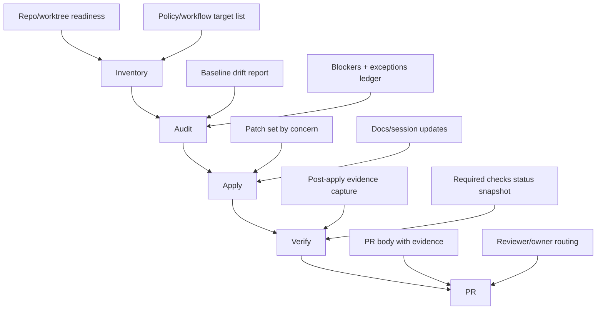

# 03_DAG_WBS — Governance Lane C (Wave1-C)

## Scope
Deliver Lane C governance execution using a strict dependency chain:
`inventory -> audit -> apply -> verify -> PR`.

## DAG

## Work Breakdown Structure (WBS)

| WBS ID | Stage | Task | Output | Owner | Depends On | Status |
|---|---|---|---|---|---|---|
| C-1 | Inventory | Confirm target repo/worktree and branch context | Inventory context note | Lane Owner | - | pending |
| C-2 | Inventory | Enumerate governance artifacts in scope (workflows, policy files, docs hooks) | Artifact inventory list | Lane Owner | C-1 | pending |
| C-3 | Inventory | Capture current baseline signatures/hashes for key files | Baseline manifest | Lane Owner | C-2 | pending |
| C-4 | Audit | Compare inventory against expected governance standard | Drift matrix | Lane Owner | C-3 | pending |
| C-5 | Audit | Classify findings (`compliant`, `needs_apply`, `blocked`) with reasons | Audit classification table | Lane Owner | C-4 | pending |
| C-6 | Audit | Record dependency and sequencing constraints for edits | Dependency notes | Lane Owner | C-5 | pending |
| C-7 | Apply | Implement required governance edits in dependency order | Applied patch set | Lane Owner | C-6 | pending |
| C-8 | Apply | Update session artifacts for decisions and exceptions | Updated docs in session folder | Lane Owner | C-7 | pending |
| C-9 | Verify | Re-scan changed artifacts to confirm expected state | Verify evidence log | Lane Owner | C-8 | pending |
| C-10 | Verify | Confirm no unresolved blockers remain for PR handoff | Go/No-go decision note | Lane Owner | C-9 | pending |
| C-11 | PR | Prepare PR narrative (scope, rationale, evidence, rollback notes) | PR draft content | Lane Owner | C-10 | pending |
| C-12 | PR | Route reviewers and finalize dependency callouts | Reviewer-ready PR checklist | Lane Owner | C-11 | pending |

## Owners Table Template

Use this table to assign accountability per sub-lane and handoff points.

| Lane/Concern | Primary Owner | Secondary Owner | Reviewer | Approver | Escalation Contact | Notes |
|---|---|---|---|---|---|---|
| Inventory | `<name>` | `<name>` | `<name>` | `<name>` | `<name>` | `<notes>` |
| Audit | `<name>` | `<name>` | `<name>` | `<name>` | `<name>` | `<notes>` |
| Apply | `<name>` | `<name>` | `<name>` | `<name>` | `<name>` | `<notes>` |
| Verify | `<name>` | `<name>` | `<name>` | `<name>` | `<name>` | `<notes>` |
| PR | `<name>` | `<name>` | `<name>` | `<name>` | `<name>` | `<notes>` |

## Dependency Notes

1. `Inventory` must freeze the artifact list before `Audit`; adding targets later invalidates drift accounting.
2. `Audit` outputs are the only source of truth for `Apply` scope; avoid opportunistic edits outside classified findings.
3. `Apply` should sequence high-blast-radius governance changes first (shared workflows/policy guards), then local wrappers/docs.
4. `Verify` must validate both content state and governance gate expectations before PR packaging.
5. `PR` handoff requires attached evidence from `Audit` and `Verify`; no evidence means no merge request.
6. If blockers are deterministic (permission/ruleset/branch-policy), record them once and route; do not retry loops.
7. Any cross-repo reuse candidate identified during `Audit`/`Apply` should be logged for explicit rollout confirmation before extraction.
