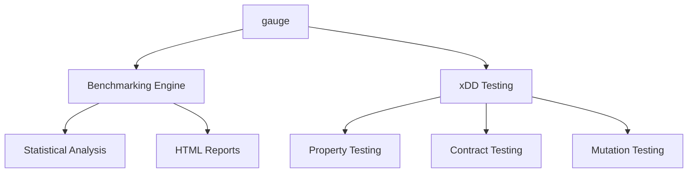

# Getting Started

## Installation

Add `gauge` to your `Cargo.toml`:

```toml
[dependencies]
gauge = { git = "https://github.com/KooshaPari/gauge" }
```

## Benchmarking

```rust
use gauge::{benchmark, group};

benchmark!("my_function").run(|| {
    my_function();
});

group!("string_ops", || {
    benchmark!("concat").run(|| format!("{} {}", "a", "b"));
    benchmark!("push_str").run(|| {
        let mut s = String::new();
        s.push_str("hello world");
    });
});
```

## Property Testing

```rust
use gauge::proptest::{regex_strategy, numeric_range};

proptest!(|(s in regex_strategy(r"\w+"))| {
    prop_assert!(validate(&s));
});
```

## Architecture



## xDD Testing Modules

| Module | Purpose |
|--------|---------|
| `proptest` | Reusable strategies for property-based testing |
| `contract` | Port/Adapter verification framework |
| `mutation` | Coverage tracking utilities |
| `specdd` | Specification parsing and validation |
