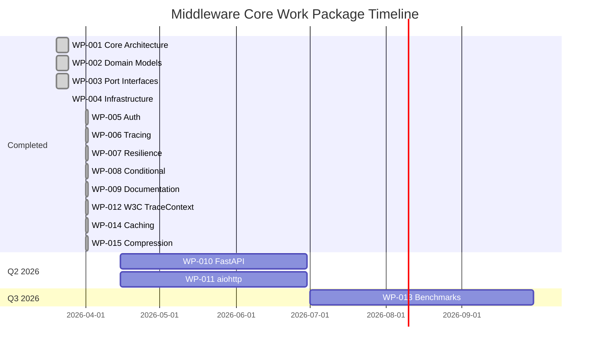

# Middleware Core — Work Package Index

This document tracks all work packages for the Middleware Core specification.

## Active Work Packages

| WP ID | Title | Status | Assignee | Due Date | FRs |
|-------|-------|--------|----------|----------|-----|
| WP-001 | Core Architecture Implementation | ✅ Complete | - | 2026-03-25 | FR-PROTO-001, FR-PIPE-001, FR-PIPE-002 |
| WP-002 | Domain Models & Error Handling | ✅ Complete | - | 2026-03-25 | FR-PROTO-004 |
| WP-003 | Port Interface Definitions | ✅ Complete | - | 2026-03-25 | FR-PROTO-001 |
| WP-004 | Infrastructure Adapters | ✅ Complete | - | 2026-03-25 | FR-BUILTIN-002 |
| WP-005 | Authentication Middleware | ✅ Complete | - | 2026-04-02 | FR-BUILTIN-001, FR-PROTO-002 |
| WP-006 | Tracing & Observability | ✅ Complete | - | 2026-04-02 | FR-BUILTIN-003 |
| WP-007 | Resilience Patterns | ✅ Complete | - | 2026-04-02 | FR-BUILTIN-004, FR-BUILTIN-005 |
| WP-008 | Conditional Middleware | ✅ Complete | - | 2026-04-02 | FR-PIPE-003 |
| WP-009 | Documentation & Examples | ✅ Complete | - | 2026-04-02 | - |

## Planned Work Packages

| WP ID | Title | Status | Target Date | FRs |
|-------|-------|--------|-------------|-----|
| WP-010 | FastAPI Integration | 📋 Planned | Q2 2026 | FR-INTEG-001, FR-INTEG-003 |
| WP-011 | aiohttp Integration | 📋 Planned | Q2 2026 | FR-INTEG-002, FR-INTEG-003 |
| WP-012 | W3C TraceContext Support | ✅ Complete | 2026-04-02 | FR-BUILTIN-003 |
| WP-013 | Performance Benchmarks | 📋 Planned | Q3 2026 | - |
| WP-014 | Caching Middleware | ✅ Complete | 2026-04-02 | FR-BUILTIN-006 |
| WP-015 | Compression Middleware | ✅ Complete | 2026-04-02 | FR-BUILTIN-007 |

## Work Package Details

### WP-001: Core Architecture Implementation

**Status**: ✅ Complete  
**Completed**: 2026-03-25

**Deliverables**:
- Hexagonal architecture structure
- `MiddlewareChain` orchestrator
- Request/Response flow handling
- Error handler support

**Tests**:
**Tests**:
- `tests/unit/test_trace_context.py`

---

### WP-014: Caching Middleware

**Status**: ✅ Completed  
**Target**: Q2 2026  
**Completed**: 2026-04-02

**Description**:
In-memory and TTL-based response caching middleware for improved performance on repeated requests.

**Deliverables**:
- `CachingMiddleware` class with configurable TTL
- Request key extraction (method + path + query params)
- Response cache storage with async safety
- Cache hit/miss metrics integration
- Configurable cache key generation strategy
- Memory safety with max entries limit

**Tests**:
- `tests/unit/test_cache_middleware.py` (15 tests)
- Trace: WP-014-CACHE

---

### WP-015: Prometheus Metrics Exporter

**Status**: 📋 Planned  
**Target**: Q2 2026

**Description**:
Native Prometheus metrics export for middleware observability.

**Deliverables**:
- Prometheus format metrics endpoint
- Counter for total requests
- Histogram for request duration
- Gauge for active middleware chains
- Custom label support

**FR Traceability**:
- FR-BUILTIN-007: Prometheus metrics export (Planned)

---
### WP-002: Domain Models & Error Handling

**Status**: ✅ Complete  
**Completed**: 2026-03-25

**Deliverables**:
- `Request` immutable dataclass
- `Response` mutable dataclass
- `MiddlewareResult` result pattern
- Error hierarchy (MiddlewareError, PipelineError, AdapterError)

**Tests**:
- `tests/unit/test_domain_models.py`

**Dependencies**: None

---

### WP-003: Port Interface Definitions

**Status**: ✅ Complete  
**Completed**: 2026-03-25

**Deliverables**:
- `MiddlewarePort` ABC
- `LoggingPort` ABC
- `MetricsPort` ABC
- `AuthPort` ABC

**Tests**:
- Contract tests verify all implementations

**Dependencies**: None

---

### WP-004: Infrastructure Adapters

**Status**: ✅ Complete  
**Completed**: 2026-03-25

**Deliverables**:
- `StdoutLoggingAdapter`
- `PrometheusMetricsAdapter`
- `LoggingMiddleware`
- `MetricsMiddleware`

**Tests**:
- `tests/contract/test_middleware_contract.py`

**Dependencies**: WP-003

---

### WP-005: Authentication Middleware

**Status**: ✅ Complete  
**Completed**: 2026-04-02

**Deliverables**:
- `AuthMiddleware` with Bearer token support
- Custom validator support
- Configurable header names
- `SyncMiddlewareAdapter` for sync middleware

**Tests**:
- `tests/unit/test_builtin_middleware.py::TestAuthMiddleware`

**Dependencies**: WP-001, WP-002, WP-003

---

### WP-006: Tracing & Observability

**Status**: ✅ Complete  
**Completed**: 2026-04-02

**Deliverables**:
- `TracingMiddleware` with correlation ID
- Trace ID preservation from headers
- Span ID generation

**Tests**:
- `tests/unit/test_builtin_middleware.py::TestTracingMiddleware`

**Dependencies**: WP-001, WP-002, WP-003

---

### WP-007: Resilience Patterns

**Status**: ✅ Complete  
**Completed**: 2026-04-02

**Deliverables**:
- `RetryMiddleware` with exponential backoff
- Configurable jitter
- `RateLimitMiddleware` with token bucket
- Per-client tracking
- Custom key extractors

**Tests**:
- `tests/unit/test_builtin_middleware.py::TestRetryMiddleware`
- `tests/unit/test_builtin_middleware.py::TestRateLimitMiddleware`

**Dependencies**: WP-001, WP-002, WP-003

---

### WP-008: Conditional Middleware

**Status**: ✅ Complete  
**Completed**: 2026-04-02

**Deliverables**:
- `ConditionalMiddleware` wrapper
- Predicate-based activation
- Pass-through when condition false

**Tests**:
- `tests/unit/test_builtin_middleware.py::TestConditionalMiddleware`

**Dependencies**: WP-001, WP-002, WP-003

---

### WP-009: Documentation & Examples

**Status**: ✅ Complete  
**Completed**: 2026-04-02

**Deliverables**:
- VitePress documentation site
- Getting started guide
- API reference
- Architecture guide with diagrams
- Advanced patterns guide
- Examples for common use cases
- Changelog

**Dependencies**: All previous WPs

---

### WP-010: FastAPI Integration

**Status**: 📋 Planned  
**Target**: Q2 2026

**Description**:
Full FastAPI adapter that integrates middleware chain as ASGI middleware.

**Deliverables**:
- `FastAPIMiddleware` ASGI wrapper
- Request/Response conversion
- Dependency injection integration
- Example application

**Rationale for Postponement**:
Requires framework-specific dependencies and testing. Core library patterns are stable and ready for community contributions.

**Decision Record**: [ADR-002](./adr/ADR-002-framework-adapters.md)

---

### WP-011: aiohttp Integration

**Status**: 📋 Planned  
**Target**: Q2 2026

**Description**:
aiohttp middleware adapter for async web applications.

**Deliverables**:
- `AioHTTPMiddleware` wrapper
- Request/Response conversion
- WebSocket support consideration
- Example application

**Rationale for Postponement**:
Similar to WP-010, requires framework-specific implementation. Can be developed independently of core library.

**Decision Record**: [ADR-002](./adr/ADR-002-framework-adapters.md)

---

### WP-012: W3C TraceContext Support

**Status**: 📋 Planned  
**Target**: Q2 2026

**Description**:
Full W3C TraceContext header support per specification.

**Deliverables**:
- `traceparent` header parsing/generation
- `tracestate` propagation
- Flag handling (sampled, etc.)

**Rationale for Postponement**:
Current implementation provides basic correlation IDs sufficient for most use cases. Full W3C compliance requires additional specification review.

**Decision Record**: [ADR-003](./adr/ADR-003-w3c-tracecontext.md)

---

### WP-012: W3C TraceContext Support

**Status**: ✅ Complete  
**Completed**: 2026-04-02

**Description**:
Full W3C TraceContext header support per specification.

**Deliverables**:
- `TraceContext` dataclass with validation
- `parse_traceparent()` function
- `format_traceparent()` function
- `tracestate` preservation
- Flag support (sampled bit)

**Tests**:
- `tests/unit/test_trace_context.py`

---

### WP-013: Performance Benchmarks

**Status**: 📋 Planned  
**Target**: Q3 2026

**Description**:
Comprehensive performance testing and optimization.

**Deliverables**:
- Benchmark suite with pytest-benchmark
- Throughput tests (target: 50K+ ops/sec)
- Memory usage profiling
- Comparative benchmarks

---

### WP-014: Caching Middleware

**Status**: 📋 Planned  
**Target**: Q3 2026

**Description**:
Response caching middleware with pluggable backends.

**Deliverables**:
- `CacheMiddleware` with TTL
- Redis backend option
- In-memory backend (default)
- Cache key customization

---

### WP-015: Compression Middleware

**Status**: ✅ Completed  
**Target**: Q3 2026
**Completed**: 2026-04-02

**Description**:
Response compression middleware with gzip and deflate support.

**Deliverables**:
- `CompressionMiddleware` with configurable compression levels
- Gzip compression support
- Deflate compression support
- Content-Encoding header handling
- Accept-Encoding negotiation
- Content type filtering (only compress text/*, application/json, etc.)
- Minimum size threshold to avoid compressing small responses
- Intelligent compression (skip if compressed size would be larger)

**Tests**:
- `tests/unit/test_compression_middleware.py` (21 tests)
- Trace: WP-015-COMPRESSION

---

## Timeline

## Decision Records

| ADR | Title | Status | Date |
|-----|-------|--------|------|
| ADR-001 | Architecture | Accepted | 2026-03-25 |
| ADR-002 | Framework Adapters Postponement | Proposed | 2026-04-02 |
| ADR-003 | W3C TraceContext | Accepted | 2026-04-02 |

---

**Last Updated**: 2026-04-02
