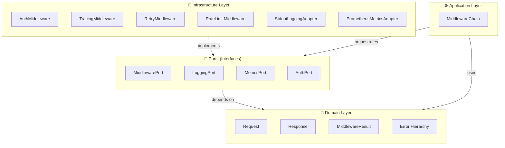
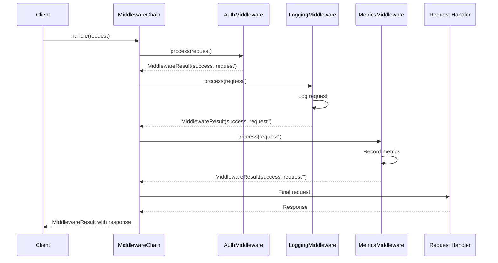
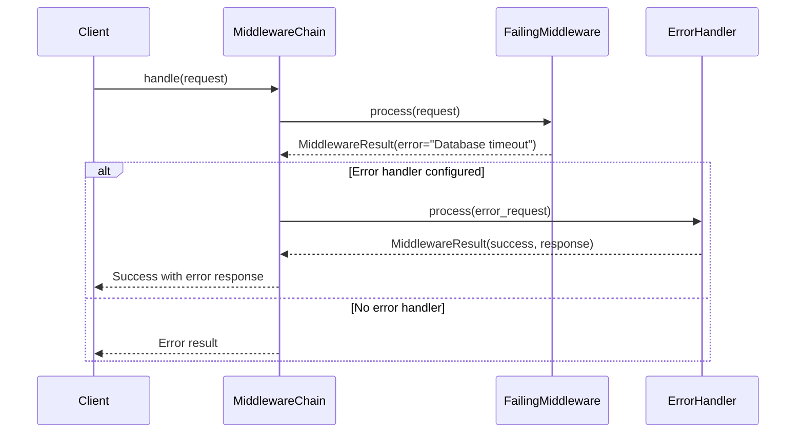
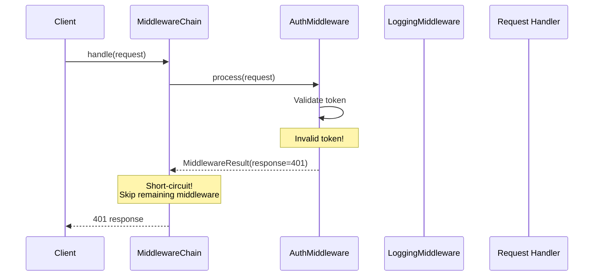
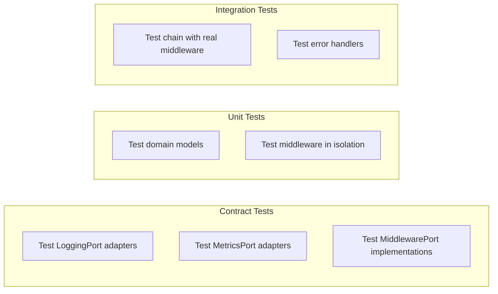

# Architecture Guide

This guide explains the hexagonal architecture of `phenotype-middleware-py` and how the different layers interact.

## Hexagonal Architecture Overview

The library follows **hexagonal architecture** (also known as ports and adapters), which separates concerns into concentric layers:



## Layer Responsibilities

### Domain Layer (`domain/`)

The innermost layer containing pure business logic with zero external dependencies.

**Contains:**
- `Request` - Immutable request object with context
- `Response` - Mutable response builder
- `MiddlewareResult` - Result pattern for explicit error handling
- `MiddlewareError`, `PipelineError`, `AdapterError` - Exception hierarchy

**Principles:**
- **Immutable data**: `Request` is frozen to prevent accidental mutation
- **Explicit errors**: `MiddlewareResult` forces handling of success/failure
- **No dependencies**: No imports from other layers

### Application Layer (`application/`)

Contains use cases that orchestrate domain objects.

**Contains:**
- `MiddlewareChain` - Orchestrates middleware execution

**Responsibilities:**
- Executes middleware in order
- Handles errors and error handlers
- Manages request/response flow
- Short-circuits when response is returned early

### Ports Layer (`ports/`)

Defines interface contracts (abstract base classes) that adapters must implement.

**Contains:**
- `MiddlewarePort` - Base interface for all middleware
- `LoggingPort` - Interface for logging adapters
- `MetricsPort` - Interface for metrics adapters
- `AuthPort` - Interface for authentication mechanisms

**Purpose:**
- Enables swapping implementations without changing domain/application code
- Facilitates contract testing
- Supports multiple backends (stdout vs file logging, Prometheus vs StatsD)

### Infrastructure Layer (`infrastructure/`)

Contains concrete implementations of ports and external service adapters.

**Contains:**
- Adapters: `StdoutLoggingAdapter`, `PrometheusMetricsAdapter`
- Middleware: `LoggingMiddleware`, `MetricsMiddleware`
- Built-in: `AuthMiddleware`, `TracingMiddleware`, `RetryMiddleware`, `RateLimitMiddleware`

## Data Flow



## Error Handling Flow



## Short-Circuit Pattern

Middleware can short-circuit the chain by returning a response:



## Adding Custom Middleware

To add custom middleware, implement `MiddlewarePort`:

```python
from phenotype_middleware.ports import MiddlewarePort
from phenotype_middleware.domain import Request, MiddlewareResult

class CustomMiddleware(MiddlewarePort):
    async def process(self, request: Request) -> MiddlewareResult:
        # Your logic here
        modified = request.with_context("custom_key", "value")
        return MiddlewareResult.ok(request=modified)
```

## Testing Architecture

The architecture supports testing at multiple levels:



- **Contract tests**: Verify adapters implement ports correctly
- **Unit tests**: Test individual components in isolation
- **Integration tests**: Test complete chains end-to-end

## Design Patterns Used

| Pattern | Usage |
|---------|-------|
| **Port/Adapter** | Decouple domain from infrastructure |
| **Result** | Explicit error handling with `MiddlewareResult` |
| **Chain of Responsibility** | Middleware execution order |
| **Builder** | `MiddlewareChain` fluent API |
| **Factory** | `MiddlewareResult.ok()` / `err()` |
| **Immutable** | `Request` frozen dataclass |

## xDD Methodologies

The codebase follows several xDD practices:

| Methodology | Implementation |
|-------------|----------------|
| **TDD** | Tests written before/parallel to implementation |
| **BDD** | Given-When-Then scenario naming in tests |
| **DDD** | Domain models with bounded context |
| **CDD** | Port/Adapter contract verification |

## Performance Considerations

- **Request immutability**: Creates new objects but enables safe caching
- **Async/await**: Non-blocking I/O for logging and metrics
- **In-memory metrics**: Fast collection with optional external flush
- **Lazy evaluation**: Error handlers only invoked on errors
