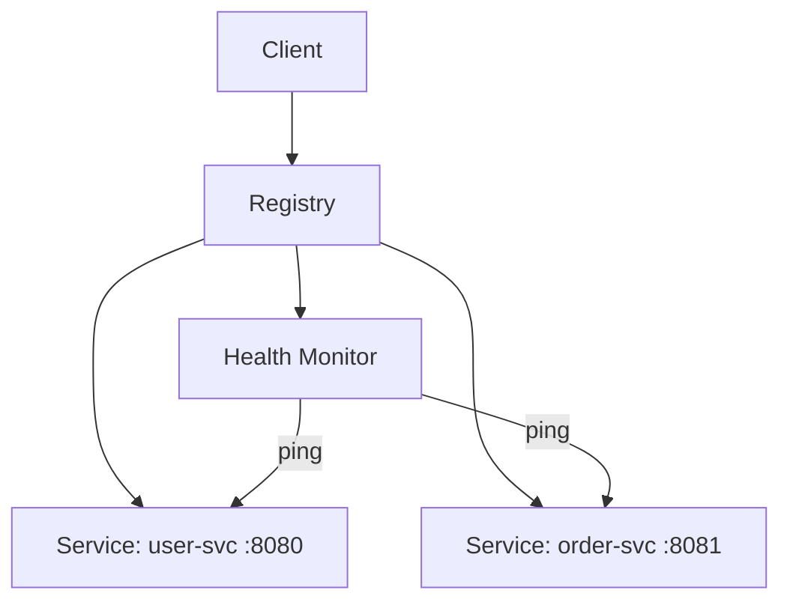

# Getting Started

## Installation

Add `nexus` to your `Cargo.toml`:

```toml
[dependencies]
nexus = { git = "https://github.com/KooshaPari/nexus" }
```

## Basic Usage

```rust
use nexus::{Registry, Service};

#[tokio::main]
async fn main() -> Result<(), Box<dyn std::error::Error>> {
    let registry = Registry::new();

    // Register a service
    registry.register(Service::new("user-svc", "localhost:8080")).await?;

    // Discover services
    let services = registry.discover("user-svc").await?;
    let endpoint = services.next()?; // Load balanced

    println!("Endpoint: {}", endpoint);
    Ok(())
}
```

## Architecture



## Load Balancing Strategies

| Strategy | Description |
|----------|-------------|
| Round Robin | Cycles through all healthy instances evenly |
| Random | Selects a random healthy instance |
| Consistent Hash | Routes by key for session affinity |
