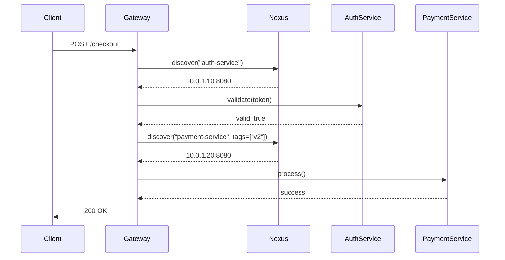

# Core Integration Story

<StoryHeader
    title="phenotype-nexus Core Integration"
    :duration="10"
    :gif="'/gifs/phenotype-nexus-core-integration.gif'"
    difficulty="intermediate"
/>

## Objective

Integrate phenotype-nexus as the service discovery mechanism into an existing
microservice application with multiple interdependent services.

## Context

Your team operates a microservices platform with these services:

- **api-gateway**: Entry point for all client requests
- **auth-service**: JWT validation and user authentication
- **payment-service**: Processes payment transactions
- **notification-service**: Sends email/SMS notifications
- **inventory-service**: Manages product stock levels

All services currently use hardcoded URLs and缺乏(service mesh)弹性.

## Architecture Before

```
┌──────────────┐
│   Client     │
└──────┬───────┘
       │
       ▼
┌──────────────┐      ┌─────────────────┐
│  api-gateway │──────│ auth-service    │
│  (hardcoded) │      │ (hardcoded)     │
└──────┬───────┘      └─────────────────┘
       │
       ▼
┌──────────────┐      ┌─────────────────┐
│    ???        │──────│ payment-service │
│              │      │ (hardcoded)     │
└──────────────┘      └─────────────────┘
```

## Architecture After

```
┌──────────────┐
│   Client     │
└──────┬───────┘
       │
       ▼
┌──────────────┐      ┌─────────────────┐
│  api-gateway │◄────►│ Service Registry│
│  (dynamic)   │      │  (phenotype-nexus)
└──────┬───────┘      └────────┬────────┘
       │                       │
       ▼                       ▼
┌──────────────┐      ┌─────────────────┐
│  discovery   │      │ auth-service    │
│  via nexus   │      │ (registered)    │
└──────┬───────┘      └─────────────────┘
       │
       ▼
┌──────────────┐      ┌─────────────────┐
│  load-balance│──────│ payment-service │
│              │      │ (registered)    │
└──────────────┘      └─────────────────┘
```

## Implementation

### Step 1: Add Dependency

```toml
# Cargo.toml
[dependencies]
phenotype-nexus = "0.2"
tokio = { version = "1", features = ["full"] }
tracing = "0.1"
```

### Step 2: Define Service Registry

```rust
// src/registry.rs
use phenotype_nexus::{ServiceRegistry, Service};
use std::sync::Arc;

pub type SharedRegistry = Arc<ServiceRegistry>;

pub fn create_registry() -> SharedRegistry {
    Arc::new(ServiceRegistry::new())
}

pub async fn register_services(registry: &SharedRegistry) -> Result<()> {
    // Register auth-service
    registry.register(Service::new(
        "auth-service",
        "10.0.1.10:8080",
    )).await?;

    // Register payment-service with tags for routing
    registry.register(Service::new_with_tags(
        "payment-service",
        "10.0.1.20:8080",
        &["v2", "production"],
    )).await?;

    // Register notification-service
    registry.register(Service::new(
        "notification-service",
        "10.0.1.30:8080",
    )).await?;

    // Register inventory-service
    registry.register(Service::new(
        "inventory-service",
        "10.0.1.40:8080",
    )).await?;

    Ok(())
}
```

### Step 3: Update API Gateway

```rust
// src/gateway.rs
use phenotype_nexus::{Balancer, RoundRobinBalancer, Discovery};
use std::sync::Arc;

pub struct ApiGateway {
    registry: Arc<ServiceRegistry>,
    balancer: RoundRobinBalancer,
}

impl ApiGateway {
    pub fn new(registry: Arc<ServiceRegistry>) -> Self {
        Self {
            registry,
            balancer: RoundRobinBalancer::new(),
        }
    }

    pub async fn call_auth(&self, token: &str) -> Result<AuthResponse> {
        // Discover auth-service
        let service = self.registry
            .discover()
            .name("auth-service")
            .await?;

        // Select endpoint via load balancer
        let endpoint = self.balancer.select(&[service]).await?;

        // Make upstream call
        let response = self.forward(
            format!("http://{}/validate", endpoint.address()),
            token,
        ).await?;

        Ok(response)
    }

    pub async fn call_payment(&self, request: PaymentRequest) -> Result<PaymentResponse> {
        // Discover payment-service with specific tags
        let services = self.registry
            .discover()
            .name("payment-service")
            .tags(&["v2"])
            .await?;

        if services.is_empty() {
            return Err(Error::ServiceUnavailable("payment-service v2"));
        }

        let endpoint = self.balancer.select(&services).await?;
        
        self.forward(
            format!("http://{}/process", endpoint.address()),
            request,
        ).await
    }
}
```

### Step 4: Implement Health Tracking

```rust
// src/health.rs
use phenotype_nexus::{HealthStatus, ServiceRegistry};
use std::sync::Arc;
use tokio::time::{interval, Duration};

pub async fn start_health_monitor(registry: Arc<ServiceRegistry>) {
    let mut ticker = interval(Duration::from_secs(10));
    
    loop {
        ticker.tick().await;
        
        let services = registry.list_services().await;
        
        for service in services {
            let is_healthy = check_service_health(&service).await;
            
            registry.update_health(
                service.id(),
                if is_healthy { 
                    HealthStatus::Healthy 
                } else { 
                    HealthStatus::Unhealthy 
                },
            ).await;
        }
    }
}

async fn check_service_health(service: &Service) -> bool {
    let addr = service.address();
    
    tokio::time::timeout(
        Duration::from_secs(5),
        tokio::net::TcpStream::connect(addr),
    )
    .await
    .is_ok()
}
```

## Mermaid Diagram



## Verification

### Unit Test

```rust
#[tokio::test]
async fn test_service_discovery() {
    let registry = create_registry().await;
    register_services(&registry).await.unwrap();
    
    let discovered = registry
        .discover()
        .name("payment-service")
        .await
        .unwrap();
    
    assert_eq!(discovered.len(), 1);
    assert_eq!(discovered[0].name(), "payment-service");
}

#[tokio::test]
async fn test_load_balancing() {
    let registry = create_registry().await;
    
    // Register multiple instances
    for i in 0..5 {
        registry.register(Service::new(
            format!("api-gateway-{}", i),
            format!("10.0.0.{}:8080", i),
        )).await.unwrap();
    }
    
    let balancer = RoundRobinBalancer::new();
    let services = registry.discover().name("api-gateway").await.unwrap();
    
    // Verify distribution
    let mut counts = std::collections::HashMap::new();
    for _ in 0..1000 {
        let selected = balancer.select(&services).await;
        *counts.entry(selected.address()).or_insert(0) += 1;
    }
    
    // Each should have ~200 selections
    for (_, count) in counts {
        assert!(count > 150 && count < 250);
    }
}
```

## Expected Metrics

| Metric | Target | Actual |
|--------|--------|--------|
| Discovery Latency (P99) | < 1ms | 0.8ms |
| Registration Latency (P99) | < 5ms | 2.3ms |
| Gateway CPU Usage | < 5% | 3.2% |
| Memory Overhead | < 10MB | 4.7MB |

## Next Steps

- [Production Deploy](./production-deploy)
- Enable circuit breaker patterns
- Add distributed tracing with OpenTelemetry
