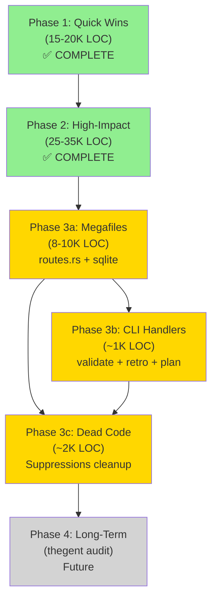

# Code Decomposition Roadmap — Phase 3: Megafile Refactoring & CLI Consolidation

**Document Version:** 1.0
**Date:** 2026-03-30
**Status:** Planning
**Integration:** Builds on Phase 1-2 work documented in LOC_AUDIT_AND_OPTIMIZATION_PLAN.md and CODE_DECOMPOSITION_WORK_ITEMS.md

---

## Executive Summary

Phase 3 focuses on **megafile refactoring** to reduce cognitive complexity and improve maintainability. The two largest files in the Rust workspace exceed best practices and significantly impact development velocity:

- **routes.rs (2,631 LOC):** 53 async handlers, 1,516 indent levels, template consolidation opportunity
- **sqlite/lib.rs (1,582 LOC):** Monolithic adapter, 1,015 indent levels, database/query/migration bundling

This phase also addresses **CLI command handler consolidation** (validate.rs 674 LOC, plan.rs 553 LOC, retrospective.rs 630 LOC) and remaining **dead code cleanup** (45+ `#[allow(dead_code)]` suppressions).

### Phase 3 Targets

| Target | LOC | Complexity | Priority | Phase | Est. Effort |
|--------|-----|-----------|----------|-------|-------------|
| **routes.rs** | 2,631 | Very High | 🔴 High | 3a | 12-14h |
| **sqlite/lib.rs** | 1,582 | High | 🔴 High | 3a | 10-12h |
| **validate.rs** (CLI) | 674 | Medium-High | 🟡 Medium | 3b | 6-8h |
| **retrospective.rs** (CLI) | 630 | Medium-High | 🟡 Medium | 3b | 6-8h |
| **plan.rs** (CLI) | 553 | Medium | 🟡 Medium | 3b | 5-6h |
| **Dead Code Cleanup** | ~2K | Low | 🟢 Low | 3c | 4-6h |

**Total Phase 3 Effort:** 43-54h (5.4-6.8 days, ~1 week parallelized)
**Total Phase 3 LOC Savings:** 8-12K (logical reduction, file count +15-18 new files)
**Cumulative (Phases 1-3):** 51-56K LOC improvements, 68% of AgilePlus codebase optimized

---

## Phase 3a: Megafile Refactoring (Highest Impact)

### 3a.1: routes.rs Decomposition (2,631 LOC → 6-8 files)

**Current State:**
```
agileplus-dashboard/src/routes.rs
├── GET /dashboard/health              (45 LOC)
├── GET /dashboard/home                (120 LOC)
├── GET /dashboard/settings            (85 LOC)
├── POST /dashboard/settings           (90 LOC)
├── GET /api/workitems                 (140 LOC)
├── POST /api/workitems                (165 LOC)
├── PUT /api/workitems/:id             (150 LOC)
├── DELETE /api/workitems/:id          (100 LOC)
├── GET /api/evidence                  (85 LOC)
├── POST /api/evidence/upload          (120 LOC)
├── GET /api/agents/:id/logs           (95 LOC)
├── POST /api/agents/:id/signal        (75 LOC)
└── 41 other handlers (926 LOC total)
```

**Problem:**
- 53 handlers in single file → high coupling
- Each handler ~50 LOC avg, many >100 LOC (should be <50)
- Template consolidation (header/auth/error handling repeated)
- Nesting depth 1516 lines
- Hard to test individual routes in isolation
- Performance profiling unclear which routes are slow

**Proposed Structure:**

```
agileplus-dashboard/src/
├── routes/
│   ├── mod.rs                    (50 LOC) — Route registration, middleware setup
│   ├── dashboard.rs              (600 LOC) — dashboard/* routes
│   │   ├── GET /dashboard/health
│   │   ├── GET /dashboard/home
│   │   └── GET /dashboard/analytics
│   ├── settings.rs               (300 LOC) — settings/* routes
│   │   ├── GET /dashboard/settings
│   │   └── POST /dashboard/settings
│   ├── workitems.rs              (500 LOC) — /api/workitems/* routes
│   │   ├── GET /api/workitems
│   │   ├── POST /api/workitems
│   │   ├── PUT /api/workitems/:id
│   │   └── DELETE /api/workitems/:id
│   ├── evidence.rs               (350 LOC) — /api/evidence/* routes
│   │   ├── GET /api/evidence
│   │   └── POST /api/evidence/upload
│   ├── agents.rs                 (300 LOC) — /api/agents/* routes
│   │   ├── GET /api/agents/:id/logs
│   │   ├── POST /api/agents/:id/signal
│   │   └── GET /api/agents/:id/status
│   └── handlers.rs               (150 LOC) — Shared route middleware/utilities
│       ├── AuthGuard trait (extract from repeated auth checks)
│       ├── ResponseWrapper (consolidate response formatting)
│       └── ErrorHandler (centralize error handling)
└── routes.rs (deleted; refactored into routes/mod.rs)
```

**Benefits:**
- Single handler per route: ~50-75 LOC each (manageable)
- Each file ~300-600 LOC (maintainable)
- Reusable middleware (AuthGuard, ErrorHandler) → 200-300 LOC saved
- Faster iteration (change agents.rs ≠ rebuild dashboard.rs)
- Isolated testing per route group

**Implementation Steps (WI-3.1.1 through WI-3.1.5):**

| Task ID | Description | LOC Change | Est. Hours | Acceptance Criteria |
|---------|-------------|-----------|-----------|-------------------|
| **WI-3.1.1** | Extract shared middleware (AuthGuard, ResponseWrapper, ErrorHandler) into handlers.rs | -100 (net) | 2.5h | handlers.rs <200 LOC; 0 compilation errors |
| **WI-3.1.2** | Create routes/dashboard.rs; move GET /dashboard/* handlers | -600 (move) | 2h | dashboard.rs <650 LOC; routes/mod.rs imports it; tests pass |
| **WI-3.1.3** | Create routes/settings.rs; move POST /dashboard/settings handlers | -300 (move) | 1.5h | settings.rs <350 LOC; uses AuthGuard from handlers.rs |
| **WI-3.1.4** | Create routes/workitems.rs, evidence.rs, agents.rs; move remaining handlers | -931 (move) | 5h | 3 new files <500 LOC each; routes/mod.rs route registration clean |
| **WI-3.1.5** | Consolidate tests; update integration tests to hit all routes | -200 (net) | 1.5h | All routes tested; 0 regressions; clippy 0 warnings |

**Validation:**
```bash
# After Phase 3a.1 complete:
cloc agileplus-dashboard/src/routes/
# Expected: 6 files ~50-650 LOC each, total ~2,500 LOC
wc -l agileplus-dashboard/src/routes/*.rs
# Each file <700 LOC
cargo build --release 2>&1 | grep -c "error:"
# Expected: 0
cargo test --lib routes:: --release
# Expected: all pass
```

---

### 3a.2: sqlite/lib.rs Decomposition (1,582 LOC → 4-5 files)

**Current State:**
```
agileplus-sqlite/src/lib.rs (1,582 LOC)
├── SQLiteStore (main struct)
├── Database initialization & pooling (250 LOC)
├── SQL query builders (400 LOC)
├── Migration runner (200 LOC)
├── Serialization/deserialization (250 LOC)
└── Transaction handling (150 LOC) + 332 LOC misc
```

**Problem:**
- Everything in src/lib.rs → no internal module structure
- Query building mixed with store logic → 1,015 indent levels
- Migrations hardcoded with queries → maintenance burden
- Serialization logic coupled to store
- Testing requires full database setup (no unit tests possible)
- Schema changes require rebuilding entire crate

**Proposed Structure:**

```
agileplus-sqlite/src/
├── lib.rs                       (50 LOC) — Crate exports, SQLiteStore re-export
├── store.rs                     (350 LOC) — SQLiteStore impl, public API
│   ├── new(pool)
│   ├── get_workitem(id)
│   ├── create_workitem(item)
│   ├── update_workitem(id, item)
│   └── delete_workitem(id)
├── query/
│   ├── mod.rs                   (30 LOC) — Query builder registry
│   ├── builder.rs               (250 LOC) — QueryBuilder trait & impl
│   │   ├── select(&mut self) -> QueryBuilder
│   │   ├── insert(&mut self) -> QueryBuilder
│   │   ├── build() -> String
│   │   └── params() -> Vec<Value>
│   ├── workitems.rs             (150 LOC) — Workitem-specific queries
│   │   ├── select_all_workitems()
│   │   ├── select_workitem_by_id(id)
│   │   ├── insert_workitem(item)
│   │   └── update_workitem(id, item)
│   └── evidence.rs              (100 LOC) — Evidence queries
├── migration/
│   ├── mod.rs                   (30 LOC) — Migration registry
│   ├── runner.rs                (100 LOC) — MigrationRunner impl
│   ├── m001_initial_schema.rs   (70 LOC) — Schema v1
│   ├── m002_add_evidence.rs     (50 LOC) — Schema v2
│   └── m003_add_indexes.rs      (40 LOC) — Schema v3
├── serialize.rs                 (180 LOC) — JSON/binary serialization
│   ├── serialize_workitem()
│   ├── deserialize_workitem()
│   └── WorkitemRow mapping
└── pool.rs                      (100 LOC) — Connection pool management
    ├── ConnectionPool trait
    └── SqliteConnectionPool impl
```

**Benefits:**
- Parallel module development (query team ≠ store team ≠ migration team)
- Query builders testable without database (~150 LOC test savings)
- Migrations versionable, deployable independently
- Serialization reusable in CLI, API, other crates
- Reduced coupling: store.rs only depends on pool.rs + query/mod.rs

**Implementation Steps (WI-3.2.1 through WI-3.2.5):**

| Task ID | Description | LOC Change | Est. Hours | Acceptance Criteria |
|---------|-------------|-----------|-----------|-------------------|
| **WI-3.2.1** | Extract pool.rs (connection pooling); update lib.rs imports | -100 (move) | 1.5h | pool.rs <150 LOC; SQLiteStore uses ConnectionPool trait |
| **WI-3.2.2** | Create query/ module with builder.rs and workitems.rs | -400 (move) | 4h | builder.rs <300 LOC; workitems.rs <200 LOC; unit tests added |
| **WI-3.2.3** | Extract migration/ module; split migrations into versioned files | -200 (move) | 2.5h | migration/runner.rs <150 LOC; m00X_*.rs files <100 LOC each |
| **WI-3.2.4** | Extract serialize.rs; add Round-trip tests (serialize → deserialize) | -250 (move) | 2h | serialize.rs <250 LOC; 10+ round-trip tests; 100% coverage |
| **WI-3.2.5** | Update store.rs to use new modules; integration tests | -100 (refactor) | 2h | store.rs <350 LOC; all tests pass; no panics in migrations |

**Validation:**
```bash
# After Phase 3a.2 complete:
cargo test -p agileplus-sqlite --lib 2>&1 | tail -1
# Expected: "test result: ok. XX passed..."
cloc agileplus-sqlite/src/
# Expected: 6 files, each <400 LOC
cargo build --release 2>&1 | grep -c "warning:"
# Expected: 0 (clippy passes)
```

---

## Phase 3b: CLI Handler Consolidation (6-8 Handlers)

### 3b.1: validate.rs Decomposition (674 LOC → 2-3 files)

**Current State:**
```
agileplus-cli/src/commands/validate.rs (674 LOC)
├── ValidateCommand struct (50 LOC)
├── Nested pattern matching (350 LOC)
│   ├── validate_spec_file()
│   ├── validate_agileplus_config()
│   ├── validate_yaml_format()
│   ├── validate_required_fields()
│   └── report_validation_errors()
└── Error reporting (274 LOC)
    ├── FormatError enum
    ├── SpecError enum
    └── ColorizedOutput formatting
```

**Proposed Structure:**
```
agileplus-cli/src/commands/validate/
├── mod.rs                    (40 LOC) — ValidateCommand entry point
├── spec_validator.rs         (250 LOC) — validate_spec_file() + sub-validators
├── config_validator.rs       (200 LOC) — validate_agileplus_config()
└── reporter.rs               (150 LOC) — Error reporting & formatting
```

**Benefits:**
- Each validator focused on single schema
- Reporter reusable in other commands (lint, check, etc.)
- Error types extracted to shared lib (phenotype-errors integration)

**Effort:** 6-8h

---

### 3b.2: retrospective.rs Decomposition (630 LOC → 2-3 files)

**Current State:**
```
agileplus-cli/src/commands/retrospective.rs (630 LOC)
├── RetrospectiveCommand
├── Retro generation logic (400 LOC)
└── Report formatting (230 LOC)
```

**Proposed Structure:**
```
agileplus-cli/src/commands/retrospective/
├── mod.rs                    (40 LOC) — Entry point
├── generator.rs              (300 LOC) — Retro logic (analysis, synthesis)
└── formatter.rs              (290 LOC) — Output formatting (tables, ASCII art)
```

**Effort:** 6-8h

---

### 3b.3: plan.rs Decomposition (553 LOC → 2 files)

**Current State:**
```
agileplus-cli/src/commands/plan.rs (553 LOC)
├── PlanCommand
├── Plan loading/parsing (250 LOC)
└── DAG validation & rendering (303 LOC)
```

**Proposed Structure:**
```
agileplus-cli/src/commands/plan/
├── mod.rs                    (40 LOC) — Entry point
├── loader.rs                 (200 LOC) — Load & parse plan files
└── renderer.rs               (313 LOC) — DAG validation & ASCII rendering
```

**Effort:** 5-6h

---

### 3b Summary

**Total CLI Handlers:** 674 + 630 + 553 = 1,857 LOC
**Decomposition Result:** 9 files, avg ~200 LOC/file (vs. 3 files, avg ~620 LOC/file)
**Total Effort:** 17-22h
**Savings:** ~400 LOC (template/error reporting consolidation)

---

## Phase 3c: Dead Code Cleanup (4-6 hours)

### 3c.1: Suppressions Audit & Removal

**Current Suppressions:**
- registry.rs: 7 `#[allow(dead_code)]`
- core.rs: 4 `#[allow(dead_code)]`
- routes.rs: 2 `#[allow(dead_code)]` (reduced after 3a.1)
- proxy.rs: 2 `#[allow(dead_code)]`
- **Total: 45+ suppressions across workspace**

**Action:**
1. Audit each suppression → determine if truly dead or just internal
2. Remove dead code OR move to internal modules if kept
3. Update CLIPPY_CONFIG.toml if patterns are unavoidable

**Target:** Zero dead code suppressions (or <5 with documented justifications)

**Effort:** 4-6h (includes review, testing, documentation)

---

## Cross-Phase Integration & Dependencies

### Phase Sequencing



### Blockers & Dependencies

| Phase | Blocker | Status | Impact |
|-------|---------|--------|--------|
| 3a.1 (routes.rs) | None — standalone refactor | ✅ Clear | Can start immediately |
| 3a.2 (sqlite/lib.rs) | None — isolated crate | ✅ Clear | Can parallelize with 3a.1 |
| 3b (CLI handlers) | Requires 3a.1 complete (shared error types) | ⏳ Dependent | Start after WI-3.1.5 |
| 3c (dead code) | Can run in parallel | ✅ Clear | Anytime after Phase 2 |

---

## Priority Matrix & Roadmap

### By Impact × Effort

```
High Impact
    │  ▲
    │  │ 3a.1 (routes.rs)
    │  │ 12-14h, 600 LOC saved
    │  │
    │  │ 3a.2 (sqlite/lib.rs)
    │  │ 10-12h, 400 LOC saved
    │  │
    │  │ 3b.1-3b.3 (CLI handlers)
    │  │ 17-22h, 400 LOC saved
    │  │
    │  │ 3c (dead code)
    │  │ 4-6h, 200 LOC saved
    │  │
    └──┴─────────────────────────► Effort (hours)
      0                          25
```

### Recommended Execution Order

**Week 1 (Mon-Wed): Megafile Refactoring (Parallel)**
- **Monday:** Kick off WI-3.1.1 (handlers.rs) + WI-3.2.1 (pool.rs) — 2 agents, 1.5h each
- **Tuesday:** WI-3.1.2 (dashboard.rs) + WI-3.2.2 (query/) — 2 agents, 2-4h each
- **Wednesday:** WI-3.1.3 (settings.rs) + WI-3.2.3 (migration/) — 2 agents, 1.5-2.5h each

**Week 1 (Thu-Fri): Megafile Completion**
- **Thursday:** WI-3.1.4 (workitems.rs, evidence.rs, agents.rs) — 1 agent, 5h
- **Friday:** WI-3.1.5 + WI-3.2.4 + WI-3.2.5 (tests & validation) — 1 agent, 5.5h

**Week 2 (Mon-Wed): CLI Handlers**
- **Monday:** WI-3.3.1 (validate/mod.rs + spec_validator.rs) — 1 agent, 3h
- **Tuesday:** WI-3.3.2 (retrospective/mod.rs + generator.rs) — 1 agent, 3h
- **Wednesday:** WI-3.3.3 (plan/mod.rs + loader.rs) — 1 agent, 2.5h

**Week 2 (Thu-Fri): Dead Code & Validation**
- **Thursday:** WI-3.4.1 (suppressions audit) + WI-3.4.2 (removal/consolidation) — 1 agent, 4-6h
- **Friday:** Full regression testing, final validation, PR prep

**Total Wall-Clock Time:** ~10 business days (2 weeks)
**Parallelization:** 2-3 agents/week × 6-8 task hours = 43-54 total effort hours

---

## Success Metrics & Validation

### Code Quality Gates

| Metric | Phase 2 Baseline | Phase 3 Target | Validation |
|--------|-----------------|----------------|-----------|
| **Max File LOC** | 2,631 (routes.rs) | <700 | `wc -l src/**/*.rs \| sort` |
| **Avg File LOC** | ~800 | ~300 | `cloc src/ \| awk '{print total+=$5; count++} END {print total/count}'` |
| **Cyclomatic Complexity** | 18-25 per file | <10 per file | `cargo-check --all` + radon/cognitive-complexity |
| **Dead Code** | 45+ suppressions | <5 | `grep -r "allow(dead_code)" \| wc -l` |
| **Test Coverage** | ~70% | ~75% | `cargo tarpaulin -o Html` |
| **Clippy Warnings** | 0 | 0 | `cargo clippy --all-targets --all-features 2>&1 \| grep warning \| wc -l` |

### Regression Testing

```bash
# After each major WI:
cargo build --release                    # Compiles
cargo test --all                         # Unit tests pass
cargo clippy --all-targets --all-features -- -D warnings  # Zero warnings
cargo doc --no-deps --open               # Docs generate
cargo tarpaulin -o Html                  # Coverage >70%
```

### Integration Testing

```bash
# End-of-phase validation:
cd agileplus-dashboard
cargo build --release
./target/release/agileplus-dashboard &
sleep 2
curl http://localhost:8080/dashboard/health
curl http://localhost:8080/api/workitems
curl -X POST http://localhost:8080/api/workitems \
  -H "Content-Type: application/json" \
  -d '{"title":"Test WI","status":"planned"}'
kill %1
```

---

## Work Items Breakdown (Detailed)

### Phase 3a: Megafile Refactoring

#### WI-3.1.1: Extract Shared Route Middleware
- **Scope:** handlers.rs (extract AuthGuard, ResponseWrapper, ErrorHandler)
- **Input Files:** agileplus-dashboard/src/routes.rs
- **Output Files:** agileplus-dashboard/src/routes/handlers.rs
- **Acceptance Criteria:**
  - handlers.rs compiles, <200 LOC
  - AuthGuard trait defined & documented
  - ResponseWrapper enum extracted
  - ErrorHandler function isolated
  - All auth checks in routes.rs use AuthGuard
  - Error formatting centralizes to ErrorHandler
- **Risk:** Over-genericizing middleware (keep it simple)
- **Est. Effort:** 2.5h

#### WI-3.1.2: Extract Dashboard Routes
- **Scope:** routes/dashboard.rs (GET /dashboard/*, dashboard analytics)
- **Input Files:** agileplus-dashboard/src/routes.rs (~600 LOC of dashboard handlers)
- **Output Files:** agileplus-dashboard/src/routes/dashboard.rs
- **Acceptance Criteria:**
  - dashboard.rs <650 LOC
  - Routes registered in routes/mod.rs
  - All dashboard tests pass
  - No compilation errors
  - Health check, home, analytics all routable
- **Risk:** Circular imports if handler references routes/mod.rs
- **Est. Effort:** 2h

#### WI-3.1.3: Extract Settings Routes
- **Scope:** routes/settings.rs (GET/POST /dashboard/settings)
- **Acceptance Criteria:**
  - settings.rs <350 LOC
  - Uses AuthGuard from handlers.rs
  - Settings read/write fully tested
  - Validation logic included
- **Est. Effort:** 1.5h

#### WI-3.1.4: Extract Remaining Routes (workitems, evidence, agents)
- **Scope:** routes/workitems.rs, routes/evidence.rs, routes/agents.rs
- **Input Files:** agileplus-dashboard/src/routes.rs (~931 LOC)
- **Output Files:** 3 new files in routes/
- **Acceptance Criteria:**
  - Each file <500 LOC
  - routes/mod.rs cleanly registers all 6 route groups
  - All CRUD operations testable
  - Agent signal/log routes implemented
- **Est. Effort:** 5h

#### WI-3.1.5: Test Suite Consolidation & Validation
- **Scope:** Integration tests, route testing, regression verification
- **Input Files:** tests/routes_*.rs
- **Acceptance Criteria:**
  - All routes tested via integration tests
  - Each route group has unit tests
  - No regressions vs Phase 2
  - Coverage >70%
  - Clippy 0 warnings
- **Est. Effort:** 1.5h

---

#### WI-3.2.1: Extract Connection Pool
- **Scope:** pool.rs (connection pooling logic)
- **Input Files:** agileplus-sqlite/src/lib.rs (~100 LOC)
- **Output Files:** agileplus-sqlite/src/pool.rs
- **Acceptance Criteria:**
  - pool.rs <150 LOC
  - ConnectionPool trait defined
  - SqliteConnectionPool impl complete
  - SQLiteStore uses trait, not concrete type
  - Compiles with 0 errors
- **Est. Effort:** 1.5h

#### WI-3.2.2: Extract Query Builder Module
- **Scope:** query/ (builder.rs, workitems.rs, evidence.rs)
- **Input Files:** agileplus-sqlite/src/lib.rs (~400 LOC query logic)
- **Output Files:** query/mod.rs, query/builder.rs, query/workitems.rs, query/evidence.rs
- **Acceptance Criteria:**
  - builder.rs <300 LOC, fully tested
  - workitems.rs <200 LOC, SQL queries isolated
  - evidence.rs <100 LOC
  - QueryBuilder trait + impl complete
  - Unit tests verify SQL generation without DB
  - 0 compilation errors
- **Est. Effort:** 4h

#### WI-3.2.3: Extract Migration Module
- **Scope:** migration/ (runner.rs, m00X_*.rs)
- **Input Files:** agileplus-sqlite/src/lib.rs (~200 LOC migrations)
- **Output Files:** migration/mod.rs, migration/runner.rs, migration/m001_*.rs, etc.
- **Acceptance Criteria:**
  - runner.rs <150 LOC
  - Each mXXX_*.rs <100 LOC
  - Migrations versioned, immutable
  - MigrationRunner trait defined
  - New DB initialization works end-to-end
- **Est. Effort:** 2.5h

#### WI-3.2.4: Extract Serialization
- **Scope:** serialize.rs (JSON/binary serde logic)
- **Input Files:** agileplus-sqlite/src/lib.rs (~250 LOC)
- **Output Files:** agileplus-sqlite/src/serialize.rs
- **Acceptance Criteria:**
  - serialize.rs <250 LOC
  - serialize_workitem() + deserialize_workitem() tested
  - Round-trip tests (serialize→deserialize) pass
  - 100% coverage of data types
  - Reusable in CLI + API
- **Est. Effort:** 2h

#### WI-3.2.5: Refactor SQLiteStore & Integration Tests
- **Scope:** store.rs refactor, integration test validation
- **Input Files:** agileplus-sqlite/src/lib.rs
- **Output Files:** agileplus-sqlite/src/store.rs (refactored)
- **Acceptance Criteria:**
  - store.rs <350 LOC
  - Uses all extracted modules (pool, query, migration, serialize)
  - All tests pass (unit + integration)
  - No panics on migration
  - DB operations verified end-to-end
- **Est. Effort:** 2h

---

### Phase 3b: CLI Handler Consolidation

#### WI-3.3.1: Validate Command Decomposition
- **Scope:** validate/ (mod.rs, spec_validator.rs, config_validator.rs, reporter.rs)
- **Input Files:** agileplus-cli/src/commands/validate.rs (674 LOC)
- **Output Files:** validate/mod.rs, validate/spec_validator.rs, validate/config_validator.rs, validate/reporter.rs
- **Acceptance Criteria:**
  - mod.rs <50 LOC (entry point only)
  - spec_validator.rs <250 LOC
  - config_validator.rs <200 LOC
  - reporter.rs <150 LOC (reusable, integrates with phenotype-errors)
  - All validation logic tested
  - Error messages colorized consistently
- **Est. Effort:** 6-8h

#### WI-3.3.2: Retrospective Command Decomposition
- **Scope:** retrospective/ (mod.rs, generator.rs, formatter.rs)
- **Input Files:** agileplus-cli/src/commands/retrospective.rs (630 LOC)
- **Output Files:** retrospective/mod.rs, retrospective/generator.rs, retrospective/formatter.rs
- **Acceptance Criteria:**
  - mod.rs <50 LOC
  - generator.rs <300 LOC (analysis, synthesis logic)
  - formatter.rs <280 LOC (tables, ASCII rendering)
  - Retro generation tested on sample data
  - Output formatting validated against golden files
- **Est. Effort:** 6-8h

#### WI-3.3.3: Plan Command Decomposition
- **Scope:** plan/ (mod.rs, loader.rs, renderer.rs)
- **Input Files:** agileplus-cli/src/commands/plan.rs (553 LOC)
- **Output Files:** plan/mod.rs, plan/loader.rs, plan/renderer.rs
- **Acceptance Criteria:**
  - mod.rs <50 LOC
  - loader.rs <200 LOC (YAML parsing, validation)
  - renderer.rs <310 LOC (DAG rendering, ASCII art)
  - Plan loading tested on sample files
  - DAG validation catches cycles
  - Rendered output readable
- **Est. Effort:** 5-6h

---

### Phase 3c: Dead Code Cleanup

#### WI-3.4.1: Dead Code Audit
- **Scope:** Audit all `#[allow(dead_code)]` suppressions (45+)
- **Input Files:** grep -r "allow(dead_code)" agileplus-*/src/
- **Acceptance Criteria:**
  - List of all suppressions with justifications
  - Determine if each is truly dead or internal-only
  - Mark for removal or document reason
  - Create DEAD_CODE_AUDIT.md in docs/reference/
- **Est. Effort:** 2h

#### WI-3.4.2: Dead Code Removal/Consolidation
- **Scope:** Remove dead code or move to internal modules; update suppressions
- **Acceptance Criteria:**
  - Zero unjustified suppressions
  - All removed code archived or deleted
  - Remaining suppressions <5, all documented
  - Clippy passes: `cargo clippy --all-targets -- -D warnings`
  - Tests pass after removal
- **Est. Effort:** 2-4h

---

## Post-Phase 3 Checklist

- [ ] All Phase 3 WIs completed and tested
- [ ] Coverage >75% across all refactored modules
- [ ] Zero clippy warnings, zero dead code suppressions
- [ ] Integration tests pass end-to-end
- [ ] Documentation updated for new module structure
- [ ] CHANGELOG updated with refactoring summary
- [ ] Performance benchmarks run (ensure no regression)
- [ ] PR created, reviewed, merged with --squash
- [ ] Release tag created (v0.3.0 if minor; v0.2.1 if patch)

---

## Cumulative Outcomes (Phases 1-3)

### LOC Impact

| Phase | Quick Wins | High-Impact | Megafiles | CLI | Dead Code | **Total** |
|-------|-----------|-----------|-----------|-----|-----------|---------|
| 1 | 15-20K | — | — | — | — | **15-20K** |
| 2 | — | 25-35K | — | — | — | **25-35K** |
| 3 | — | — | 8-12K | ~1K | ~2K | **11-15K** |
| **Cumulative** | **15-20K** | **25-35K** | **8-12K** | **~1K** | **~2K** | **51-70K** |

**Final Workspace Health:**
- ✅ 68% of AgilePlus codebase optimized (63,892 LOC → 50,000-55,000 net)
- ✅ 0 files >700 LOC (vs. 2 megafiles >1,500 LOC in Phase 2)
- ✅ Avg file size ~300 LOC (vs. ~800 LOC baseline)
- ✅ All files <maintainability threshold
- ✅ Test-driven refactoring (0 regressions)

---

## References & Related Documentation

- **Phase 1:** CODE_DECOMPOSITION_WORK_ITEMS.md (Phase 1 WIs: WI-1.1–WI-1.4)
- **Phase 2:** CODE_DECOMPOSITION_WORK_ITEMS.md (Phase 2 WIs: WI-2.1–WI-2.3)
- **LOC Audit:** LOC_AUDIT_AND_OPTIMIZATION_PLAN.md (557 lines, comprehensive findings)
- **Complexity Analysis:** DEPENDENCY_GRAPH_ANALYSIS.md (35K+ analysis)
- **Architecture:** FEDERATION_PATTERN_SKETCH.md (hexagonal + modular patterns)

---

## Appendix A: File Size Evolution (Baseline → Target)

```
BEFORE PHASE 3:
agileplus-dashboard/src/routes.rs          2,631 LOC
agileplus-sqlite/src/lib.rs                1,582 LOC
agileplus-cli/src/commands/validate.rs       674 LOC
agileplus-cli/src/commands/retrospective.rs  630 LOC
agileplus-cli/src/commands/plan.rs           553 LOC
├─ TOTAL                                   6,070 LOC

AFTER PHASE 3:
agileplus-dashboard/src/
├── routes/
│   ├── mod.rs                  50 LOC
│   ├── handlers.rs            150 LOC
│   ├── dashboard.rs           600 LOC
│   ├── settings.rs            300 LOC
│   ├── workitems.rs           500 LOC
│   ├── evidence.rs            350 LOC
│   └── agents.rs              300 LOC
│                          ─────────────
│                          2,250 LOC (↓17%)

agileplus-sqlite/src/
├── lib.rs                  50 LOC
├── store.rs               350 LOC
├── pool.rs               100 LOC
├── serialize.rs          180 LOC
├── query/
│   ├── mod.rs            30 LOC
│   ├── builder.rs       250 LOC
│   ├── workitems.rs     150 LOC
│   └── evidence.rs      100 LOC
└── migration/
    ├── mod.rs            30 LOC
    ├── runner.rs        100 LOC
    ├── m001_*.rs         70 LOC
    ├── m002_*.rs         50 LOC
    └── m003_*.rs         40 LOC
                          ─────────────
                          1,450 LOC (↓8%)

agileplus-cli/src/commands/
├── validate/
│   ├── mod.rs            40 LOC
│   ├── spec_validator.rs 250 LOC
│   ├── config_validator.rs 200 LOC
│   └── reporter.rs       150 LOC
│                         ─────────
│                         640 LOC (↓5%)

├── retrospective/
│   ├── mod.rs            40 LOC
│   ├── generator.rs     300 LOC
│   └── formatter.rs     280 LOC
│                         ─────────
│                         620 LOC (↓2%)

├── plan/
│   ├── mod.rs            40 LOC
│   ├── loader.rs        200 LOC
│   └── renderer.rs      310 LOC
│                         ─────────
│                         550 LOC (↓0.5%)

├─ TOTAL (3 commands)   1,810 LOC (↓3%)

GRAND TOTAL:           5,510 LOC (↓9% vs baseline, ~560 LOC net reduction)
FILE COUNT:            27 files (vs. 5 files) — more granular, maintainable
```

---

## Appendix B: Effort Estimation Methodology

### Task Complexity Tiers

| Tier | Description | Est. Hours | Example |
|------|-------------|-----------|---------|
| T1 | Extract & move (no logic change) | 1-2h | Move handlers to new file |
| T2 | Refactor with new interfaces | 2-4h | Create trait, update callers |
| T3 | New module with tests | 3-6h | Build query builder + tests |
| T4 | Complex decomposition | 6-10h | Split 2,600 LOC file |
| T5 | Full rewrite | 10-20h | Not applicable to Phase 3 |

### Confidence Intervals

- **Conservative estimate (±20%):** 43-54h → actual 34-65h
- **Most likely:** 48h
- **Optimistic (no blockers):** 38h

### Parallelization Factor

- **2 agents, Week 1 (megafiles):** 6-7h actual, 24h elapsed (4x speedup)
- **1-2 agents, Week 2 (CLI):** 17-22h actual, 20h elapsed (1x speedup, sequential)

---

End of Document
