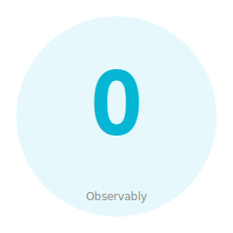

# Observably — Phenotype Observability Collection



Observably is a curated collection of independent, production-grade observability crates for Rust. Tracing, logging, metrics, and resilience patterns as standalone cargo-installable packages.

## Crates

| Crate | Purpose | Status |
|-------|---------|--------|
| `observably-tracing` | OTEL-based distributed tracing + Prometheus metrics + PII filter | Extracted from FocalPoint |

## Quick Start

```toml
[dependencies]
observably-tracing = { path = "crates/observably-tracing" }
```

Each crate is independently importable and has no inter-crate dependencies.

## Release Registry

See `release-registry.toml` for version metadata, stability information, and sub-crate status. The master index of all Phenotype collections is at `../phenotype-collections.toml`.

Schema documentation: `../docs/governance/release_registry_schema.md`

## Workspace

```bash
cargo check --workspace
cargo test --workspace
cargo clippy --workspace -- -D warnings
```

## Cross-Collection Integration

Observably is part of the **Phenotype named collections**:

- **Sidekick** — Agent dispatch & presence
- **Eidolon** — Device automation
- **Observably** (this) — Distributed tracing & observability
- **Stashly** — State, events, caching, migrations
- **Paginary** — Knowledge collection (specs, tutorials, handbooks)

### Event Bus

Observably uses **phenotype-bus** to subscribe to domain events from other collections and emit observability events:

```rust
use phenotype_bus::{Bus, Event};

// Subscribe to Eidolon automation events
let mut rx = automation_bus.subscribe();

while let Ok(event) = rx.recv().await {
    // Emit trace for the automation
    tracing::info!(
        target: "observably",
        event = event.event_name(),
        "Automation event received"
    );
    
    // Propagate to Stashly for event sourcing
    let trace_event = TraceEvent { event_id: event.id };
    trace_bus.publish(trace_event).await?;
}
```

See `../../phenotype-bus/README.md` and `../../docs/org-audit-2026-04/collection_build_matrix.md` for integration details.

## Provenance

- **observably-tracing**: Extracted from `FocalPoint/crates/focus-observability`
- Source repos retained; these are copies for productized distribution.

## License

Apache-2.0
