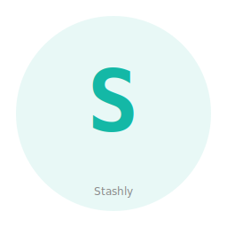

# Stashly — Phenotype Storage & Persistence Collection



Stashly is a curated collection of independent, battle-tested storage crates for Rust. Caching, event sourcing, state machines, and persistence patterns as standalone cargo-installable packages.

## Crates

| Crate | Purpose | Status |
|-------|---------|--------|
| `stashly-cache` | Two-tier LRU + DashMap cache with TTL support | Extracted from phenotype-cache-adapter |
| `stashly-eventstore` | Append-only event store with SHA-256 hash chains | Extracted from phenotype-event-sourcing |
| `stashly-statemachine` | Generic FSM with transition guards and context | Extracted from phenotype-state-machine |

## Quick Start

```toml
[dependencies]
stashly-cache = { path = "crates/stashly-cache" }
stashly-eventstore = { path = "crates/stashly-eventstore" }
stashly-statemachine = { path = "crates/stashly-statemachine" }
```

Each crate is independently importable and has no inter-crate dependencies.

## Release Registry

See `release-registry.toml` for version metadata, stability information, and sub-crate status. The master index of all Phenotype collections is at `../phenotype-collections.toml`.

Schema documentation: `../docs/governance/release_registry_schema.md`

## Workspace

```bash
cargo check --workspace
cargo test --workspace
cargo clippy --workspace -- -D warnings
```

## Cross-Collection Integration

Stashly is part of the **Phenotype named collections**:

- **Sidekick** — Agent dispatch & presence
- **Eidolon** — Device automation
- **Observably** — Distributed tracing & observability
- **Stashly** (this) — State, events, caching, migrations
- **Paginary** — Knowledge collection (specs, tutorials, handbooks)

### Event Bus

Stashly uses **phenotype-bus** to subscribe to events from other collections and store them in the event store:

```rust
use phenotype_bus::{Bus, Event};
use stashly_eventstore::EventStore;

// Subscribe to Sidekick dispatch events
let mut rx = dispatch_bus.subscribe();

let event_store = EventStore::new();

while let Ok(event) = rx.recv().await {
    // Append to event store for replaying / auditing
    event_store.append(
        &event.event_name(),
        serde_json::to_value(event)?,
    ).await?;
}
```

Stashly's state machines can also emit events for other collections:

```rust
pub struct StateTransitioned {
    pub from_state: String,
    pub to_state: String,
}

impl Event for StateTransitioned {
    fn event_name(&self) -> &'static str { "StateTransitioned" }
}

// Emit for Observably to trace
state_transition_bus.publish(StateTransitioned { /* ... */ }).await?;
```

See `../../phenotype-bus/README.md` and `../../docs/org-audit-2026-04/collection_build_matrix.md` for integration details.

## Provenance

- **stashly-cache**: Extracted from `crates/phenotype-cache-adapter`
- **stashly-eventstore**: Extracted from `crates/phenotype-event-sourcing`
- **stashly-statemachine**: Extracted from `crates/phenotype-state-machine`
- Source repos retained; these are copies for productized distribution.

## See Also

Explore Stashly and other Phenotype collections at the [Collections Showcase](https://dev.phenotype.io/collections).

**Sibling Collections:**
- **[Sidekick](../Sidekick)** — AI-powered agent framework & dispatch routing
- **[Eidolon](../Eidolon)** — Unified trait-based device automation (desktop, mobile, sandbox)
- **[Observably](../PhenoObservability)** — Observability & distributed tracing
- **[Paginary](../Paginary)** — Knowledge collection (specs, tutorials, handbooks)
- **[phenotype-shared](../phenoShared)** — Rust infrastructure toolkit (domain, application, ports)

## Governance & Development

**AgilePlus Tracking**: All work tracked in `/repos/AgilePlus`. Review `CLAUDE.md` for development standards and policies.

**Quality Checks**:
```bash
cargo test --workspace               # Complete test suite
cargo clippy --workspace -- -D warnings  # Zero warnings required
cargo fmt --check                   # Format validation
```

**Crate Publishing**: Each crate independently published to crates.io with `stashly-*` prefix for granular dependency management.

**Cross-Collection Integration**: Stashly uses phenotype-bus to consume events from Sidekick (dispatch), Observably (tracing), and Eidolon (automation) for persistence and state management.

## Usage Patterns

**Event Sourcing Workflow**:
```rust
// Subscribe to domain events
let mut rx = domain_bus.subscribe();
// Store in event store
event_store.append(&event).await?;
// Replay for audit/replay
let history = event_store.all().await?;
```

**State Machine with Guards**:
```rust
// Define states and transitions
let mut fsm = StateMachine::new(initial_state);
// Guard transitions with context
fsm.transition(next_state, context)?;
```

## Related Phenotype Collections

- **[Sidekick](../Sidekick)** — Agent dispatch
- **[Eidolon](../Eidolon)** — Device automation
- **[Observably](../Observably)** — Distributed tracing
- **[Paginary](../Paginary)** — Knowledge collection
- **[phenotype-shared](../phenotype-shared)** — Shared infrastructure

## License

Apache-2.0

**Status**: Active collection (expanding Phase 2)  
**Collections Showcase**: https://dev.phenotype.io/collections  
**Last Updated**: 2026-04-24
