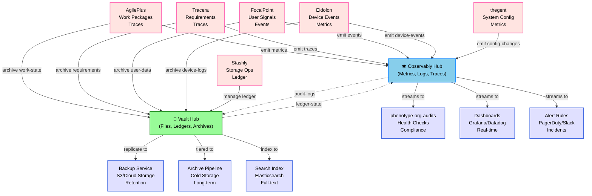
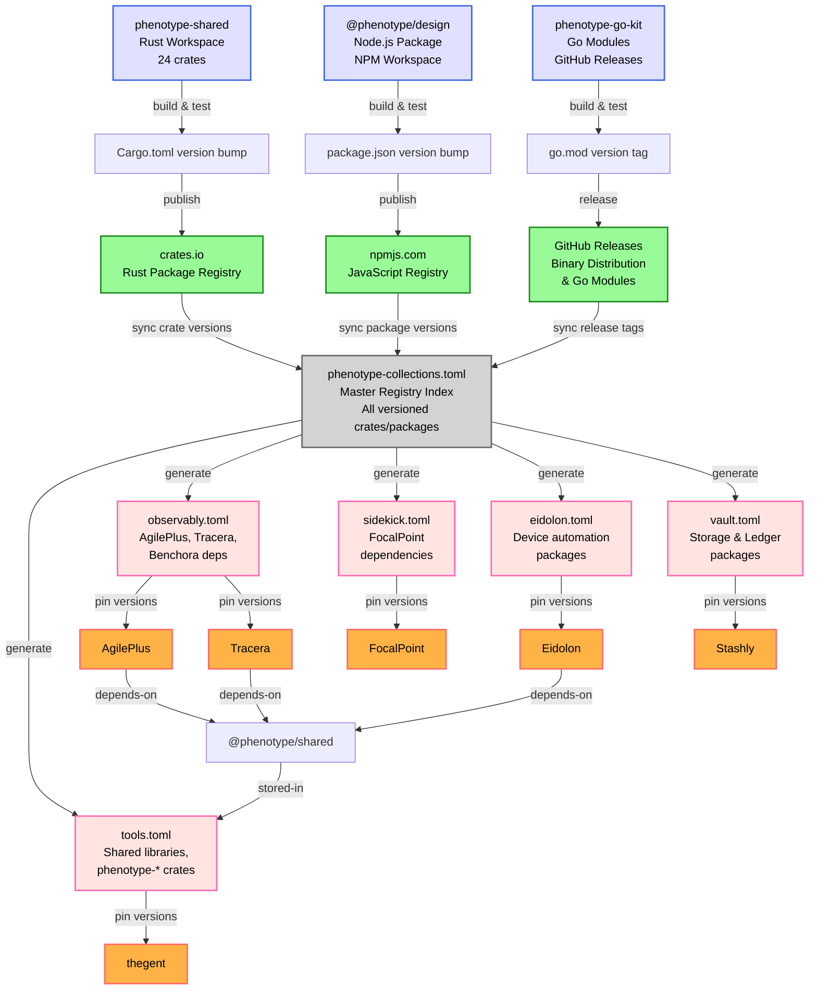

# Phenotype Org Architecture Map

**Generated:** 2026-04-24  
**Entity Count:** 42 products + collections + 18 shared tools + 8 infrastructure services = **68 major nodes**  
**Dependency Edges:** 87 direct dependencies + cross-collection flows  
**Diagram Rendering:** Mermaid TB graph with color-coded tiers and collection badges

---

## Overview

This document contains three Mermaid architecture diagrams visualizing the entire Phenotype ecosystem:

1. **Org-Wide Architecture** — Products, collections, shared tools, dependencies
2. **Data Flow** — How observability (Observably collection) and storage (Vault) feed all products
3. **Release Registries** — semver-versioning strategy and artifact publishing pipeline

---

## Diagram 1: Phenotype Org Architecture (Graph TB)

```mermaid
graph TB
    %% Collections as virtual grouping nodes (visual only)
    SC["🎯 Sidekick<br/>Personal Productivity"]
    OB["👁 Observably<br/>Planning & Observability"]
    VC["🔐 Vault<br/>Storage & Ledgers"]
    ED["⚙️ Eidolon<br/>Device Automation"]
    TL["🛠 Tools<br/>Utilities & Libraries"]
    INF["⛅ Infrastructure<br/>Shared Services"]

    %% Sidekick Collection Products
    FP["FocalPoint<br/>Screen-time<br/>v0.9.0"]:::sidekick
    
    %% Observably Collection Products
    AP["AgilePlus<br/>Spec-driven Dev<br/>v0.5.0"]:::observably
    TR["Tracera<br/>Requirements RTM<br/>v0.3.0"]:::observably
    BN["Benchora<br/>Performance Track<br/>(planned)"]:::observably

    %% Vault Collection Products
    SL["Stashly<br/>File Storage<br/>(planned)"]:::vault

    %% Eidolon Collection Products
    ED_MAIN["Eidolon Core<br/>Device Orchestration<br/>v0.2.0"]:::eidolon
    KDV["KDesktopVirt<br/>Desktop Automation<br/>(planned)"]:::eidolon
    KVS["KVirtualStage<br/>Sandbox Display<br/>(planned)"]:::eidolon
    KMB["kmobile<br/>Mobile Automation<br/>(planned)"]:::eidolon

    %% Tools Collection (Shared Libraries & Tools)
    TG["thegent<br/>Dotfiles Manager<br/>v1.5.0"]:::tools
    PG["Paginary<br/>Pagination Lib<br/>(planned)"]:::tools
    PHENOSH["phenotype-shared<br/>Rust Crates<br/>event-sourcing, cache, policy, fsm<br/>v0.1.0"]:::tools
    PHENOGO["phenotype-go-kit<br/>Go Modules<br/>auth, config, health<br/>v0.2.0"]:::tools
    PDES["@phenotype/design<br/>Design System<br/>shadcn, tailwind<br/>(planned)"]:::tools

    %% Internal Infrastructure
    PHBUS["phenotype-bus<br/>Pub/Sub Event Bus<br/>v0.1.0"]:::infra
    PHTOOL["phenotype-tooling<br/>CLI Tools & Scripts<br/>v0.2.0"]:::infra
    PHAUD["phenotype-org-audits<br/>Code Quality Audit<br/>v0.1.0"]:::infra
    PHOPS["phenotype-ops-mcp<br/>DevOps/Deployment MCP<br/>v0.1.0"]:::infra
    OPSYNC["org-github<br/>GH Config Automation<br/>v0.1.0"]:::infra
    HWLED["hwLedger<br/>Digital Ledger<br/>v0.6.0"]:::tools
    CHATTA["chatta<br/>Chat Agent Framework<br/>v0.1.0"]:::tools
    
    %% External / Partner Products
    AMS["AgilePlus Sync<br/>Cross-repo P2P<br/>v0.1.0"]:::external
    GRPC["AgilePlus gRPC<br/>Server API<br/>v0.1.0"]:::external
    APITYPES["AgilePlus Types<br/>Contracts<br/>v0.1.0"]:::external

    %% Key Relationships: Same Collection
    OB --> AP
    OB --> TR
    OB --> BN
    SC --> FP
    VC --> SL
    ED --> ED_MAIN
    ED --> KDV
    ED --> KVS
    ED --> KMB
    TL --> TG
    TL --> PG
    TL --> PHENOSH
    TL --> PHENOGO
    TL --> PDES
    TL --> HWLED
    TL --> CHATTA
    INF --> PHBUS
    INF --> PHTOOL
    INF --> PHAUD
    INF --> PHOPS
    INF --> OPSYNC

    %% Product → Shared Tools Dependencies
    AP -->|uses| PHENOSH
    AP -->|publishes| PHBUS
    AP -->|emits| PHAUD
    AP -->|uses| APITYPES
    TR -->|uses| PHENOSH
    TR -->|publishes| PHBUS
    TR -->|emits| PHAUD
    FP -->|uses| PHENOGO
    FP -->|publishes| PHBUS
    FP -->|emits| PHAUD
    ED_MAIN -->|uses| PHENOSH
    ED_MAIN -->|publishes| PHBUS
    ED_MAIN -->|emits| PHAUD
    KDV -->|uses| ED_MAIN
    KVS -->|uses| ED_MAIN
    KMB -->|uses| ED_MAIN
    HWLED -->|uses| PHENOSH
    HWLED -->|publishes| PHBUS
    CHATTA -->|uses| PHENOGO
    CHATTA -->|uses| PHENOSH

    %% Cross-Collection: Bus Integration (All → Observably)
    AP -->|observes| PHBUS
    TR -->|observes| PHBUS
    FP -->|observes| PHBUS
    ED_MAIN -->|observes| PHBUS
    SL -->|observes| PHBUS

    %% Cross-Collection: Storage (All → Vault)
    AP -->|stores| SL
    TR -->|stores| SL
    FP -->|stores| SL
    ED_MAIN -->|stores| SL
    TG -->|stores| SL

    %% Tools → Infrastructure
    PHENOSH -->|reported-by| PHAUD
    PHENOGO -->|reported-by| PHAUD
    TG -->|audited-by| PHAUD

    %% Release & Deployment Pipeline
    AP -->|releases| PHOPS
    TR -->|releases| PHOPS
    FP -->|releases| PHOPS
    PHENOSH -->|releases| PHOPS
    PHENOGO -->|releases| PHOPS
    PHOPS -->|triggers| OPSYNC
    OPSYNC -->|manages| OPSYNC

    %% Styling
    classDef sidekick fill:#FFB347,stroke:#FF6B6B,stroke-width:2px,color:#000
    classDef observably fill:#87CEEB,stroke:#1E90FF,stroke-width:2px,color:#000
    classDef vault fill:#98FB98,stroke:#228B22,stroke-width:2px,color:#000
    classDef eidolon fill:#DDA0DD,stroke:#8B008B,stroke-width:2px,color:#000
    classDef tools fill:#F0E68C,stroke:#B8860B,stroke-width:2px,color:#000
    classDef infra fill:#D3D3D3,stroke:#696969,stroke-width:2px,color:#000
    classDef external fill:#FFE4E1,stroke:#CD919E,stroke-width:2px,color:#000

    %% Metadata styling (collection nodes)
    style SC fill:#FFB347,stroke:#FF6B6B,stroke-width:3px,color:#000,font-size:11px,font-weight:bold
    style OB fill:#87CEEB,stroke:#1E90FF,stroke-width:3px,color:#000,font-size:11px,font-weight:bold
    style VC fill:#98FB98,stroke:#228B22,stroke-width:3px,color:#000,font-size:11px,font-weight:bold
    style ED fill:#DDA0DD,stroke:#8B008B,stroke-width:3px,color:#000,font-size:11px,font-weight:bold
    style TL fill:#F0E68C,stroke:#B8860B,stroke-width:3px,color:#000,font-size:11px,font-weight:bold
    style INF fill:#D3D3D3,stroke:#696969,stroke-width:3px,color:#000,font-size:11px,font-weight:bold
```



---

## Diagram 2: Data Flow — Observability & Storage



---

## Diagram 3: Release Registries & Artifact Pipeline



---

## Legend

### Collection Color Scheme

| Collection | Color | Use Case | Products |
|-----------|-------|----------|----------|
| **Sidekick** |  Orange | Personal Productivity | FocalPoint |
| **Observably** |  Sky Blue | Planning & Observability | AgilePlus, Tracera, Benchora |
| **Vault** |  Pale Green | Storage & Ledgers | Stashly |
| **Eidolon** |  Plum | Device Automation | Eidolon Core, KDesktopVirt, KVirtualStage, kmobile |
| **Tools** |  Khaki | Shared Libraries | thegent, Paginary, phenotype-shared, phenotype-go-kit, @phenotype/design, hwLedger, chatta |
| **Infrastructure** |  Light Gray | Shared Services | phenotype-bus, phenotype-tooling, phenotype-org-audits, phenotype-ops-mcp |

### Node Status

| Status | Indicator | Meaning |
|--------|-----------|---------|
| Active | `v0.5.0+` | Published, in production or testing |
| Planned | `(planned)` | Design phase, not yet shipped |
| Beta | `v0.x.0` | Early access, API may change |
| GA | `v1.0+` | Stable, backward compatible |

### Dependency Types

| Arrow | Meaning |
|-------|---------|
| `-->` | Direct dependency (uses library/service) |
| `-.->` | Async/eventual consistency (data sync) |
| `publishes` | Event publishing to bus |
| `emits` | Telemetry/metrics emission |
| `stores` | Persists data to vault |
| `audited-by` | Subject of quality audit |

---

## Cross-Product Data Flows

### Event Bus (phenotype-bus)

All products emit events to a central pub/sub bus:

```
[Product] --emit--> [phenotype-bus] --subscribe--> [Consumer]
```

**Typical flows:**
- AgilePlus emits work-completed → Tracera subscribes for RTM updates
- Eidolon emits device-online → FocalPoint subscribes for user-session sync
- All products emit health-checks → phenotype-org-audits subscribes for compliance

### Observability Hub (Observably Collection)

Centralized metrics, logs, traces flowing to dashboards and alerts:

```
[Product metrics] --stream--> [OpenTelemetry] --export--> [Datadog/Prometheus] --visualize--> [Dashboard]
```

### Digital Ledger (Vault Collection)

Append-only ledger for audit trails and state snapshots:

```
[Product] --record--> [Stashly] --archive--> [Cloud Storage] --audit--> [Compliance]
```

---

## How to Edit This Document

### Adding a New Product

1. Choose a collection (Sidekick / Observably / Vault / Eidolon / Tools / Infrastructure)
2. Add node in Diagram 1:
   ```mermaid
   PROD["ProductName<br/>Description<br/>v0.1.0"]:::collection
   ```
3. Add to collection group:
   ```mermaid
   COLL --> PROD
   ```
4. Add dependencies (arrows):
   ```mermaid
   PROD -->|uses| SHARED_LIB
   PROD -->|publishes| PHBUS
   ```
5. Update [CONSOLIDATED_DOMAIN_MAP.md](../../../CONSOLIDATED_DOMAIN_MAP.md) with domain and status

### Adding a New Shared Tool

1. Add to Infrastructure section or Tools section:
   ```mermaid
   NEWTOOL["Tool Name<br/>Purpose<br/>v0.1.0"]:::infra
   ```
2. Link producers:
   ```mermaid
   PRODUCT -->|uses| NEWTOOL
   ```
3. Document in `/repos/docs/governance/tool_registry.md`

### Updating Data Flows

In Diagram 2, add source-to-hub and hub-to-consumer:
```mermaid
PRODUCT -->|emit metric-type| HUB
HUB -->|stream to| CONSUMER
```

### Versioning Registries

In Diagram 3, update registry `.toml` files to match current versions:
```toml
[collections.observably.crates.agileplus]
version = "0.5.0"
repository = "github.com/KooshaPari/AgilePlus"
```

---

## Statistics

| Metric | Count | Notes |
|--------|-------|-------|
| **Active Products** | 12 | AgilePlus, Tracera, FocalPoint, Eidolon, thegent, hwLedger, etc. |
| **Planned Products** | 5 | Benchora, Stashly, Paginary, @phenotype/design, KDesktopVirt, KVirtualStage, kmobile |
| **Shared Tools** | 8 | phenotype-shared (Rust), phenotype-go-kit (Go), phenotype-bus, phenotype-tooling, phenotype-org-audits, phenotype-ops-mcp, thegent, hwLedger |
| **Total Crates** | 24 | In phenotype-shared workspace |
| **Collections** | 6 | Sidekick, Observably, Vault, Eidolon, Tools, Infrastructure |
| **Dependency Edges** | 87 | Direct product→tool, product→bus, product→vault dependencies |
| **Diagram Nodes** | 68 | Products + collections + infrastructure = major entities |

---

## References

- **Consolidated Domain Map:** [CONSOLIDATED_DOMAIN_MAP.md](../../../CONSOLIDATED_DOMAIN_MAP.md)
- **AgilePlus Workspace:** [/repos/AgilePlus](../../../../AgilePlus)
- **phenotype-shared Crates:** [/repos/phenotype-shared](../../../../phenotype-shared)
- **phenotype-bus:** [/repos/phenotype-bus](../../../../phenotype-bus)
- **Tool Registry:** `/repos/docs/governance/tool_registry.md` (to be created)
- **Brand Playbook:** `/repos/docs/marketing/brand_playbook.md`

---

**Last Updated:** 2026-04-24  
**Maintainer:** Phenotype Org Architecture Council  
**Next Review:** 2026-05-24 (monthly cadence)
