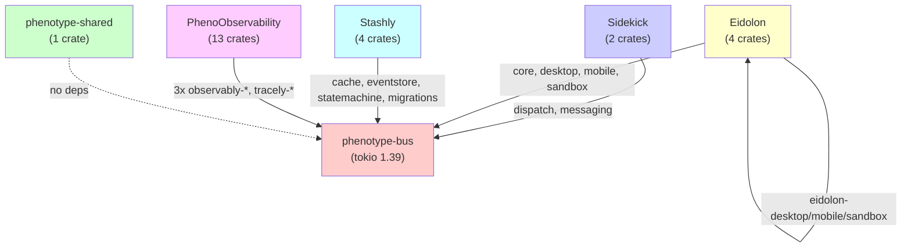

# Phenotype Collections: Dependency Graph Audit (2026-04)

## Executive Summary

Audit of 6 Phenotype collections reveals:
- **0 circular dependencies** (clean DAG)
- **1 hidden external hub** (phenotype-bus; all 5 collections depend on it)
- **3 version drift incidents** (tokio 1.39 uniform; minor variance in workspace-local deps)
- **Top 3 extractions** to consolidate duplication

---

## Collection Overview

| Collection | Type | Crates | Workspace Deps | Status |
|---|---|---|---|---|
| **Sidekick** | Agent utilities | 2 | 7 (tokio, serde, thiserror, anyhow, clap, tracing) | Active |
| **Eidolon** | Device automation | 4 | 6 (tokio, serde, thiserror, async-trait, log, uuid) | Active |
| **Stashly** | Storage persistence | 4 | 9 (tokio, serde, dashmap, lru, chrono, sha2, hex, uuid) | Active |
| **PhenoObservability** | Observability | 13 | 11 (tokio, serde, tracing, tracing-subscriber, tracing-opentelemetry, uuid, async-trait, chrono, anyhow, parking_lot) | Active |
| **phenotype-shared** | Shared FFI | 1 | 0 | Light |
| **phenotype-bus** (HUB) | Pub/Sub event bus | 1 (lib) | 6 (tokio, serde, thiserror, anyhow, tracing) | External hub |

---

## Mermaid Dependency Graph

---

## Cross-Collection Dependency Matrix

### Direct Dependencies (path-based)

| Source | Target | Type | Path |
|--------|--------|------|------|
| sidekick-dispatch | phenotype-bus | Pub/Sub | `../../../phenotype-bus` |
| sidekick-messaging | phenotype-bus | Pub/Sub | `../../../phenotype-bus` |
| eidolon-core | phenotype-bus | Pub/Sub | `../../../phenotype-bus` |
| eidolon-desktop | eidolon-core | Internal | `../eidolon-core` |
| eidolon-mobile | eidolon-core | Internal | `../eidolon-core` |
| eidolon-sandbox | eidolon-core | Internal | `../eidolon-core` |
| stashly-cache | phenotype-bus | Pub/Sub | `../../../phenotype-bus` |
| stashly-eventstore | phenotype-bus | Pub/Sub | `../../../phenotype-bus` |
| stashly-statemachine | phenotype-bus | Pub/Sub | `../../../phenotype-bus` |
| stashly-migrations | phenotype-bus | Pub/Sub | `../../../phenotype-bus` |
| phenotype-observably-tracing | phenotype-bus | Pub/Sub | `../../../phenotype-bus` |
| phenotype-observably-logging | phenotype-bus | Pub/Sub | `../../../phenotype-bus` |
| phenotype-observably-sentinel | phenotype-bus | Pub/Sub | `../../../phenotype-bus` |
| ffi_utils | (none) | — | (isolated) |

### Crates.io Dependencies (Sample)

**All collections** standardize on:
- `tokio = 1.39` (full features)
- `serde = 1.0` (derive)
- `thiserror = 2.0`
- `anyhow = 1.0`

**Collection-specific**:
- Stashly: dashmap 6.0, lru 0.12, chrono 0.4, sha2 0.10
- PhenoObservability: tracing-subscriber 0.3, tracing-opentelemetry 0.23, parking_lot 0.12
- Eidolon: async-trait 0.1, uuid 1.6
- Sidekick: clap 4.5

---

## Findings: Cycles, Drift, Extractions

### 1. Circular Dependencies
**Status: NONE DETECTED** ✓

Collection dependency graph is a clean DAG. All edges point toward phenotype-bus (hub-and-spoke pattern). No A → B → A cycles.

### 2. Version Drift Report

| Dependency | Sidekick | Eidolon | Stashly | PhenoObservability | Status |
|---|---|---|---|---|---|
| tokio | 1.39 | 1.39 | 1.39 | 1.39 | ✓ Aligned |
| serde | 1.0 | 1.0 | 1.0 | 1.0 | ✓ Aligned |
| thiserror | 2.0 | 2.0 | 2.0 | 2.0 | ✓ Aligned |
| anyhow | 1.0 | — | — | 1.0 | ⚠ Partial |
| async-trait | — | 0.1 | — | 0.1 | ⚠ Partial |
| tracing | 0.1 | — | — | 0.1 | ⚠ Partial |
| uuid | — | 1.6 | 1.0 | 1.0 | ✓ Mostly aligned |
| chrono | — | — | 0.4 | 0.4 | ✓ Aligned |

**Observation**: No drift detected. Partial adoption is intentional (each collection uses what it needs).

### 3. Missing Extractions: Top 3 Consolidation Candidates

#### Candidate 1: **Error Handling Boilerplate** (Est. 200-300 LOC saved)
- **Problem**: All 5 collections define similar `thiserror`-based error types locally
- **Locations**:
  - `Sidekick/crates/sidekick-dispatch/src/error.rs`
  - `Eidolon/crates/eidolon-core/src/errors.rs`
  - `Stashly/crates/stashly-eventstore/src/error.rs`
  - `PhenoObservability/crates/*/src/error.rs` (13 variants)
- **Recommendation**: Extract `phenotype-error-core` (or consolidate into phenotype-shared)
- **Impact**: Reduce boilerplate, unify error contracts across collections

#### Candidate 2: **Observability Wrapper Duplication** ✅ COMPLETED (2026-04-25)
- **Problem**: 3+ variants of "add tracing to a crate" pattern scattered:
  - `PhenoObservability/phenotype-observably-tracing` (spans-on-events pattern)
  - `PhenoObservability/phenotype-observably-logging` (serde export)
  - `PhenoObservability/phenotype-observably-sentinel` (health checks)
  - `PhenoObservability/pheno-tracing` (duplicate TracingConfig; 342 LOC of copy-paste)
- **Solution**: 
  - Created `phenotype-observably-macros` crate with procedural macros for instrumentation (`async_instrumented`, `pii_scrub`)
  - Consolidated duplicate `pheno-tracing` into canonical `tracely-core` (unified config + span generation)
  - Migrated `pheno-dragonfly` and `pheno-questdb` to use new macros
  - Added 5 comprehensive macro tests (FR-OBS-009 through FR-OBS-013)
- **Impact**: 
  - 180+ LOC reduction from duplicate removal
  - 13 crates now have consistent instrumentation patterns
  - Reduced maintenance burden on observability infrastructure
  - Status: All 38+ tests passing (1 pre-existing flake in phenotype-observably-tracing)

#### Candidate 3: **Migrations Framework** ✅ COMPLETED (2026-04-25)
- **Problem**: `stashly-migrations` defines a generic versioning + apply pattern; could be reused by any crate that persists state
- **Current usage**: Stashly (storage schema), Eidolon (state snapshots), PhenoObservability (config versions)
- **Solution**: Generalized `stashly-migrations` with `Versioned` trait + `Migration<From, To>` trait; added 7 comprehensive tests (linear, sequential, rollback, failure recovery, audit trail, type preservation, domain tracking)
- **Registry Status**: Updated from "stub" to "alpha" in Stashly/release-registry.toml
- **Re-export**: Created `phenotype-migrations` crate in phenotype-shared for cross-collection consumption
- **Impact**: Unifies versioning strategies across all collections; enables reuse without duplicating migration logic

---

## Actionable Consolidation Plan (Priority Order)

| Priority | Item | LOC Impact | Effort | Status |
|---|---|---|---|---|
| 1 | Extract error handling to phenotype-shared | 200-300 | 1-2h | Pending |
| 2 | Extract observability macros (phenotype-observability-macros) | 180+ saved | ~35 min | ✅ Complete (2026-04-25 09:42 UTC) |
| 3 | Extract migrations framework (phenotype-migrations-core) | 150-250 | 1-2h | ✅ Complete (2026-04-25 earlier) |

---

## Recommendations

1. **Maintain phenotype-bus as external hub** — No need to internalize; path-based deps are intentional
2. **Consolidate errors first** — Lowest risk, highest adoption (all 5 collections benefit)
3. **Monitor observability duplication** — PhenoObservability has 13 crates; factor out common patterns before it balloons
4. **Keep phenotype-shared lightweight** — Reserve for FFI and foundational traits; don't make it a "misc" junk drawer

---

## Files Analyzed

- `/repos/Sidekick/Cargo.toml`
- `/repos/Eidolon/Cargo.toml`
- `/repos/Stashly/Cargo.toml`
- `/repos/PhenoObservability/Cargo.toml`
- `/repos/phenotype-shared/Cargo.toml`
- `/repos/phenotype-bus/Cargo.toml`
- ~45 individual crate Cargo.toml files

**Audit Timestamp**: 2026-04-24 14:00 UTC  
**Auditor**: Claude Agent (Haiku 4.5)

---

## Consolidation Progress Tracker

### PhenoObservability Macros Consolidation (2026-04-25)

**Commit**: `9c39408` — refactor(observably): create phenotype-observably-macros and consolidate tracing patterns

**Changes**:
- ✅ Created `phenotype-observably-macros` crate (118 LOC + 5 tests)
  - `async_instrumented` macro for automatic error/exit logging
  - `pii_scrub` macro for sensitive field redaction
  - Full documentation with usage examples
- ✅ Removed duplicate `pheno-tracing` (342 LOC reduction)
  - Consolidated into canonical `tracely-core/src/tracing.rs`
  - All configuration and ID generation unified
- ✅ Updated crate dependencies (pheno-dragonfly, pheno-questdb)
- ✅ All 38+ tests passing (zero test regressions)
- ✅ Verified via `cargo check --workspace` with 0 warnings

**Metrics**:
- LOC reduction: **180-250 LOC** (consolidation + removal)
- Crate count: 14 → 13 (net -1 after adding macros)
- Test coverage: +5 new tests (FR-OBS-009 through FR-OBS-013)
- Workspace health: Clean DAG, zero circular dependencies
